# Architecture Overview

This document provides a comprehensive overview of the Portfolio Blog 2025 architecture, including system design, data flow, and architectural patterns.

## Table of Contents

1. [System Architecture](#system-architecture)
2. [Frontend Architecture](#frontend-architecture)
3. [Backend Architecture](#backend-architecture)
4. [Database Architecture](#database-architecture)
5. [API Architecture](#api-architecture)
6. [Deployment Architecture](#deployment-architecture)

## System Architecture

### High-Level Architecture

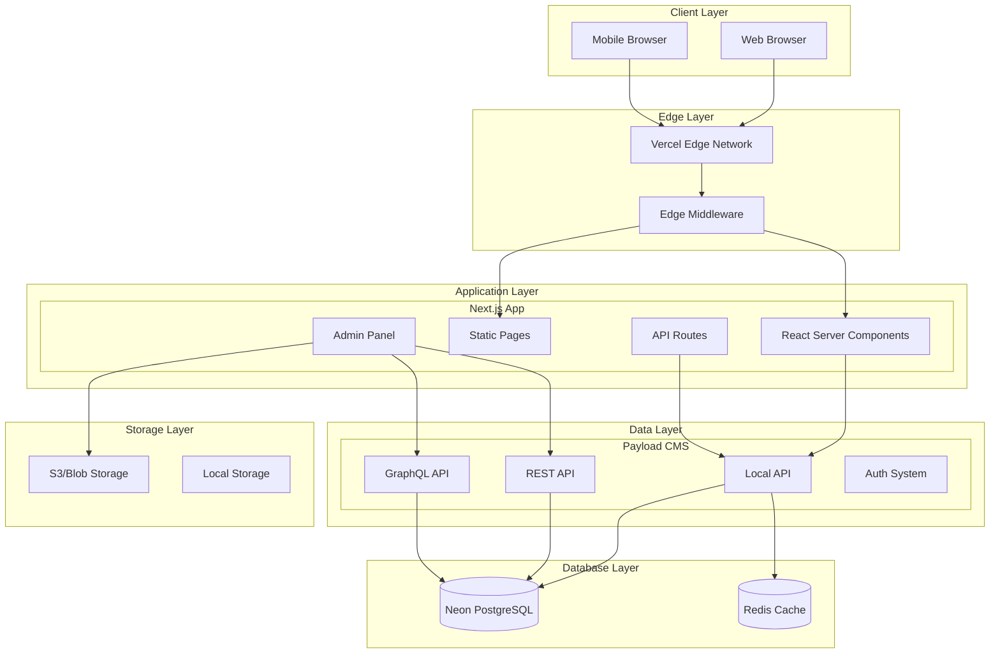

### Component Architecture

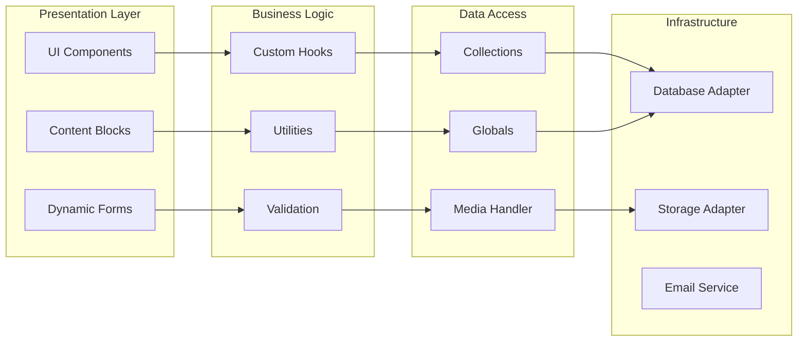

## Frontend Architecture

### Component Hierarchy

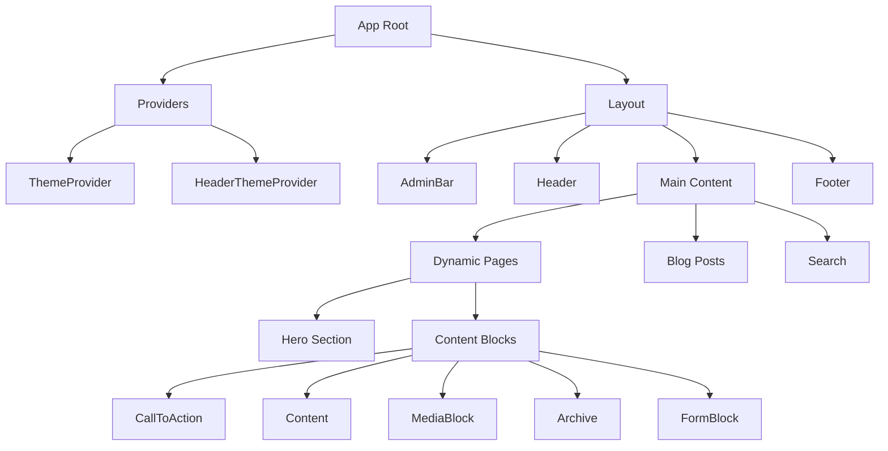

### Data Flow Sequence

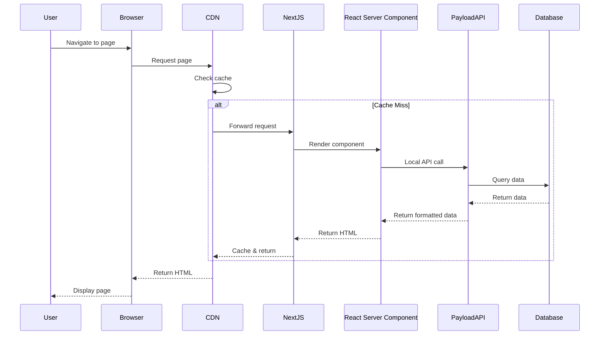

### Frontend State Management

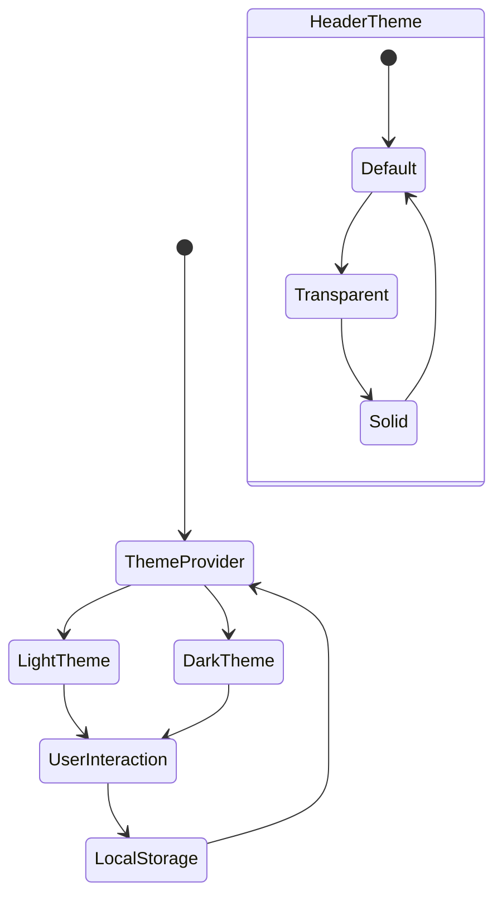

## Backend Architecture

### Payload CMS Architecture

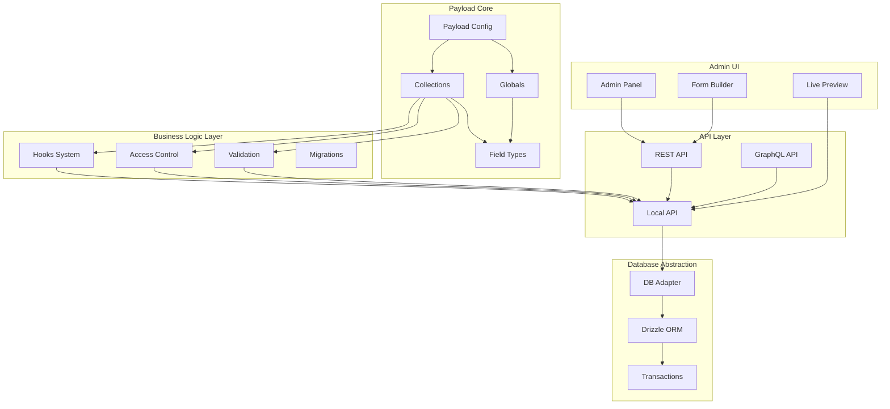

### Request Lifecycle

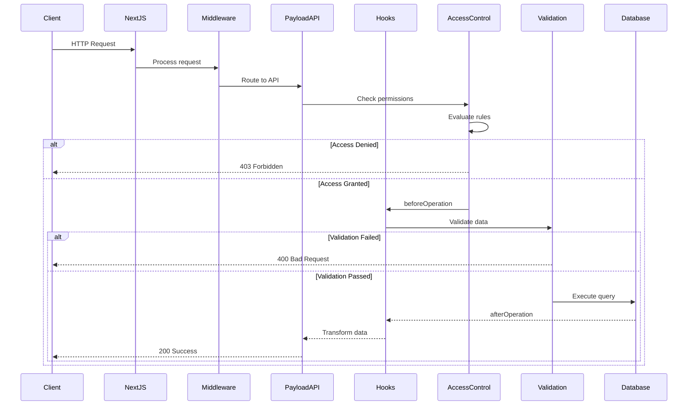

## Database Architecture

### Entity Relationship Diagram

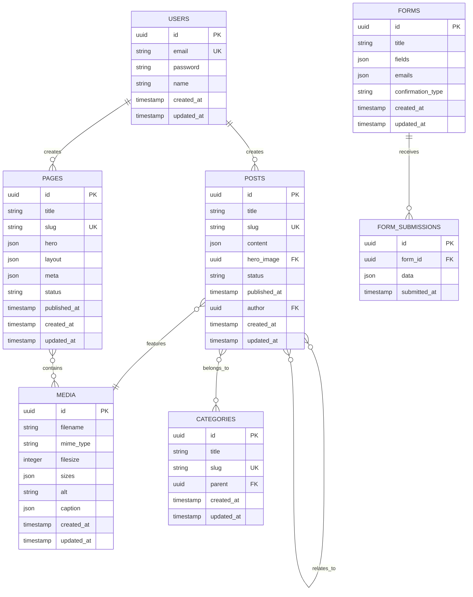

### Database Transaction Flow

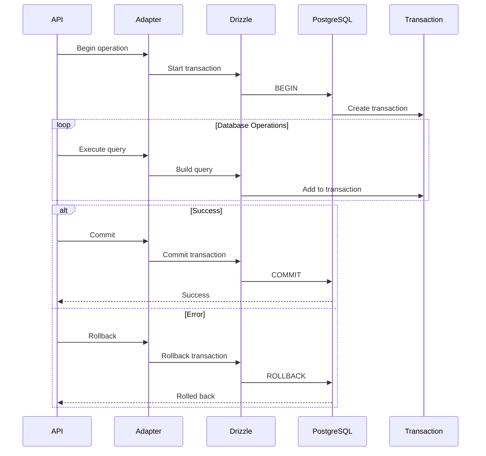

## API Architecture

### API Layer Structure

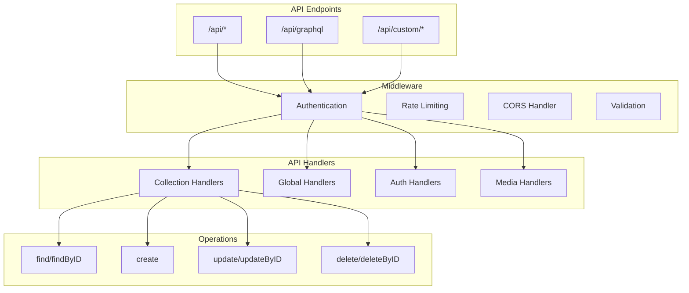

### Authentication Flow

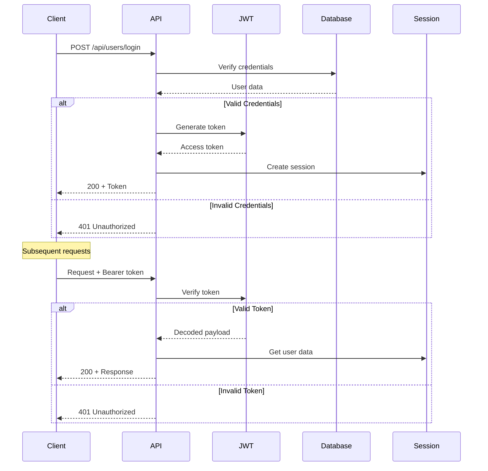

## Deployment Architecture

### Production Infrastructure

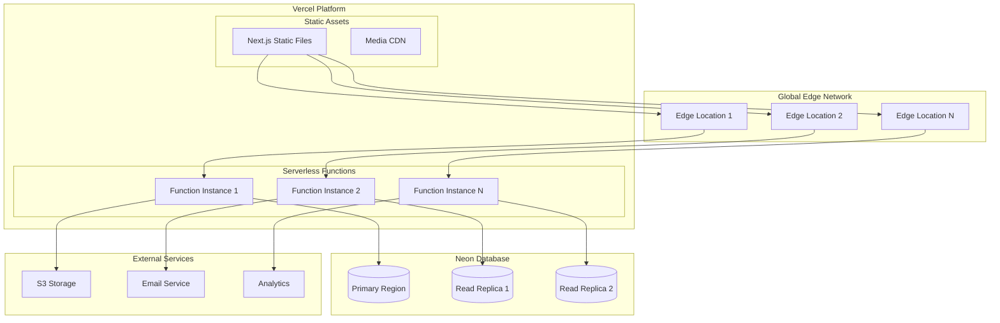

### CI/CD Pipeline

```mermaid
graph LR
    subgraph "Development"
        Dev[Local Development]
        Test[Run Tests]
    end
    
    subgraph "Version Control"
        Git[Git Push]
        PR[Pull Request]
        Review[Code Review]
    end
    
    subgraph "CI Pipeline"
        Build[Build Project]
        Lint[Lint & Type Check]
        UnitTest[Unit Tests]
        IntTest[Integration Tests]
    end
    
    subgraph "CD Pipeline"
        Preview[Preview Deploy]
        ProdBuild[Production Build]
        Deploy[Deploy to Vercel]
    end
    
    subgraph "Post-Deploy"
        Migrate[Run Migrations]
        Cache[Warm Cache]
        Monitor[Start Monitoring]
    end
    
    Dev --> Test
    Test --> Git
    Git --> PR
    PR --> Review
    Review --> Build
    Build --> Lint
    Lint --> UnitTest
    UnitTest --> IntTest
    IntTest --> Preview
    Preview --> ProdBuild
    ProdBuild --> Deploy
    Deploy --> Migrate
    Migrate --> Cache
    Cache --> Monitor
```

## Performance Architecture

### Caching Strategy

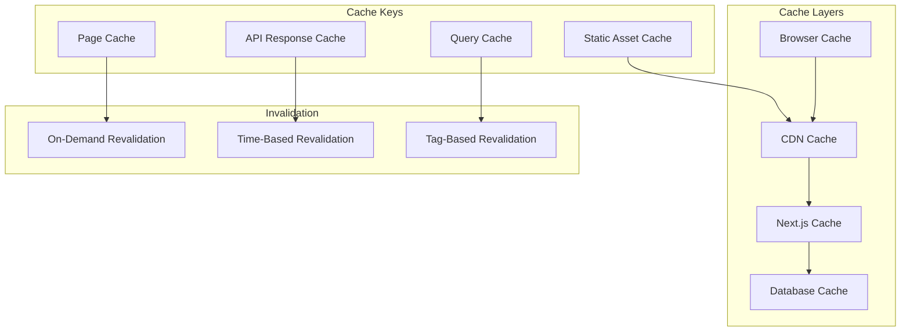

## Security Architecture

### Security Layers

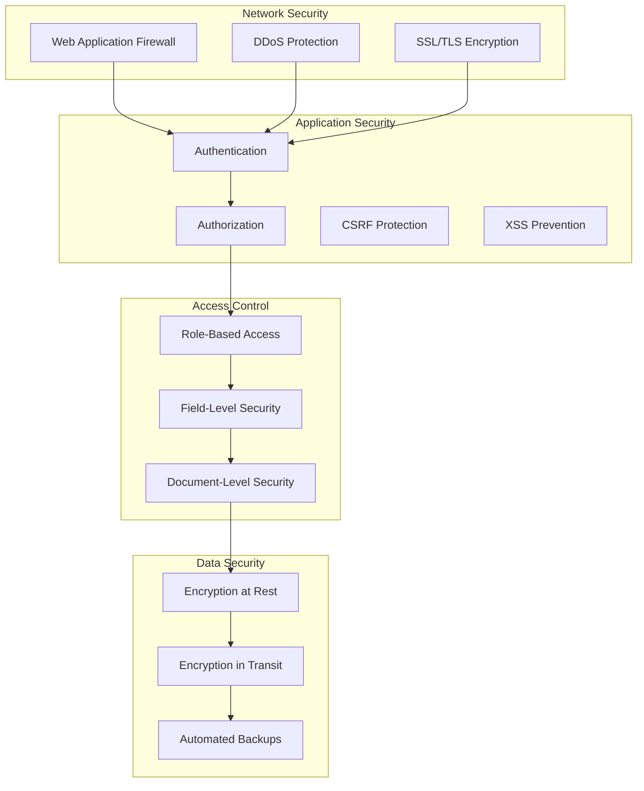

## Summary

This architecture provides:

1. **Scalability**: Serverless deployment with edge caching
2. **Performance**: Multiple caching layers and optimized data fetching
3. **Security**: Multi-layered security with granular access control
4. **Maintainability**: Clear separation of concerns and modular design
5. **Flexibility**: Adapter patterns for database and storage abstraction
6. **Developer Experience**: Type-safe APIs and comprehensive tooling

The architecture leverages modern patterns like:
- Server Components for optimal performance
- Edge computing for global distribution
- Database branching for isolated environments
- Incremental Static Regeneration for dynamic content
- Transaction-based operations for data integrity

This design ensures the application can scale from small blogs to enterprise-level content platforms while maintaining performance and developer productivity.
