# Backend Architecture Documentation - Portfolio Blog 2025

## Table of Contents
1. [PayloadCMS Architecture Overview](#payloadcms-architecture-overview)
2. [Database Schema & Relationships](#database-schema--relationships)
3. [Collections Deep Dive](#collections-deep-dive)
4. [API Architecture](#api-architecture)
5. [Plugin System](#plugin-system)
6. [Security & Access Control](#security--access-control)
7. [Performance & Optimization](#performance--optimization)
8. [Development Workflows](#development-workflows)

## PayloadCMS Architecture Overview

### Core System Architecture

```mermaid
graph TB
    subgraph "Next.js Application"
        Frontend[Frontend Routes - /(frontend)]
        Admin[Admin Routes - /(payload)]
    end
    
    subgraph "PayloadCMS Core"
        Config[payload.config.ts]
        Collections[Collections Layer]
        Globals[Globals Layer]
        Plugins[Plugin System]
        Hooks[Hooks System]
    end
    
    subgraph "Database Layer"
        PostgreSQL[(Neon PostgreSQL)]
        Drizzle[Drizzle ORM]
        Adapter[PostgreSQL Adapter]
        Migrations[Migration System]
    end
    
    subgraph "API Interfaces"
        LocalAPI[Local API - Direct]
        RestAPI[REST API - /api/*]
        GraphQL[GraphQL API - /api/graphql]
    end
    
    subgraph "External Services"
        Media[Media Storage]
        Email[Email Service]
        Search[Search Index]
        Cloud[Payload Cloud]
    end
    
    Frontend --> LocalAPI
    Admin --> RestAPI
    Admin --> GraphQL
    
    Config --> Collections
    Config --> Globals
    Config --> Plugins
    Config --> Hooks
    
    Collections --> Adapter
    Globals --> Adapter
    
    Adapter --> Drizzle
    Drizzle --> PostgreSQL
    
    LocalAPI --> Collections
    RestAPI --> Collections
    GraphQL --> Collections
    
    Collections --> Media
    Collections --> Email
    Collections --> Search
    
    Plugins --> Cloud
```

### Configuration Architecture

**Location**: `src/payload.config.ts`

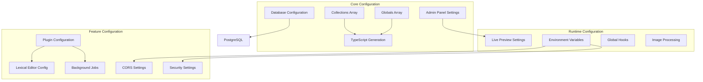

**Key Configuration Features**:
```typescript
export default buildConfig({
  // Database with connection pooling
  db: postgresAdapter({
    pool: { connectionString: process.env.DATABASE_URI }
  }),
  
  // Admin with live preview
  admin: {
    livePreview: {
      collections: ['pages', 'posts', 'projects'],
      breakpoints: [/* mobile, tablet, desktop */]
    }
  },
  
  // Type-safe collections
  collections: [Pages, Posts, Projects, Media, Categories, Technologies, ProjectCategories, Users],
  globals: [Header, Footer],
  
  // Plugin ecosystem
  plugins: [seoPlugin, searchPlugin, formBuilderPlugin, /* ... */],
  
  // Background job system
  jobs: {
    access: { run: authOrCronAccess },
    tasks: []
  }
})
```

## Database Schema & Relationships

### Complete Entity Relationship Diagram

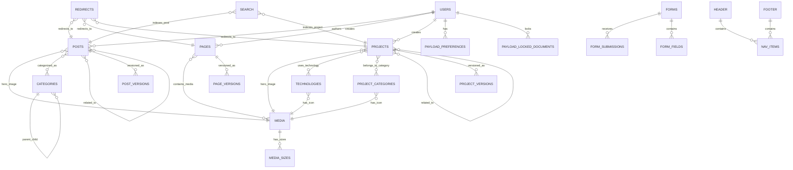

### Detailed Table Schemas

#### Core Collections Schema

```sql
-- Users Table (Authentication & Authorization)
CREATE TABLE users (
    id SERIAL PRIMARY KEY,
    email VARCHAR(255) UNIQUE NOT NULL,
    name VARCHAR(255),
    password_hash VARCHAR(255) NOT NULL,
    salt VARCHAR(255),
    login_attempts INTEGER DEFAULT 0,
    lock_until TIMESTAMP,
    reset_password_token VARCHAR(255),
    reset_password_expiration TIMESTAMP,
    email_verified BOOLEAN DEFAULT false,
    created_at TIMESTAMP DEFAULT CURRENT_TIMESTAMP,
    updated_at TIMESTAMP DEFAULT CURRENT_TIMESTAMP
);

-- Projects Table (Main Portfolio Collection)
CREATE TABLE projects (
    id SERIAL PRIMARY KEY,
    title VARCHAR(255) NOT NULL,
    slug VARCHAR(255) UNIQUE NOT NULL,
    description TEXT NOT NULL,
    project_status VARCHAR(20) DEFAULT 'completed',
    featured BOOLEAN DEFAULT false,
    hero_image_id INTEGER REFERENCES media(id),
    hero_video VARCHAR(255),
    links JSONB, -- {github, liveDemo, documentation}
    layout JSONB, -- Content blocks array
    tags TEXT[],
    meta JSONB, -- SEO metadata
    start_date DATE,
    completion_date DATE,
    published_at TIMESTAMP,
    _status VARCHAR(20) DEFAULT 'draft',
    created_at TIMESTAMP DEFAULT CURRENT_TIMESTAMP,
    updated_at TIMESTAMP DEFAULT CURRENT_TIMESTAMP
);

-- Technologies Table (Technology Stack Management)
CREATE TABLE technologies (
    id SERIAL PRIMARY KEY,
    name VARCHAR(255) UNIQUE NOT NULL,
    slug VARCHAR(255) UNIQUE NOT NULL,
    description TEXT,
    icon_id INTEGER REFERENCES media(id) NOT NULL,
    category VARCHAR(50) NOT NULL, -- frontend, backend, database, etc.
    official_website VARCHAR(500),
    documentation VARCHAR(500),
    color VARCHAR(7), -- Hex color for theming
    created_at TIMESTAMP DEFAULT CURRENT_TIMESTAMP,
    updated_at TIMESTAMP DEFAULT CURRENT_TIMESTAMP
);

-- Project Categories Table
CREATE TABLE project_categories (
    id SERIAL PRIMARY KEY,
    name VARCHAR(255) NOT NULL,
    slug VARCHAR(255) UNIQUE NOT NULL,
    description TEXT,
    color VARCHAR(7), -- Hex color for UI
    icon_id INTEGER REFERENCES media(id),
    created_at TIMESTAMP DEFAULT CURRENT_TIMESTAMP,
    updated_at TIMESTAMP DEFAULT CURRENT_TIMESTAMP
);

-- Junction Tables for Many-to-Many Relationships
CREATE TABLE projects_technologies (
    project_id INTEGER REFERENCES projects(id) ON DELETE CASCADE,
    technology_id INTEGER REFERENCES technologies(id) ON DELETE CASCADE,
    order_index INTEGER DEFAULT 0,
    PRIMARY KEY (project_id, technology_id)
);

CREATE TABLE projects_project_categories (
    project_id INTEGER REFERENCES projects(id) ON DELETE CASCADE,
    project_category_id INTEGER REFERENCES project_categories(id) ON DELETE CASCADE,
    order_index INTEGER DEFAULT 0,
    PRIMARY KEY (project_id, project_category_id)
);

CREATE TABLE projects_related_projects (
    project_id INTEGER REFERENCES projects(id) ON DELETE CASCADE,
    related_project_id INTEGER REFERENCES projects(id) ON DELETE CASCADE,
    order_index INTEGER DEFAULT 0,
    PRIMARY KEY (project_id, related_project_id)
);
```

#### Indexes for Performance

```sql
-- Primary lookup indexes
CREATE INDEX idx_projects_slug ON projects(slug);
CREATE INDEX idx_projects_status ON projects(_status);
CREATE INDEX idx_projects_featured ON projects(featured);
CREATE INDEX idx_projects_published_at ON projects(published_at);

CREATE INDEX idx_technologies_slug ON technologies(slug);
CREATE INDEX idx_technologies_category ON technologies(category);

CREATE INDEX idx_project_categories_slug ON project_categories(slug);

-- Junction table indexes
CREATE INDEX idx_projects_technologies_project ON projects_technologies(project_id);
CREATE INDEX idx_projects_technologies_technology ON projects_technologies(technology_id);

CREATE INDEX idx_projects_categories_project ON projects_project_categories(project_id);
CREATE INDEX idx_projects_categories_category ON projects_project_categories(project_category_id);

-- Search and filtering indexes
CREATE INDEX idx_projects_title_search ON projects USING gin(to_tsvector('english', title));
CREATE INDEX idx_projects_description_search ON projects USING gin(to_tsvector('english', description));
CREATE INDEX idx_projects_tags ON projects USING gin(tags);
```

## Collections Deep Dive

### Projects Collection

**Location**: `src/collections/Projects/index.ts`

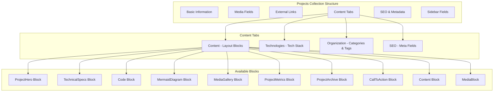

**Key Features**:
- **Live Preview**: Real-time preview across multiple device breakpoints
- **Version Control**: Draft/publish workflow with auto-save every 100ms
- **Relationship Management**: Deep relationships with technologies, categories, and related projects
- **SEO Integration**: Complete meta tag generation with image support
- **Block-Based Content**: Flexible layout system with 10 specialized blocks

**Field Configuration**:
```typescript
fields: [
  // Basic fields
  { name: 'title', type: 'text', required: true },
  { name: 'description', type: 'textarea', required: true, maxLength: 500 },
  { name: 'projectStatus', type: 'select', options: ['in-progress', 'completed', 'archived'] },
  { name: 'featured', type: 'checkbox', admin: { position: 'sidebar' } },
  
  // Media fields
  { name: 'heroImage', type: 'upload', relationTo: 'media' },
  { name: 'heroVideo', type: 'text' }, // YouTube video ID
  
  // External links with validation
  {
    name: 'links',
    type: 'group',
    fields: [
      { name: 'github', type: 'text', validate: githubUrlValidator },
      { name: 'liveDemo', type: 'text', validate: urlValidator },
      { name: 'documentation', type: 'text', validate: urlValidator }
    ]
  },
  
  // Tabbed content structure
  {
    type: 'tabs',
    tabs: [
      {
        label: 'Content',
        fields: [
          { name: 'layout', type: 'blocks', blocks: [/* all project blocks */] }
        ]
      },
      {
        label: 'Technologies',
        fields: [
          { name: 'technologies', type: 'relationship', relationTo: 'technologies', hasMany: true },
          { name: 'primaryTechnology', type: 'relationship', relationTo: 'technologies' }
        ]
      },
      // ... other tabs
    ]
  }
]
```

### Technologies Collection

**Location**: `src/collections/Technologies/index.ts`

**Purpose**: Centralized technology stack management with icons, categories, and branding.

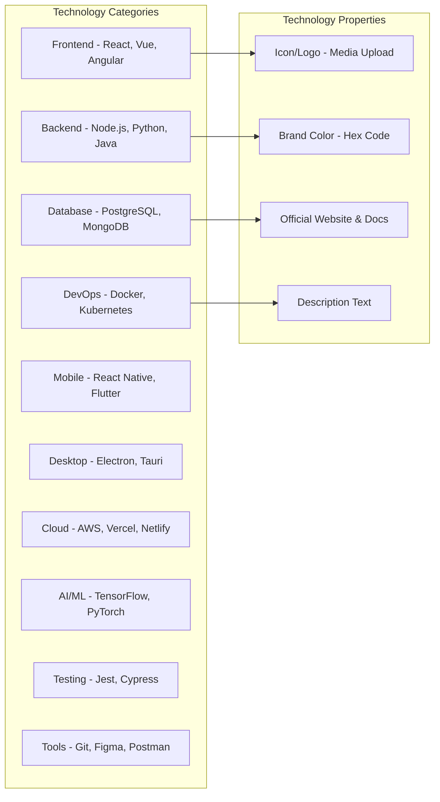

**Access Control**:
- **Read**: Anyone (public access for frontend display)
- **Create/Update/Delete**: Authenticated users only

**Validation Rules**:
- Name uniqueness across all technologies
- Icon requirement (SVG preferred for scalability)
- URL validation for official website and documentation
- Hex color validation for brand theming

### ProjectCategories Collection

**Location**: `src/collections/ProjectCategories/index.ts`

**Purpose**: Organize projects into logical categories (separate from blog categories).

**Features**:
- Color-coded categories for UI theming
- Optional icons for visual distinction
- Slug-based URL routing (`/projects/category/[slug]`)
- Description support for category pages

### User Collection & Authentication

**Location**: `src/collections/Users/index.ts`

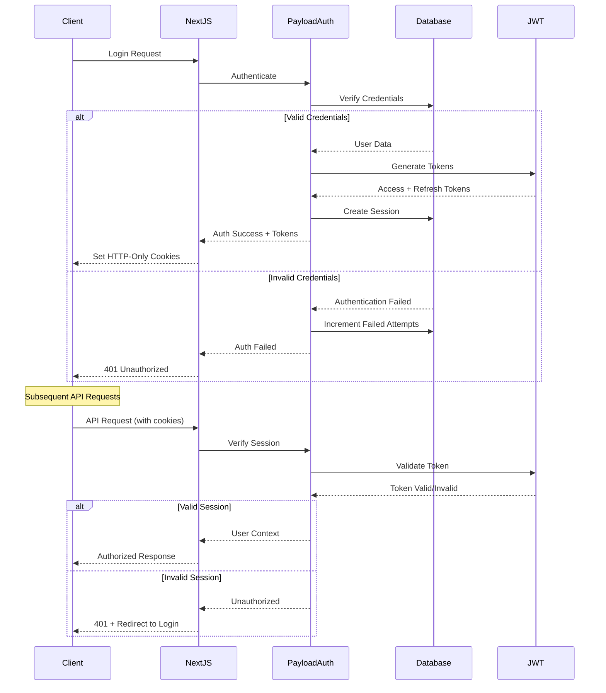

## API Architecture

### API Layer Overview

```mermaid
graph TB
    subgraph "API Access Methods"
        Local[Local API - Server Components]
        REST[REST API - /api/[collection]]
        GraphQL[GraphQL API - /api/graphql]
    end
    
    subgraph "Authentication Methods"
        JWT[JWT Tokens]
        Session[Session Cookies]
        APIKey[API Keys]
    end
    
    subgraph "Data Access Patterns"
        CRUD[CRUD Operations]
        Relationships[Relationship Population]
        Search[Search & Filtering]
        Versioning[Version Management]
    end
    
    Local --> Session
    REST --> JWT
    GraphQL --> JWT
    
    Session --> CRUD
    JWT --> CRUD
    
    CRUD --> Relationships
    Relationships --> Search
    Search --> Versioning
```

### Local API Usage (Recommended for Server Components)

```typescript
// Server Component data fetching
export default async function ProjectsPage() {
  const payload = await getPayload({ config: configPromise })
  
  const projects = await payload.find({
    collection: 'projects',
    where: {
      _status: { equals: 'published' },
      featured: { equals: true }
    },
    limit: 12,
    sort: '-updatedAt',
    depth: 2, // Populate relationships
    select: {
      title: true,
      slug: true,
      description: true,
      heroImage: true,
      technologies: true,
      projectStatus: true
    }
  })
  
  return <ProjectsList projects={projects.docs} />
}
```

### REST API Endpoints

```yaml
# Projects Collection
GET    /api/projects                    # List projects with pagination
GET    /api/projects/:id               # Get single project
POST   /api/projects                   # Create project (auth required)
PATCH  /api/projects/:id               # Update project (auth required)
DELETE /api/projects/:id               # Delete project (auth required)

# Technologies Collection
GET    /api/technologies               # List all technologies
GET    /api/technologies/:id           # Get single technology
POST   /api/technologies               # Create technology (auth required)
PATCH  /api/technologies/:id           # Update technology (auth required)
DELETE /api/technologies/:id           # Delete technology (auth required)

# Project Categories Collection
GET    /api/project-categories         # List categories
GET    /api/project-categories/:id     # Get single category
POST   /api/project-categories         # Create category (auth required)
PATCH  /api/project-categories/:id     # Update category (auth required)
DELETE /api/project-categories/:id     # Delete category (auth required)

# Relationships & Filtering
GET    /api/projects?where[technologies.slug][equals]=react
GET    /api/projects?where[categories.slug][equals]=web-app
GET    /api/projects?where[projectStatus][equals]=completed
GET    /api/projects?where[or][0][title][contains]=portfolio&where[or][1][description][contains]=portfolio

# Versions
GET    /api/projects/:id/versions      # Get project versions
POST   /api/projects/:id/versions/publish  # Publish draft
```

### GraphQL Schema

```graphql
type Query {
  # Projects
  Projects(
    where: Project_where
    limit: Int = 10
    page: Int = 1
    sort: String = "-updatedAt"
    draft: Boolean = false
  ): Projects
  
  Project(
    id: Int!
    draft: Boolean = false
  ): Project
  
  # Technologies
  Technologies(
    where: Technology_where
    limit: Int = 100
    sort: String = "name"
  ): Technologies
  
  # Project Categories
  ProjectCategories(
    where: ProjectCategory_where
    limit: Int = 50
    sort: String = "name"
  ): ProjectCategories
}

type Mutation {
  # Create
  createProject(
    data: mutationProjectInput!
    draft: Boolean = false
  ): Project
  
  createTechnology(
    data: mutationTechnologyInput!
  ): Technology
  
  # Update
  updateProject(
    id: Int!
    data: mutationProjectUpdateInput!
    draft: Boolean = false
    autosave: Boolean = false
  ): Project
  
  # Delete
  deleteProject(id: Int!): Project
  deleteTechnology(id: Int!): Technology
}

# Types
type Project {
  id: Int!
  title: String!
  slug: String!
  description: String!
  projectStatus: Project_projectStatus
  featured: Boolean
  heroImage: Media
  heroVideo: String
  links: Project_Links
  layout: [Project_Layout_Union]
  technologies(limit: Int): [Technology]
  primaryTechnology: Technology
  categories(limit: Int): [ProjectCategory]
  tags: [String]
  relatedProjects(limit: Int): [Project]
  meta: Project_Meta
  startDate: DateTime
  completionDate: DateTime
  publishedAt: DateTime
  createdAt: DateTime!
  updatedAt: DateTime!
  _status: Project__status
}

enum Project_projectStatus {
  in_progress
  completed
  archived
}

type Technology {
  id: Int!
  name: String!
  slug: String!
  description: String
  icon: Media!
  category: Technology_category!
  officialWebsite: String
  documentation: String
  color: String
  createdAt: DateTime!
  updatedAt: DateTime!
}

enum Technology_category {
  frontend
  backend
  database
  devops
  mobile
  desktop
  cloud
  ai_ml
  testing
  tools
}
```

## Plugin System

### Installed Plugins Architecture

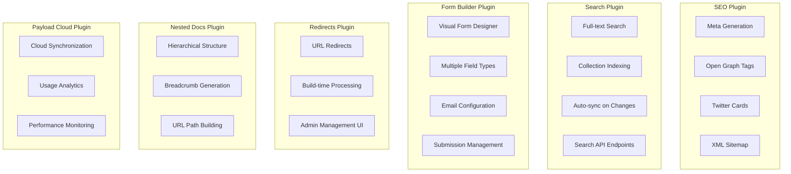

### Plugin Configuration

**Location**: `src/plugins/index.ts`

```typescript
export const plugins: Plugin[] = [
  // SEO optimization for all collections
  seoPlugin({
    generateTitle: ({ doc }) => 
      doc?.title ? `${doc.title} | Portfolio Blog` : 'Portfolio Blog',
    generateURL: ({ doc, req }) => {
      const url = getServerSideURL()
      if (!doc?.slug) return url
      
      // Handle different collections
      if (req.collection?.slug === 'projects') return `${url}/projects/${doc.slug}`
      if (req.collection?.slug === 'posts') return `${url}/posts/${doc.slug}`
      return `${url}/${doc.slug}` // Pages
    },
  }),
  
  // Full-text search across posts and projects
  searchPlugin({
    collections: ['posts', 'projects'],
    beforeSync: beforeSyncWithSearch,
    searchOverrides: {
      fields: ({ defaultFields }) => [...defaultFields, ...searchFields]
    },
  }),
  
  // Form builder with email notifications
  formBuilderPlugin({
    fields: { payment: false }, // Disable payment fields
    formOverrides: {
      fields: ({ defaultFields }) => 
        defaultFields.map((field) => {
          if ('name' in field && field.name === 'confirmationMessage') {
            return {
              ...field,
              editor: lexicalEditor({
                features: ({ rootFeatures }) => [
                  ...rootFeatures,
                  FixedToolbarFeature(),
                  HeadingFeature({ enabledHeadingSizes: ['h1', 'h2', 'h3', 'h4'] })
                ]
              })
            }
          }
          return field
        })
    },
  }),
  
  // URL redirects management
  redirectsPlugin({
    collections: ['pages', 'posts', 'projects'],
    overrides: {
      hooks: { afterChange: [revalidateRedirects] }
    },
  }),
  
  // Hierarchical categories
  nestedDocsPlugin({
    collections: ['categories'],
    generateURL: (docs) => docs.reduce((url, doc) => `${url}/${doc.slug}`, ''),
  }),
  
  // Payload Cloud integration
  payloadCloudPlugin(),
]
```

## Security & Access Control

### Access Control Matrix

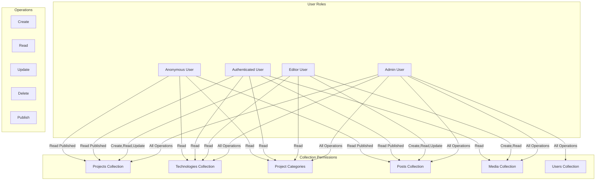

### Access Control Functions

**Location**: `src/access/`

```typescript
// Public access for published content
export const authenticatedOrPublished = ({ req: { user } }) => {
  if (user) return true // Authenticated users see all
  
  return {
    _status: { equals: 'published' } // Anonymous users see only published
  }
}

// Authenticated users only
export const authenticated = ({ req: { user } }) => {
  return Boolean(user)
}

// Public read access
export const anyone = () => true

// Admin-only access
export const adminOnly = ({ req: { user } }) => {
  return user?.role === 'admin'
}

// Field-level access control
export const adminOrEditorOnly = ({ req: { user } }) => {
  return user?.role === 'admin' || user?.role === 'editor'
}
```

### JWT & Session Management

```mermaid
sequenceDiagram
    participant Browser
    participant NextJS
    participant PayloadAuth
    participant Database
    participant JWT
    
    Note over Browser,JWT: Login Flow
    
    Browser->>NextJS: POST /api/users/login
    NextJS->>PayloadAuth: authenticate(email, password)
    PayloadAuth->>Database: findUser(email)
    Database-->>PayloadAuth: user || null
    
    alt User Found & Password Valid
        PayloadAuth->>JWT: sign(payload, secret)
        JWT-->>PayloadAuth: accessToken
        PayloadAuth->>Database: createSession(user, token)
        PayloadAuth-->>NextJS: { user, token, exp }
        NextJS-->>Browser: Set-Cookie: payload-token=jwt; HttpOnly; Secure
    else Authentication Failed
        PayloadAuth->>Database: incrementLoginAttempts(email)
        PayloadAuth-->>NextJS: AuthenticationError
        NextJS-->>Browser: 401 Unauthorized
    end
    
    Note over Browser,JWT: Authenticated Request Flow
    
    Browser->>NextJS: GET /api/projects (with cookie)
    NextJS->>PayloadAuth: verifyToken(cookie.token)
    PayloadAuth->>JWT: verify(token, secret)
    
    alt Token Valid
        JWT-->>PayloadAuth: decoded payload
        PayloadAuth->>Database: getUser(payload.id)
        Database-->>PayloadAuth: user data
        PayloadAuth-->>NextJS: { user, isValid: true }
        NextJS-->>Browser: 200 OK + Data
    else Token Invalid/Expired
        PayloadAuth-->>NextJS: { isValid: false }
        NextJS-->>Browser: 401 Unauthorized
    end
```

### Field-Level Security

```typescript
// Example: Sensitive fields visible only to admins
{
  name: 'internalNotes',
  type: 'textarea',
  access: {
    read: adminOnly,
    update: adminOnly
  },
  admin: {
    condition: (data, siblingData, { user }) => user?.role === 'admin'
  }
}

// Example: User can only edit their own content
{
  name: 'author',
  type: 'relationship',
  relationTo: 'users',
  access: {
    update: ({ req: { user }, data }) => {
      if (user?.role === 'admin') return true
      return data?.author === user?.id
    }
  }
}
```

## Performance & Optimization

### Database Optimization Strategy

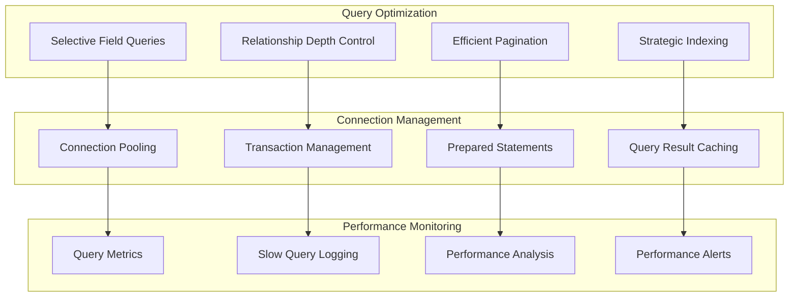

### Optimized Query Patterns

```typescript
// Selective field queries to reduce payload
const projects = await payload.find({
  collection: 'projects',
  select: {
    title: true,
    slug: true,
    description: true,
    heroImage: true,
    projectStatus: true,
    featured: true,
    // Exclude heavy fields like layout blocks
  },
  where: { _status: { equals: 'published' } },
  limit: 12,
  sort: '-updatedAt'
})

// Controlled relationship depth
const projectDetail = await payload.findByID({
  collection: 'projects',
  id: projectId,
  depth: 2, // Only populate 2 levels deep
  select: {
    title: true,
    slug: true,
    description: true,
    layout: true,
    technologies: {
      name: true,
      slug: true,
      icon: true,
      color: true
    },
    categories: {
      name: true,
      slug: true,
      color: true
    }
  }
})

// Efficient pagination with counting
const paginatedProjects = await payload.find({
  collection: 'projects',
  page: currentPage,
  limit: 12,
  pagination: true, // Include total count
  where: buildWhereClause(filters)
})
```

### Caching Strategy

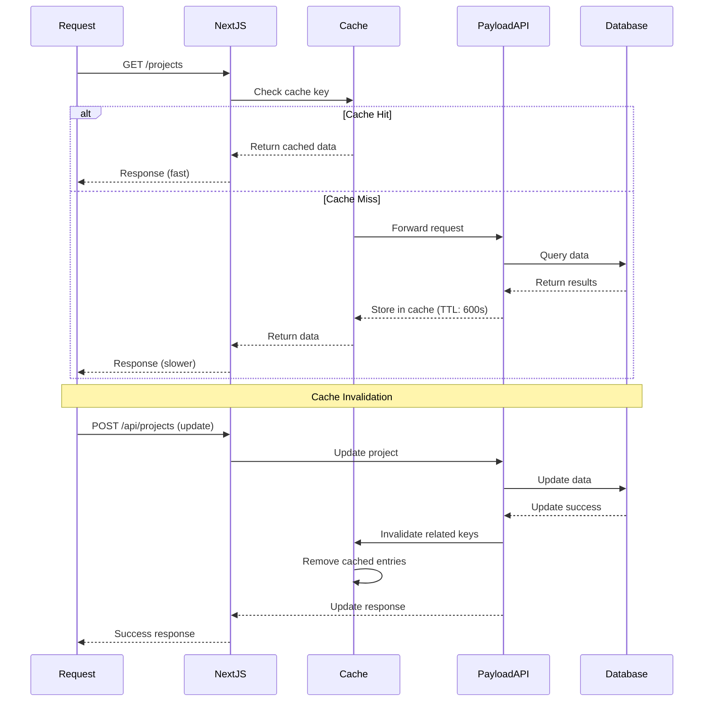

### Media Optimization

```typescript
// Optimized media configuration
export const Media: CollectionConfig = {
  slug: 'media',
  upload: {
    staticDir: 'public/media',
    imageSizes: [
      {
        name: 'thumbnail',
        width: 150,
        height: 150,
        position: 'centre',
        formatOptions: { format: 'webp', options: { quality: 70 } }
      },
      {
        name: 'square',
        width: 400,
        height: 400,
        position: 'centre',
        formatOptions: { format: 'webp', options: { quality: 80 } }
      },
      {
        name: 'small',
        width: 600,
        height: undefined, // Maintain aspect ratio
        formatOptions: { format: 'webp', options: { quality: 80 } }
      },
      {
        name: 'medium',
        width: 1200,
        height: undefined,
        formatOptions: { format: 'webp', options: { quality: 85 } }
      },
      {
        name: 'large',
        width: 1920,
        height: undefined,
        formatOptions: { format: 'webp', options: { quality: 90 } }
      },
      {
        name: 'og',
        width: 1200,
        height: 630,
        position: 'centre',
        formatOptions: { format: 'jpeg', options: { quality: 90 } }
      }
    ],
    focalPoint: true,
    crop: true
  }
}
```

## Development Workflows

### Hook System Architecture

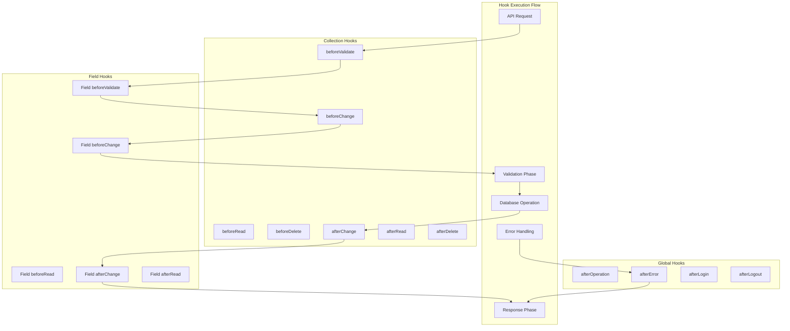

### Custom Hooks Implementation

```typescript
// Project revalidation hook
export const revalidateProject: CollectionAfterChangeHook = async ({
  doc,
  previousDoc,
  req: { payload, collection }
}) => {
  if (collection?.slug === 'projects') {
    try {
      // Revalidate project detail page
      await fetch(`${getServerSideURL()}/api/revalidate`, {
        method: 'POST',
        headers: { 'Content-Type': 'application/json' },
        body: JSON.stringify({
          paths: [
            `/projects/${doc.slug}`,
            '/projects', // Projects listing page
            '/' // Homepage if featured
          ]
        })
      })
      
      // Revalidate technology pages if technologies changed
      if (doc.technologies !== previousDoc?.technologies) {
        const techPaths = doc.technologies?.map(tech => 
          `/projects/technology/${tech.slug}`
        ) || []
        
        await fetch(`${getServerSideURL()}/api/revalidate`, {
          method: 'POST',
          headers: { 'Content-Type': 'application/json' },
          body: JSON.stringify({ paths: techPaths })
        })
      }
      
      payload.logger.info(`Revalidated project: ${doc.slug}`)
    } catch (error) {
      payload.logger.error(`Failed to revalidate project: ${error}`)
    }
  }
}

// Populate published date hook
export const populatePublishedAt: CollectionBeforeChangeHook = async ({
  data,
  originalDoc,
  operation
}) => {
  if (operation === 'create' || operation === 'update') {
    // Set publishedAt when status changes to published
    if (data._status === 'published' && !originalDoc?.publishedAt) {
      data.publishedAt = new Date().toISOString()
    }
    
    // Clear publishedAt when status changes to draft
    if (data._status === 'draft') {
      data.publishedAt = null
    }
  }
  
  return data
}
```

### Migration System

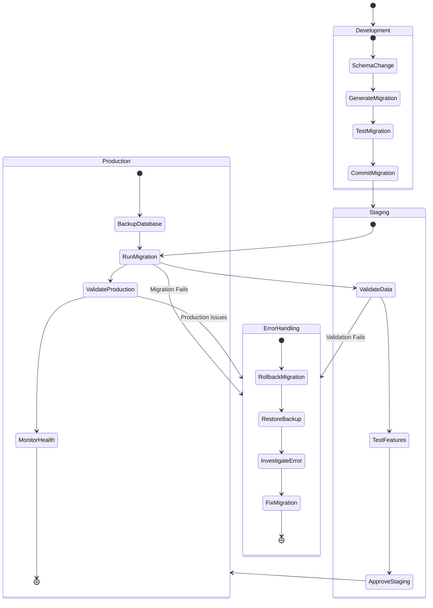

### Migration Example

```typescript
// Example project collections migration
export const migration_20250119_000000_add_project_collections = {
  up: async ({ payload }: { payload: Payload }) => {
    payload.logger.info('Adding project collections...')
    
    try {
      // Create technologies if they don't exist
      const technologies = [
        { name: 'React', category: 'frontend', color: '#61DAFB' },
        { name: 'Node.js', category: 'backend', color: '#339933' },
        { name: 'PostgreSQL', category: 'database', color: '#336791' },
        // ... more technologies
      ]
      
      for (const tech of technologies) {
        await payload.create({
          collection: 'technologies',
          data: {
            ...tech,
            slug: tech.name.toLowerCase().replace(/[^a-z0-9]+/g, '-'),
            description: `${tech.name} technology stack`
          }
        })
      }
      
      // Create project categories
      const categories = [
        { name: 'Web Application', color: '#3B82F6' },
        { name: 'Mobile App', color: '#10B981' },
        { name: 'API Service', color: '#F59E0B' },
        // ... more categories
      ]
      
      for (const category of categories) {
        await payload.create({
          collection: 'project-categories',
          data: {
            ...category,
            slug: category.name.toLowerCase().replace(/[^a-z0-9]+/g, '-'),
            description: `${category.name} projects`
          }
        })
      }
      
      payload.logger.info('Project collections added successfully')
    } catch (error) {
      payload.logger.error('Failed to add project collections:', error)
      throw error
    }
  },
  
  down: async ({ payload }: { payload: Payload }) => {
    payload.logger.info('Removing project collections...')
    
    try {
      // Remove all projects
      await payload.delete({
        collection: 'projects',
        where: {}
      })
      
      // Remove all technologies
      await payload.delete({
        collection: 'technologies',
        where: {}
      })
      
      // Remove all project categories
      await payload.delete({
        collection: 'project-categories',
        where: {}
      })
      
      payload.logger.info('Project collections removed successfully')
    } catch (error) {
      payload.logger.error('Failed to remove project collections:', error)
      throw error
    }
  }
}
```

### Environment Configuration

```typescript
// Environment-specific configuration
const config = {
  development: {
    db: {
      connectionString: process.env.DATABASE_URI,
      // Enable query logging in development
      logging: true,
      // Smaller connection pool for development
      pool: { min: 2, max: 10 }
    },
    admin: {
      // Development admin settings
      webpack: (config) => {
        // Custom webpack config for development
        return config
      }
    }
  },
  
  production: {
    db: {
      connectionString: process.env.DATABASE_URI,
      // Disable query logging in production
      logging: false,
      // Larger connection pool for production
      pool: { min: 5, max: 50 }
    },
    admin: {
      // Production optimizations
      bundler: 'webpack',
      meta: {
        // Add production meta tags
        titleSuffix: ' - Admin'
      }
    }
  }
}

export default buildConfig(config[process.env.NODE_ENV] || config.development)
```

## Summary

This backend architecture provides a robust foundation for content management with:

### Key Strengths

1. **Flexible Content Management**: Block-based layout system with 10+ specialized blocks
2. **Type Safety**: Full TypeScript integration with auto-generated types
3. **Performance**: Optimized queries, connection pooling, and caching strategies
4. **Security**: Multi-layered access control with field-level permissions
5. **Scalability**: Database optimization and efficient relationship management
6. **Developer Experience**: Comprehensive hook system and migration support

### Architecture Highlights

- **Database**: PostgreSQL with Drizzle ORM for type-safe queries
- **API**: Triple API approach (Local, REST, GraphQL) for flexibility
- **Collections**: 7 core collections with intelligent relationships
- **Plugins**: 6 essential plugins for SEO, search, forms, and more
- **Security**: JWT-based authentication with role-based access control
- **Performance**: Strategic indexing, connection pooling, and query optimization

### Production Readiness

The backend is designed for production deployment with:
- Comprehensive error handling and logging
- Database migration system with rollback support
- Performance monitoring and optimization
- Security best practices implementation
- Scalable architecture patterns

This architecture supports the complete content management workflow from creation to publication, with advanced features like live preview, version control, and automated SEO optimization.