# Backend & Database Architecture

This document provides a detailed exploration of the backend architecture, database design, and data flow patterns in the Portfolio Blog 2025 project.

## Table of Contents

1. [Backend Architecture Overview](#backend-architecture-overview)
2. [Database Design](#database-design)
3. [API Architecture](#api-architecture)
4. [Data Flow Patterns](#data-flow-patterns)
5. [Security Architecture](#security-architecture)
6. [Performance & Scaling](#performance--scaling)

## Backend Architecture Overview

### Payload CMS Architecture

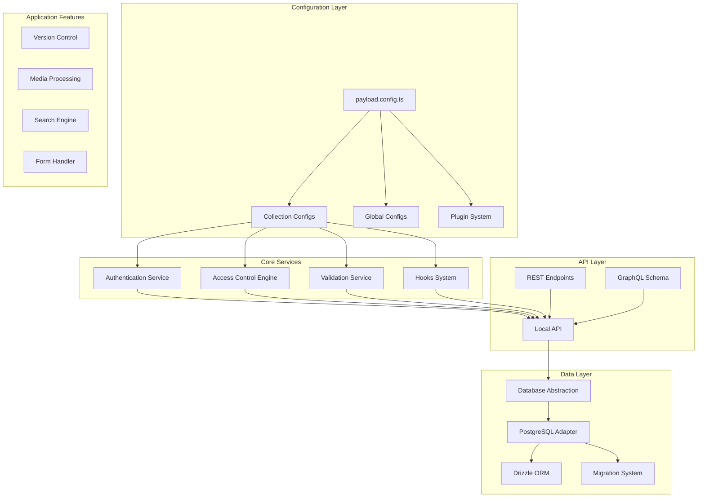

### Service Layer Architecture

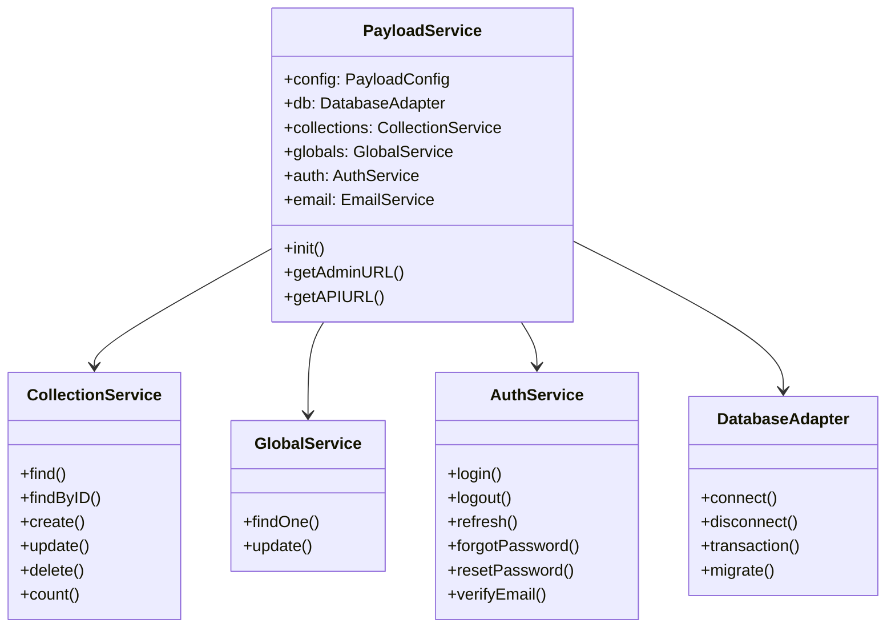

## Database Design

### Schema Architecture

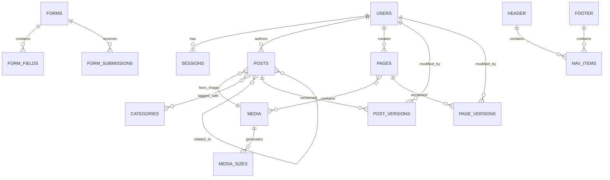

### Detailed Table Schemas

#### Users Table
```sql
CREATE TABLE users (
    id UUID PRIMARY KEY DEFAULT gen_random_uuid(),
    email VARCHAR(255) UNIQUE NOT NULL,
    password VARCHAR(255) NOT NULL,
    name VARCHAR(255),
    role VARCHAR(50) DEFAULT 'user',
    email_verified BOOLEAN DEFAULT false,
    locked_until TIMESTAMP,
    login_attempts INTEGER DEFAULT 0,
    created_at TIMESTAMP DEFAULT CURRENT_TIMESTAMP,
    updated_at TIMESTAMP DEFAULT CURRENT_TIMESTAMP
);

CREATE INDEX idx_users_email ON users(email);
CREATE INDEX idx_users_role ON users(role);
```

#### Posts Table
```sql
CREATE TABLE posts (
    id UUID PRIMARY KEY DEFAULT gen_random_uuid(),
    title VARCHAR(255) NOT NULL,
    slug VARCHAR(255) UNIQUE NOT NULL,
    content JSONB NOT NULL,
    hero_image_id UUID REFERENCES media(id),
    status VARCHAR(20) DEFAULT 'draft',
    published_at TIMESTAMP,
    author_id UUID REFERENCES users(id),
    meta JSONB,
    created_at TIMESTAMP DEFAULT CURRENT_TIMESTAMP,
    updated_at TIMESTAMP DEFAULT CURRENT_TIMESTAMP
);

CREATE INDEX idx_posts_slug ON posts(slug);
CREATE INDEX idx_posts_status ON posts(status);
CREATE INDEX idx_posts_published_at ON posts(published_at);
CREATE INDEX idx_posts_author ON posts(author_id);
```

#### Categories Table
```sql
CREATE TABLE categories (
    id UUID PRIMARY KEY DEFAULT gen_random_uuid(),
    title VARCHAR(255) NOT NULL,
    slug VARCHAR(255) UNIQUE NOT NULL,
    parent_id UUID REFERENCES categories(id),
    created_at TIMESTAMP DEFAULT CURRENT_TIMESTAMP,
    updated_at TIMESTAMP DEFAULT CURRENT_TIMESTAMP
);

CREATE INDEX idx_categories_slug ON categories(slug);
CREATE INDEX idx_categories_parent ON categories(parent_id);
```

#### Posts_Categories Junction Table
```sql
CREATE TABLE posts_categories (
    post_id UUID REFERENCES posts(id) ON DELETE CASCADE,
    category_id UUID REFERENCES categories(id) ON DELETE CASCADE,
    order_index INTEGER DEFAULT 0,
    PRIMARY KEY (post_id, category_id)
);

CREATE INDEX idx_posts_categories_post ON posts_categories(post_id);
CREATE INDEX idx_posts_categories_category ON posts_categories(category_id);
```

### Database Relationships

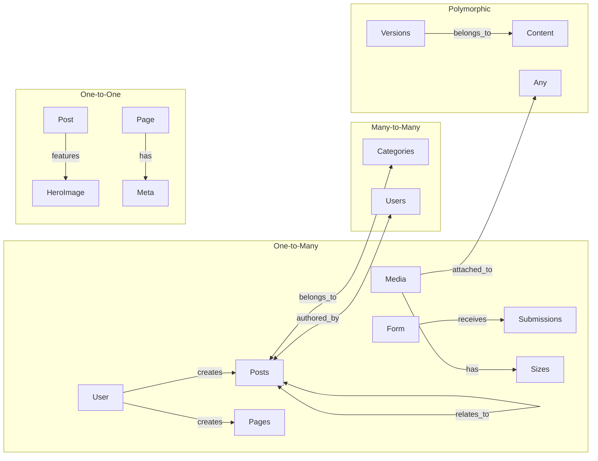

## API Architecture

### API Layer Structure

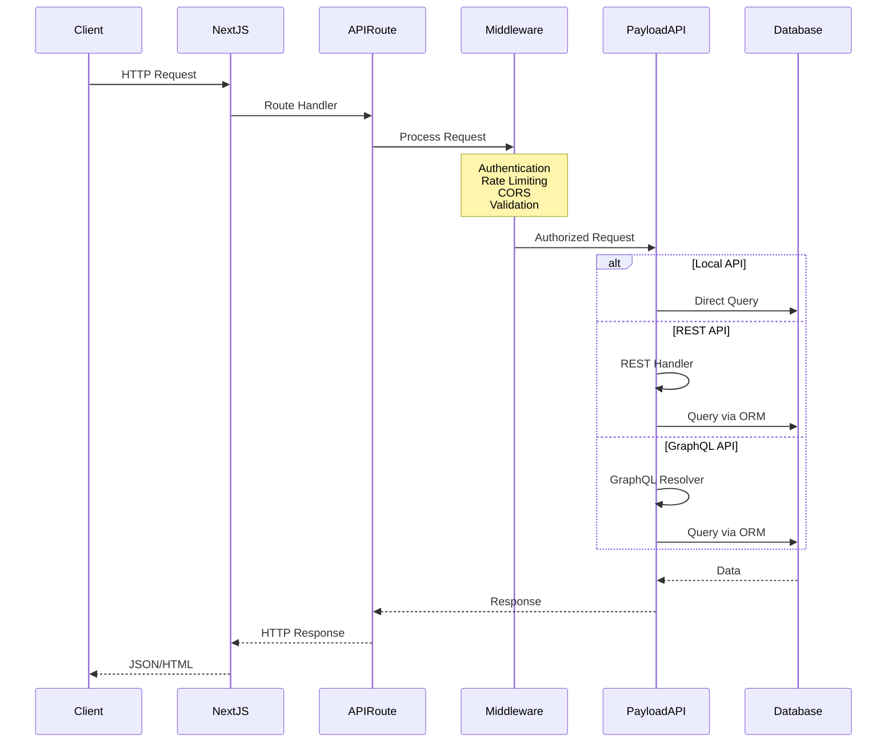

### REST API Endpoints

```yaml
# Collections
GET     /api/{collection}              # List with pagination
GET     /api/{collection}/:id          # Get single document
POST    /api/{collection}              # Create document
PATCH   /api/{collection}/:id          # Update document
DELETE  /api/{collection}/:id          # Delete document

# Globals
GET     /api/globals/{global}          # Get global
POST    /api/globals/{global}          # Update global

# Auth
POST    /api/users/login               # Login
POST    /api/users/logout              # Logout
POST    /api/users/refresh-token       # Refresh JWT
POST    /api/users/forgot-password     # Request reset
POST    /api/users/reset-password      # Reset password

# Media
POST    /api/media                     # Upload file
GET     /api/media/:id/download        # Download file

# Special
GET     /api/{collection}/:id/versions # Get versions
POST    /api/{collection}/:id/publish  # Publish draft
GET     /api/access                    # Get user permissions
```

### GraphQL Schema

```graphql
type Query {
  # Collections
  Posts(
    where: Post_where
    limit: Int
    page: Int
    sort: String
    draft: Boolean
  ): Posts
  
  Post(
    id: String!
    draft: Boolean
  ): Post
  
  # Globals
  Header: Header
  Footer: Footer
  
  # Access
  Access: Access
}

type Mutation {
  # Create
  createPost(
    data: mutationPostInput!
    draft: Boolean
  ): Post
  
  # Update
  updatePost(
    id: String!
    data: mutationPostUpdateInput!
    draft: Boolean
    autosave: Boolean
  ): Post
  
  # Delete
  deletePost(id: String!): Post
  
  # Auth
  loginUser(
    email: String!
    password: String!
  ): usersLoginResult
  
  logoutUser: String
  
  # Media
  createMedia(
    data: mutationMediaInput!
    file: Upload!
  ): Media
}

# Types
type Post {
  id: String!
  title: String!
  slug: String!
  content: JSON
  heroImage: Media
  categories(limit: Int): [Category]
  authors(limit: Int): [User]
  status: Post_status
  publishedAt: DateTime
  createdAt: DateTime
  updatedAt: DateTime
}

enum Post_status {
  draft
  published
}
```

## Data Flow Patterns

### Request Lifecycle

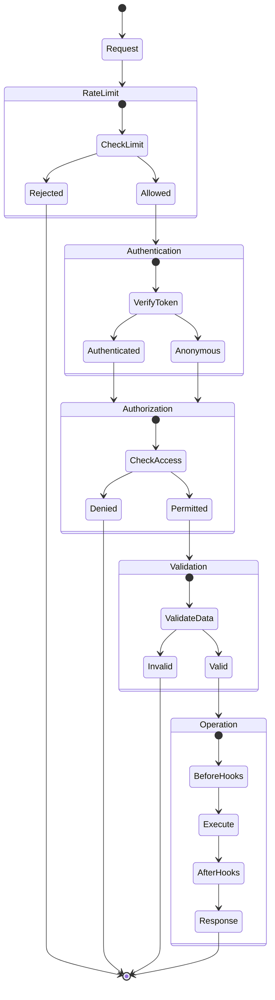

### Hook Execution Flow

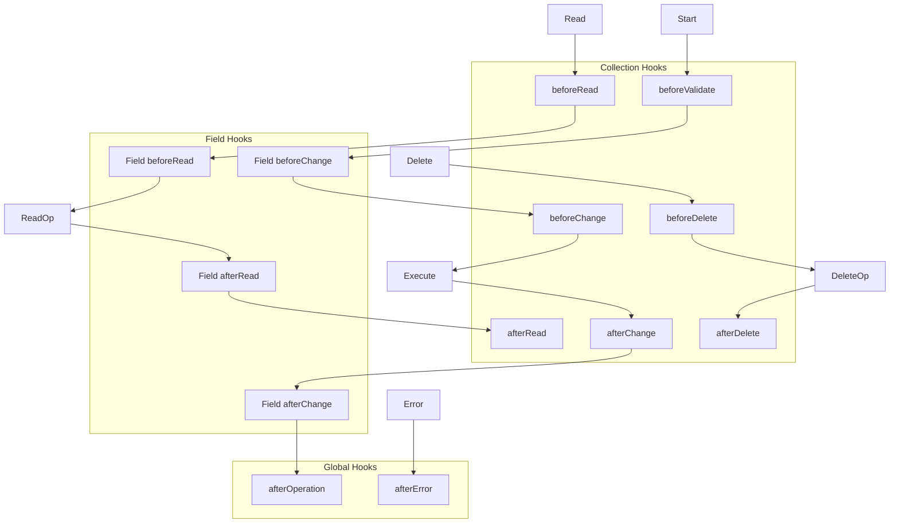

### Transaction Management

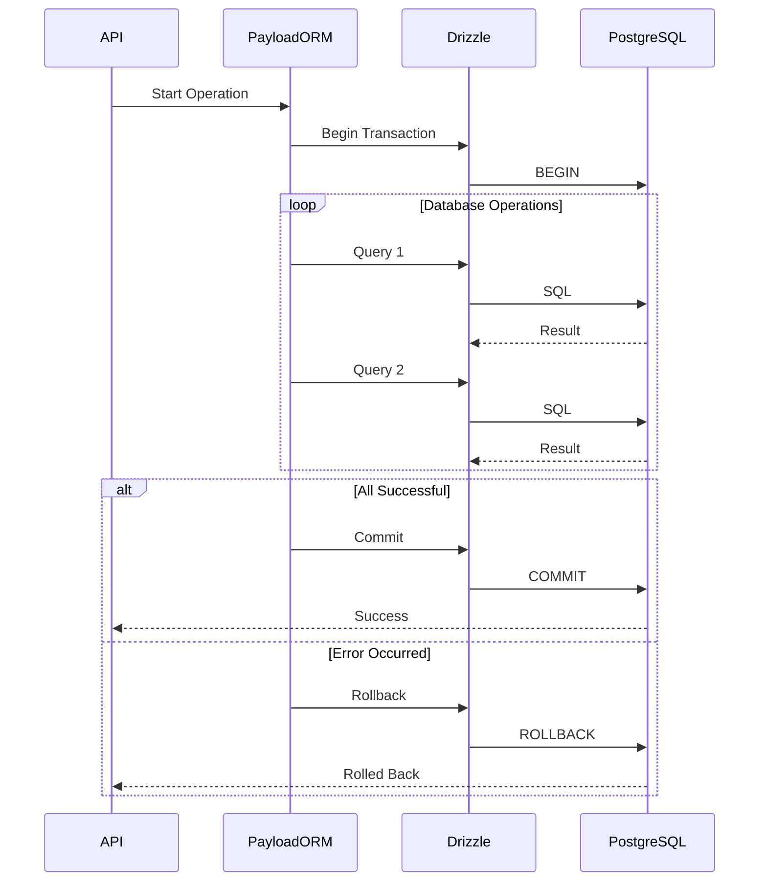

## Security Architecture

### Authentication Flow

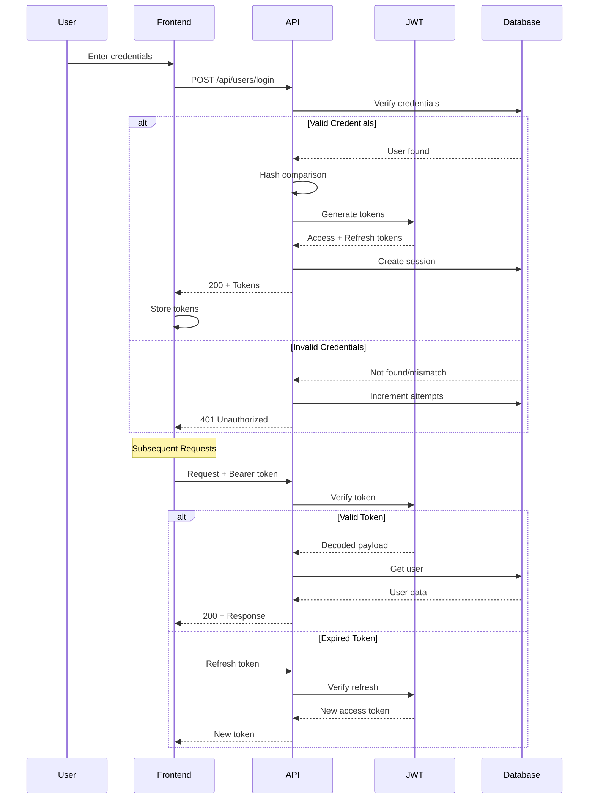

### Access Control Matrix

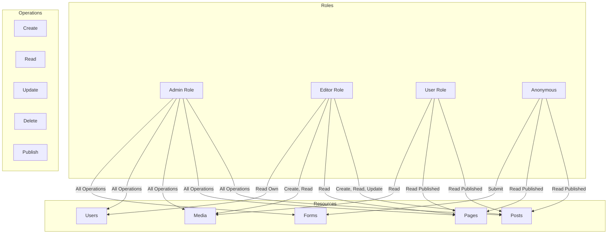

### Field-Level Security

```typescript
// Field access control example
{
  name: 'internalNotes',
  type: 'textarea',
  access: {
    read: ({ req: { user } }) => {
      return user?.role === 'admin' || user?.role === 'editor'
    },
    update: ({ req: { user } }) => {
      return user?.role === 'admin'
    }
  }
}
```

## Performance & Scaling

### Query Optimization

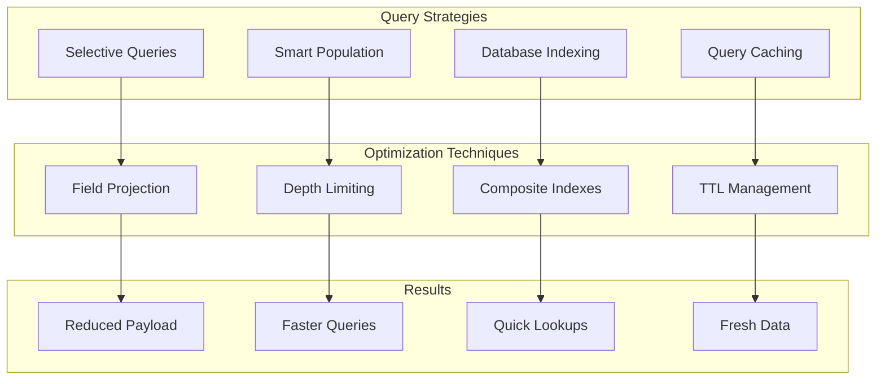

### Caching Strategy

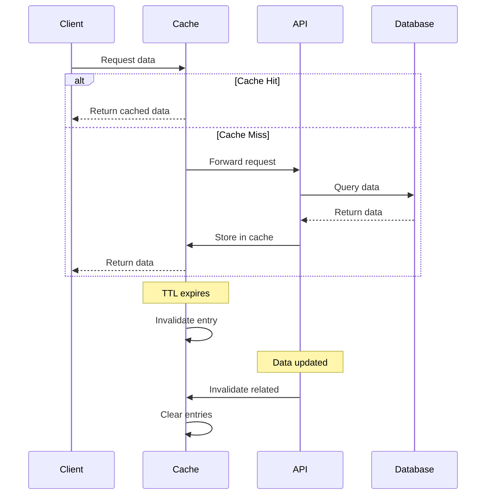

### Database Connection Pooling

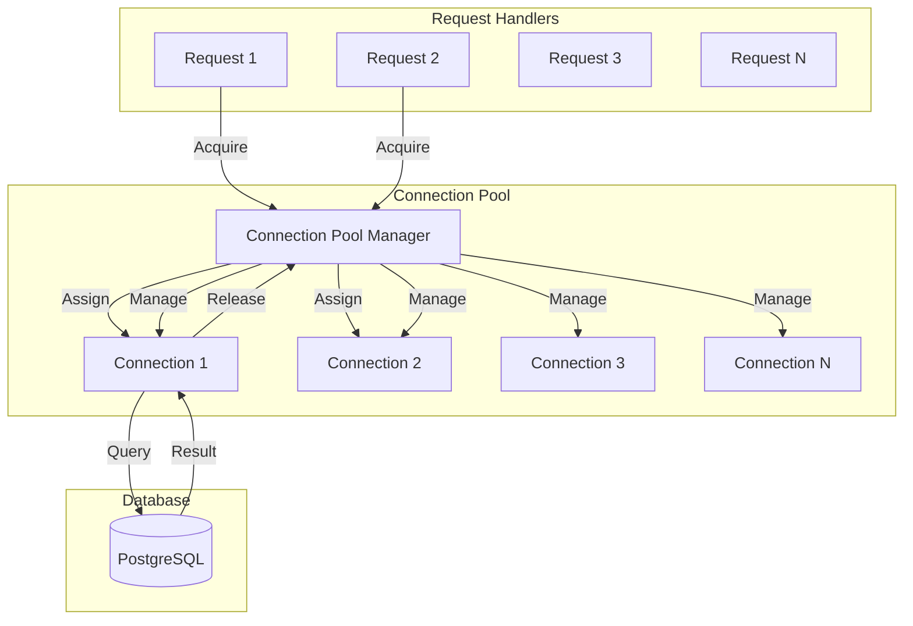

### Scaling Architecture

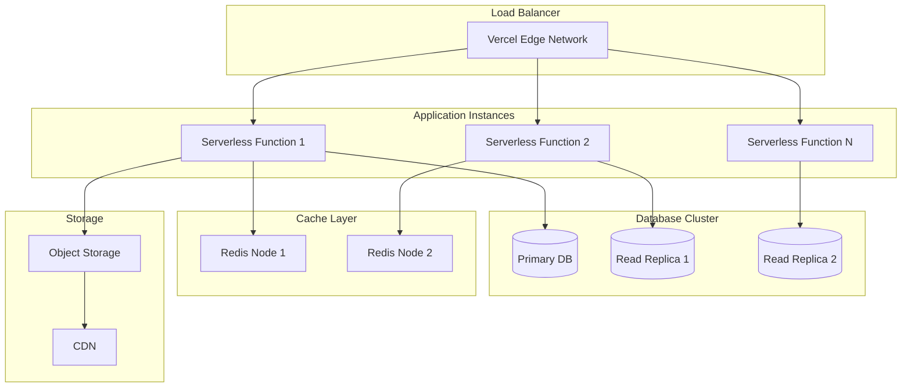

## Migration System

### Migration Workflow

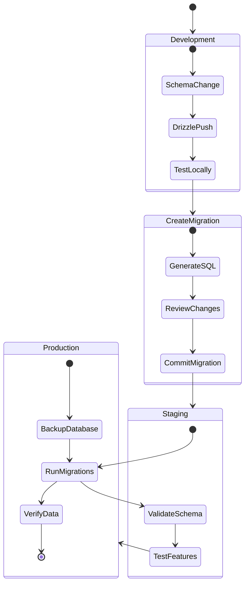

## Summary

The backend and database architecture provides:

1. **Flexibility**: Database adapter pattern for multiple database support
2. **Security**: Multi-layered security with granular access control
3. **Performance**: Connection pooling, query optimization, and caching
4. **Reliability**: Transaction support and automatic rollbacks
5. **Scalability**: Horizontal scaling with read replicas and caching
6. **Maintainability**: Clear separation of concerns and migration system

Key architectural decisions:
- **PostgreSQL with Drizzle**: Type-safe queries with excellent performance
- **Adapter Pattern**: Easy to switch databases if needed
- **Hook System**: Extensible business logic without modifying core
- **API Options**: Local, REST, and GraphQL for different use cases
- **Serverless Ready**: Optimized for edge deployment

This architecture ensures the application can handle complex content management requirements while maintaining performance and developer experience.
