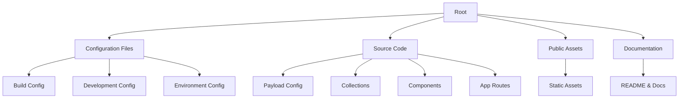
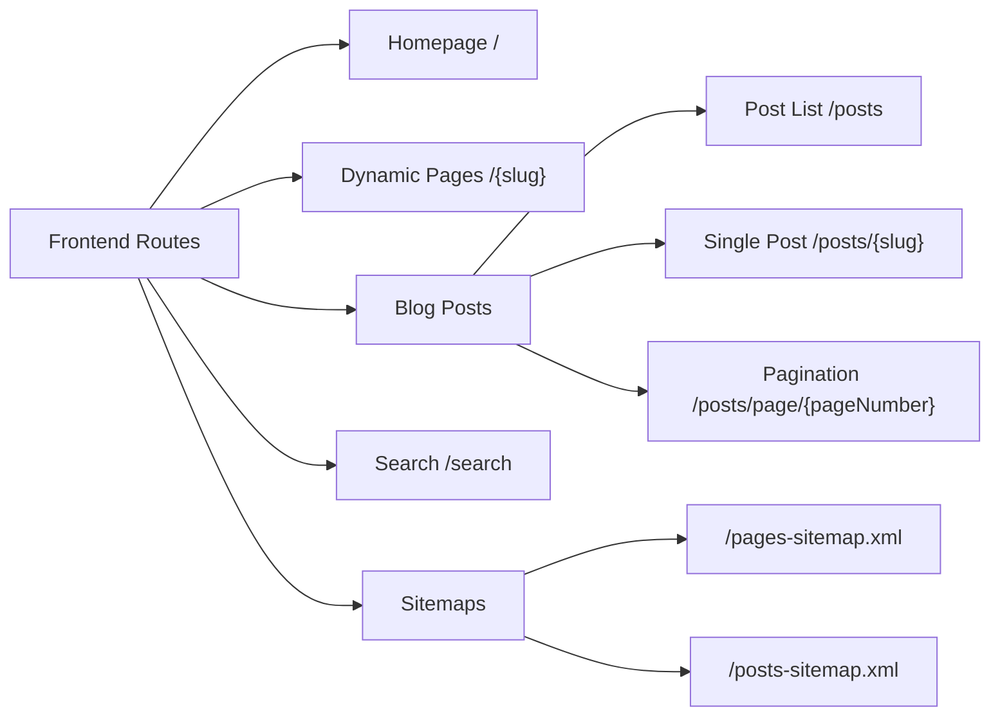

# Portfolio Blog 2025 - File Documentation

This document contains a comprehensive analysis of every file in the Payload CMS website template project.

## Project Structure Overview

## Configuration Files (Root Level)

### ✅ package.json
**Purpose**: Defines project metadata, dependencies, and scripts
**Key Dependencies**:
- **Payload CMS**: `payload@3.43.0` - The core CMS framework
- **Database**: `@payloadcms/db-postgres@3.43.0` - PostgreSQL adapter for database operations
- **Next.js**: `next@15.3.0` - The React framework for production
- **UI Libraries**: 
  - `@radix-ui/*` - Headless UI components
  - `lucide-react` - Icon library
  - `tailwindcss` - Utility-first CSS framework
- **Payload Plugins**:
  - `@payloadcms/plugin-form-builder` - Dynamic form creation
  - `@payloadcms/plugin-nested-docs` - Hierarchical document structure
  - `@payloadcms/plugin-redirects` - URL redirect management
  - `@payloadcms/plugin-search` - Search functionality
  - `@payloadcms/plugin-seo` - SEO optimization tools

**Scripts**:
- `dev`: Development server with deprecation warnings suppressed
- `build`: Production build using Next.js
- `postbuild`: Generates sitemap after build
- `generate:types`: Creates TypeScript types from Payload schema

### ✅ tsconfig.json
**Purpose**: TypeScript compiler configuration
**Key Features**:
- Strict mode enabled for type safety
- Path aliases configured (`@/*` maps to `./src/*`)
- ES2022 target with ESNext modules
- Special `@payload-config` alias for Payload configuration
- Next.js plugin integration

### ✅ next.config.js
**Purpose**: Next.js configuration with Payload integration
**Key Features**:
- Wrapped with `withPayload` for CMS integration
- Dynamic server URL configuration for different environments
- Image optimization configuration with remote patterns
- Redirect rules imported from separate file
- React strict mode enabled

### ✅ src/payload.config.ts
**Purpose**: Central Payload CMS configuration
**Architecture**:
- **Database**: PostgreSQL via `postgresAdapter`
- **Collections**: Pages, Posts, Media, Categories, Users
- **Globals**: Header, Footer (site-wide configuration)
- **Admin Panel**:
  - Custom components for login and dashboard
  - Live preview with responsive breakpoints
  - User authentication tied to Users collection
- **Media Processing**: Sharp integration for image optimization
- **Jobs**: Background task configuration with access control
- **TypeScript**: Auto-generates types to `payload-types.ts`

**Reference**: [Payload Config Documentation](https://payloadcms.com/docs/configuration/overview)

.
### ✅ .env.example
**Purpose**: Template for environment variables
**Key Variables**:
- `DATABASE_URI`: MongoDB or PostgreSQL connection string
- `PAYLOAD_SECRET`: JWT token encryption key
- `NEXT_PUBLIC_SERVER_URL`: Base URL for CORS and link generation
- `CRON_SECRET`: Authentication for scheduled jobs
- `PREVIEW_SECRET`: Live preview validation

### ✅ .editorconfig
**Purpose**: Ensures consistent coding styles across different editors
**Settings**:
- 2-space indentation
- UTF-8 encoding
- LF line endings
- Trailing whitespace trimming

### ✅ .gitignore
**Purpose**: Specifies intentionally untracked files
**Excludes**:
- Build outputs (`.next`, `dist`)
- Environment files (`.env`)
- Media uploads (`public/media/`)
- Generated sitemaps and robots.txt

### ✅ .npmrc
**Purpose**: npm configuration
**Settings**:
- `legacy-peer-deps=true`: Allows installation with peer dependency conflicts
- `enable-pre-post-scripts=true`: Enables pre/post scripts execution

### ✅ .prettierrc.json & .prettierignore
**Purpose**: Code formatting configuration
**Settings**:
- Single quotes
- Trailing commas
- 100 character line width
- No semicolons
**Ignores**: Generated files like `payload-types.ts`, build outputs

## Build and Style Configuration

### ✅ tailwind.config.mjs
**Purpose**: Tailwind CSS configuration
**Key Features**:
- Dark mode support via `[data-theme="dark"]` selector
- Custom color scheme using CSS variables
- Container configuration with responsive padding
- Typography plugin for rich text styling
- Animation utilities for accordions
- Safelist for dynamic classes
**Reference**: [Tailwind CSS Documentation](https://tailwindcss.com/docs)

### ✅ postcss.config.js
**Purpose**: PostCSS configuration for CSS processing
**Plugins**:
- `tailwindcss`: Processes Tailwind utilities
- `autoprefixer`: Adds vendor prefixes automatically

### ✅ eslint.config.mjs
**Purpose**: ESLint configuration for code quality
**Features**:
- Extends Next.js recommended rules
- TypeScript integration
- Custom rules for unused variables with underscore prefix
- Warnings for TypeScript comments and any types

### ✅ components.json
**Purpose**: shadcn/ui components configuration
**Settings**:
- Default style with CSS variables
- React Server Components enabled
- TypeScript support
- Component aliases pointing to `@/components`
- Utilities alias for UI helpers
**Reference**: [shadcn/ui Documentation](https://ui.shadcn.com/docs)

├── ✅ .editorconfig
├── ✅ .env
├── ✅ .env.example
├── ✅ .gitignore
├── ✅ .npmrc
├── ✅ .prettierignore
├── ✅ .prettierrc.json
├── .vscode
│   ├── ✅ extensions.json
│   ├── ✅ launch.json
│   └── ✅ settings.json
├── ✅ components.json
├── ✅ docker-compose.yml
├── ✅ Dockerfile

## VS Code Configuration

### ✅ .vscode/extensions.json
**Purpose**: Recommended VS Code extensions
**Extensions**:
- `dbaeumer.vscode-eslint`: ESLint integration
- `esbenp.prettier-vscode`: Prettier formatting

### ✅ .vscode/launch.json
**Purpose**: Debug configuration for VS Code
**Features**:
- Full stack Next.js debugging
- Automatic Chrome debugging integration
- Server inspection enabled

### ✅ .vscode/settings.json
**Purpose**: Workspace-specific VS Code settings
**Key Settings**:
- pnpm as package manager
- Prettier as default formatter
- Format on save enabled
- ESLint auto-fix on save
- TypeScript SDK path configuration

## Deployment Configuration

### ✅ docker-compose.yml
**Purpose**: Local development with Docker
**Services**:
- **payload**: Node.js 18 Alpine container
  - Port 3000 exposed
  - Volume mounts for code and node_modules
  - Runs `yarn install && yarn dev`
- **mongo**: MongoDB database
  - Port 27017 exposed
  - WiredTiger storage engine
  - Data persisted in volumes

### ✅ Dockerfile
**Purpose**: Production Docker image configuration
**Multi-stage Build**:
1. **deps**: Install dependencies with proper lockfile
2. **builder**: Build Next.js application
3. **runner**: Production image with minimal footprint
**Features**:
- Node.js 22.12.0 Alpine base
- Non-root user execution
- Standalone Next.js output
- Port 3000 exposed

### ✅ next-sitemap.config.cjs
**Purpose**: Sitemap generation configuration
**Features**:
- Dynamic site URL from environment
- Robots.txt generation
- Admin routes excluded from crawling
- Separate sitemaps for pages and posts
- Post-build execution via npm script

### ✅ redirects.js
**Purpose**: Next.js redirect rules
**Current Rules**:
- Internet Explorer incompatibility redirect
- Detects IE via user agent (Trident)
- Redirects to `/ie-incompatible.html`
├── docs
│   └── files.md
├── ✅ eslint.config.mjs
├── next-env.d.ts
├── ✅ next-sitemap.config.cjs
├── ✅ next.config.js
├── ✅ package.json

## Payload Collections

Collections define the data structure and behavior for groups of documents in Payload. Each collection has its own API endpoints, access control, and admin UI.

### ✅ src/collections/Categories.ts
**Purpose**: Category taxonomy for organizing posts
**Schema**:
- `title` (text, required): Category name
- `slug` (auto-generated): URL-friendly identifier
**Access Control**:
- Create/Update/Delete: Authenticated users only
- Read: Public access
**Features**:
- Uses `slugField()` utility for automatic slug generation
- Title field used as admin display title

### ✅ src/collections/Media.ts
**Purpose**: File upload and media management
**Schema**:
- `alt` (text): Alternative text for accessibility
- `caption` (rich text): Media description with formatting
- Auto-added: `filename`, `mimeType`, `filesize`
**Upload Configuration**:
- Static directory: `public/media`
- Focal point support for smart cropping
- Multiple image sizes:
  - `thumbnail`: 300px width
  - `square`: 500x500px
  - `small`: 600px width
  - `medium`: 900px width
  - `large`: 1400px width
  - `xlarge`: 1920px width
  - `og`: 1200x630px (Open Graph)
**Access Control**: Same as Categories
**Reference**: [Payload Uploads Documentation](https://payloadcms.com/docs/upload/overview)

### ✅ src/collections/Pages/index.ts
**Purpose**: Static pages management (homepage, about, etc.)
**Schema**:
- `title` (text, required): Page title
- `hero`: Hero section configuration
- `layout` (blocks): Flexible content blocks
  - CallToAction
  - Content 
  - MediaBlock
  - Archive
  - FormBlock
- `meta` (tab): SEO fields from plugin
- `publishedAt` (date): Publication control
- `slug` (auto-generated): URL path
**Features**:
- Draft/publish workflow with versioning
- Live preview support
- Scheduled publishing
- SEO plugin integration
- Automatic revalidation on changes
- Homepage special handling (slug: 'home' → path: '/')
**Hooks**:
- `populatePublishedAt`: Auto-sets publish date
- `revalidatePage`: Next.js cache revalidation

### ✅ src/collections/Posts/index.ts  
**Purpose**: Blog posts with rich content
**Schema**:
- `title` (text, required): Post title
- `heroImage` (upload): Featured image
- `content` (rich text): Lexical editor with:
  - Headings (h1-h4)
  - Banner, Code, MediaBlock blocks
  - Fixed/inline toolbars
  - Horizontal rules
- `relatedPosts` (relationship): Cross-references
- `categories` (relationship): Taxonomy
- `authors` (relationship): Multiple authors
- `populatedAuthors` (array): Denormalized author data
- `meta` (tab): SEO fields
- `publishedAt` (date): With time picker
- `slug` (auto-generated): URL path
**Features**:
- Rich text editing with custom blocks
- Author population hook for privacy
- Related posts with self-exclusion
- Same versioning/preview as Pages
**Reference**: [Lexical Rich Text Documentation](https://payloadcms.com/docs/rich-text/lexical)

### ✅ src/collections/Users/index.ts
**Purpose**: User authentication and management
**Schema**:
- `name` (text): Display name
- `email` (auto-added): Login credential
- `password` (auto-added): Hashed password
**Features**:
- Built-in authentication system
- All operations require authentication
- Used as admin panel users
- Timestamps automatically added
**Access Control**: All operations authenticated only
**Reference**: [Payload Authentication Documentation](https://payloadcms.com/docs/authentication/overview)
## Access Control Utilities

### ✅ src/access/anyone.ts
**Purpose**: Allow public access
**Returns**: Always `true`
**Usage**: Read operations on public content

### ✅ src/access/authenticated.ts
**Purpose**: Restrict to logged-in users
**Returns**: Boolean based on user presence
**Usage**: Admin operations, content creation/editing

### ✅ src/access/authenticatedOrPublished.ts
**Purpose**: Public read for published content, full access for authenticated
**Returns**: 
- `true` if user is authenticated
- Query constraint `{ _status: { equals: 'published' } }` for public
**Usage**: Read operations on Pages and Posts

## Global Configurations

Globals are single-document collections used for site-wide settings.

### ✅ src/Header/config.ts
**Purpose**: Site header navigation
**Schema**:
- `navItems` (array, max 6): Navigation links
  - Uses shared `link` field type
  - Custom row label component
**Features**:
- Public read access
- Revalidation hook for Next.js cache
- Collapsible admin UI

### ✅ src/Footer/config.ts
**Purpose**: Site footer navigation
**Schema**: Identical to Header
**Features**: Same as Header

**Reference**: [Payload Globals Documentation](https://payloadcms.com/docs/configuration/globals)

├── pnpm-lock.yaml
├── ✅ postcss.config.js
## Field Utilities

Reusable field configurations that provide consistent UI and behavior across collections.

### ✅ src/fields/link.ts
**Purpose**: Configurable link field with internal/external support
**Features**:
- Radio toggle between internal reference and custom URL
- Internal links relate to pages/posts
- New tab option
- Optional label field
- Appearance variants (default, outline)
- Conditional field visibility
**Usage**: Navigation items, CTAs, content links

### ✅ src/fields/linkGroup.ts
**Purpose**: Array of links wrapper
**Features**:
- Wraps link field in array
- Collapsed by default in admin
- Inherits link appearances
**Usage**: Multiple navigation items

### ✅ src/fields/defaultLexical.ts
**Purpose**: Default rich text editor configuration
**Features**:
- Basic formatting: Bold, Italic, Underline
- Paragraph support
- Link feature with internal page/post references
- Custom URL validation
**Usage**: Default editor for all rich text fields

### ✅ src/fields/slug/index.ts
**Purpose**: Auto-generated URL slugs with locking
**Returns**: Tuple of [slugField, slugLockCheckbox]
**Features**:
- Auto-generates from specified field (default: 'title')
- Lock checkbox to prevent auto-updates
- Custom slug component UI
- Format hook for consistent slugs
- Indexed for performance
**Usage**: Pages, Posts, Categories

## Plugin Configuration

### ✅ src/plugins/index.ts
**Purpose**: Central plugin configuration
**Active Plugins**:

1. **redirectsPlugin**:
   - URL redirect management
   - Collections: pages, posts
   - Rebuild notice on changes
   - Revalidation hook

2. **nestedDocsPlugin**:
   - Hierarchical categories
   - Breadcrumb URL generation

3. **seoPlugin**:
   - Meta title/description management
   - Open Graph support
   - Auto-generation functions
   - Title format: `{title} | Payload Website Template`

4. **formBuilderPlugin**:
   - Dynamic form creation
   - Payment fields disabled
   - Rich text confirmation messages

5. **searchPlugin**:
   - Post search functionality
   - Custom field overrides
   - Before sync hook

6. **payloadCloudPlugin**:
   - Payload Cloud integration

**References**:
- [Payload Plugins Documentation](https://payloadcms.com/docs/plugins/overview)
- [SEO Plugin](https://payloadcms.com/docs/plugins/seo)
- [Form Builder Plugin](https://payloadcms.com/docs/plugins/form-builder)

├── public
│   ├── favicon.ico
│   ├── favicon.svg
│   └── website-template-OG.webp
├── README.md
├── ✅ redirects.js
## Content Blocks

Reusable content blocks that can be composed in the layout field of Pages and content field of Posts.

### ✅ src/blocks/CallToAction/config.ts
**Purpose**: CTA section with rich text and buttons
**Fields**:
- `richText`: Heading and description content
- `links`: Up to 2 CTA buttons (default/outline styles)
**Features**: Lexical editor with headings, toolbars

### ✅ src/blocks/Content/config.ts
**Purpose**: Multi-column content layout
**Fields**:
- `columns` (array): Each column has:
  - `size`: oneThird, half, twoThirds, full
  - `richText`: Column content
  - `enableLink`: Toggle for link
  - `link`: Optional CTA link
**Features**: Flexible grid layouts

### ✅ src/blocks/MediaBlock/config.ts
**Purpose**: Simple media embed
**Fields**:
- `media` (upload, required): Media file reference
**Usage**: Images, videos in content

### ✅ src/blocks/Form/config.ts
**Purpose**: Embed forms from Form Builder plugin
**Fields**:
- `form` (relationship): Link to forms collection
- `enableIntro`: Toggle intro content
- `introContent`: Rich text above form
**Features**: Dynamic form rendering

### ✅ src/blocks/ArchiveBlock/config.ts
**Purpose**: Dynamic post listings
**Fields**:
- `introContent`: Section introduction
- `populateBy`: 'collection' or 'selection'
- Collection mode:
  - `relationTo`: Currently 'posts' only
  - `categories`: Filter by categories
  - `limit`: Number of posts
- Selection mode:
  - `selectedDocs`: Manual post selection
**Usage**: Blog listings, featured posts

### ✅ src/blocks/Banner/config.ts
**Purpose**: Alert/notification banners
**Fields**:
- `style`: info, warning, error, success
- `content`: Rich text message
**Usage**: Inline notifications in posts

### ✅ src/blocks/Code/config.ts
**Purpose**: Syntax-highlighted code blocks
**Fields**:
- `language`: typescript, javascript, css
- `code`: Code content
**Usage**: Technical blog posts

### ✅ src/blocks/RelatedPosts/*
**Purpose**: Display related posts grid
**Usage**: End of blog posts

### ✅ src/blocks/RenderBlocks.tsx
**Purpose**: Dynamic block renderer component
**Features**: Maps block types to React components

├── src
│   ├── access
│   │   ├── ✅ anyone.ts
│   │   ├── ✅ authenticated.ts
│   │   └── ✅ authenticatedOrPublished.ts
│   ├── app
│   │   ├── (frontend)
│   │   └── (payload)
│   ├── blocks
│   │   ├── ✅ ArchiveBlock
│   │   ├── ✅ Banner
│   │   ├── ✅ CallToAction
│   │   ├── ✅ Code
│   │   ├── ✅ Content
│   │   ├── ✅ Form
│   │   ├── ✅ MediaBlock
│   │   ├── ✅ RelatedPosts
│   │   └── ✅ RenderBlocks.tsx

## Hero Configurations

### ✅ src/heros/config.ts
**Purpose**: Hero section field configuration
**Field Type**: Group field for pages
**Options**:
- `none`: No hero section
- `lowImpact`: Text and links only
- `mediumImpact`: Text, links, and media
- `highImpact`: Full-width with media background
**Fields**:
- `type`: Hero variant selection
- `richText`: Hero content with headings
- `links`: Up to 2 CTA buttons
- `media`: Required for high/medium impact

## App Routes Structure

### Frontend Routes (src/app/(frontend))

#### Key Frontend Routes:
- **/** - Homepage (renders page with slug 'home')
- **/[slug]** - Dynamic page routing
- **/posts** - Blog listing with pagination
- **/posts/[slug]** - Individual blog posts
- **/search** - Search results page
- **/next/preview** - Preview mode handling
- **/next/exit-preview** - Exit preview mode

### Admin/API Routes (src/app/(payload))

#### Admin Panel:
- **/admin/[[...segments]]** - Payload admin UI
- Custom SCSS styling in `custom.scss`
- Import map for dynamic imports

#### API Endpoints:
- **/api/[...slug]** - REST API catch-all
- **/api/graphql** - GraphQL endpoint
- **/api/graphql-playground** - GraphQL playground UI
│   ├── collections
│   │   ├── ✅ Categories.ts
│   │   ├── ✅ Media.ts
│   │   ├── ✅ Pages
│   │   ├── ✅ Posts
│   │   └── ✅ Users
│   ├── components
│   │   ├── AdminBar
│   │   ├── BeforeDashboard
│   │   ├── BeforeLogin
│   │   ├── Card
│   │   ├── CollectionArchive
│   │   ├── Link
│   │   ├── LivePreviewListener
│   │   ├── Logo
│   │   ├── Media
│   │   ├── PageRange
│   │   ├── Pagination
│   │   ├── PayloadRedirects
│   │   ├── RichText
│   │   └── ui
│   ├── cssVariables.js
│   ├── endpoints
│   │   └── seed
│   ├── environment.d.ts
│   ├── fields
│   │   ├── ✅ defaultLexical.ts
│   │   ├── ✅ link.ts
│   │   ├── ✅ linkGroup.ts
│   │   └── ✅ slug
│   ├── Footer
│   │   ├── Component.tsx
│   │   ├── ✅ config.ts
│   │   ├── hooks
│   │   └── RowLabel.tsx
│   ├── Header
│   │   ├── Component.client.tsx
│   │   ├── Component.tsx
│   │   ├── ✅ config.ts
│   │   ├── hooks
│   │   ├── Nav
│   │   └── RowLabel.tsx
│   ├── heros
│   │   ├── ✅ config.ts
│   │   ├── HighImpact
│   │   ├── LowImpact
│   │   ├── MediumImpact
│   │   ├── PostHero
│   │   └── RenderHero.tsx
│   ├── hooks
│   │   ├── ✅ formatSlug.ts
│   │   ├── ✅ populatePublishedAt.ts
│   │   └── ✅ revalidateRedirects.ts

## Hooks

Custom hooks for data manipulation and side effects.

### ✅ src/hooks/populatePublishedAt.ts
**Purpose**: Auto-populate publish date on create/update
**Type**: CollectionBeforeChangeHook
**Logic**: Sets current date if publishedAt is empty

### ✅ src/hooks/formatSlug.ts
**Purpose**: Format slugs consistently
**Type**: FieldHook
**Features**:
- Replaces spaces with hyphens
- Removes non-alphanumeric characters
- Converts to lowercase
- Falls back to specified field value

### ✅ src/hooks/revalidateRedirects.ts
**Purpose**: Revalidate Next.js redirect cache
**Type**: CollectionAfterChangeHook
**Action**: Tags 'redirects' for revalidation
│   ├── payload-types.ts
│   ├── ✅ payload.config.ts
│   ├── plugins
│   │   └── ✅ index.ts
│   ├── providers
│   │   ├── HeaderTheme
│   │   ├── index.tsx
│   │   └── Theme
│   ├── search
│   │   ├── beforeSync.ts
│   │   ├── Component.tsx
│   │   └── fieldOverrides.ts
│   └── utilities
│       ├── canUseDOM.ts
│       ├── deepMerge.ts
│       ├── formatAuthors.ts
│       ├── formatDateTime.ts
│       ├── ✅ generateMeta.ts
│       ├── ✅ generatePreviewPath.ts
│       ├── getDocument.ts
│       ├── getGlobals.ts
│       ├── getMediaUrl.ts
│       ├── getMeUser.ts
│       ├── getRedirects.ts
│       ├── ✅ getURL.ts
│       ├── mergeOpenGraph.ts
│       ├── toKebabCase.ts
│       ├── ui.ts
│       ├── useClickableCard.ts
│       └── useDebounce.ts

## Key Utilities

### ✅ src/utilities/generateMeta.ts
**Purpose**: Generate Next.js metadata for SEO
**Features**:
- Extracts meta from pages/posts
- Handles Open Graph images
- Falls back to default OG image
- Appends site name to titles

### ✅ src/utilities/generatePreviewPath.ts
**Purpose**: Create preview URLs for draft content
**Features**:
- Encodes collection and slug parameters
- Uses preview secret for security
- Maps collections to URL prefixes

### ✅ src/utilities/getURL.ts
**Purpose**: Get server/client URLs dynamically
**Functions**:
- `getServerSideURL()`: Server-side URL detection
- `getClientSideURL()`: Client-side URL detection
**Features**:
- Vercel environment support
- Fallback to localhost
- Protocol detection

## Summary

This Payload CMS website template provides a complete, production-ready foundation for building dynamic websites with:

- **Content Management**: Pages, Posts, Media, Categories
- **Rich Editing**: Lexical editor with custom blocks
- **SEO**: Built-in SEO plugin with meta management
- **Forms**: Dynamic form builder
- **Authentication**: User management system
- **Preview**: Live preview for drafts
- **Search**: Post search functionality
- **Performance**: Next.js ISR with revalidation
- **Developer Experience**: TypeScript, ESLint, Prettier

The architecture follows Payload CMS best practices with:
- Clear separation of concerns
- Reusable field configurations
- Modular block system
- Comprehensive access control
- Hook-based side effects
- Type-safe development

├── ✅ tailwind.config.mjs
└── ✅ tsconfig.json
