# Frontend Architecture Documentation - Portfolio Blog 2025

## Table of Contents
1. [Architecture Overview](#architecture-overview)
2. [Component System](#component-system)
3. [Content Blocks System](#content-blocks-system)
4. [Page Architecture](#page-architecture)
5. [Design System Implementation](#design-system-implementation)
6. [State Management](#state-management)
7. [Performance Patterns](#performance-patterns)
8. [Development Guidelines](#development-guidelines)

## Architecture Overview

### Next.js App Router Structure

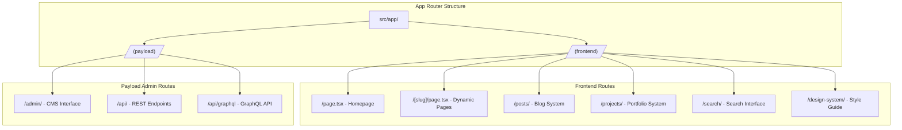

### Component Architecture Hierarchy

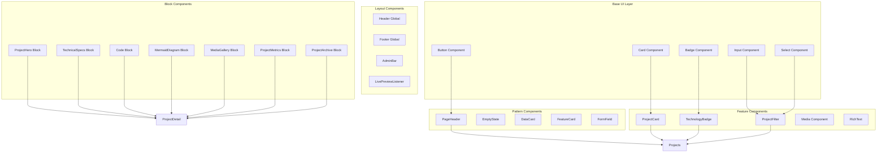

## Component System

### Core UI Components

#### Button Component
**Location**: `src/components/ui/button.tsx`

**Variants**:
```typescript
type ButtonVariants = {
  variant: 'default' | 'destructive' | 'outline' | 'secondary' | 'ghost' | 'link'
  size: 'default' | 'sm' | 'lg' | 'icon'
}
```

**Usage Examples**:
```tsx
<Button variant="default">Primary Action</Button>
<Button variant="outline" size="lg">Secondary Action</Button>
<Button variant="ghost" size="icon"><Search /></Button>
```

#### Card Component
**Location**: `src/components/ui/card.tsx`

**Composition**:
```tsx
<Card>
  <CardHeader>
    <CardTitle>Title</CardTitle>
    <CardDescription>Description</CardDescription>
  </CardHeader>
  <CardContent>Content</CardContent>
  <CardFooter>Actions</CardFooter>
</Card>
```

#### Badge Component
**Location**: `src/components/ui/badge.tsx`

**Variants**: `default`, `secondary`, `destructive`, `outline`

### Pattern Components

#### PageHeader Component
**Location**: `src/components/patterns/page-header.tsx`

**Features**:
- Animated title and description
- Support for action buttons
- Responsive typography
- Optional breadcrumbs

**Usage**:
```tsx
<PageHeader 
  title="Projects"
  description="Explore my portfolio of web applications"
>
  <Button>Get Started</Button>
</PageHeader>
```

#### EmptyState Component
**Location**: `src/components/patterns/empty-state.tsx`

**Features**:
- Icon support
- Action buttons
- Link integration
- Consistent messaging

**Usage**:
```tsx
<EmptyState
  icon={FileText}
  title="No projects found"
  description="Try adjusting your search criteria"
  action={{
    label: "Browse All Projects",
    href: "/projects"
  }}
/>
```

### Feature Components

#### ProjectCard Component
**Location**: `src/components/ProjectCard/index.tsx`

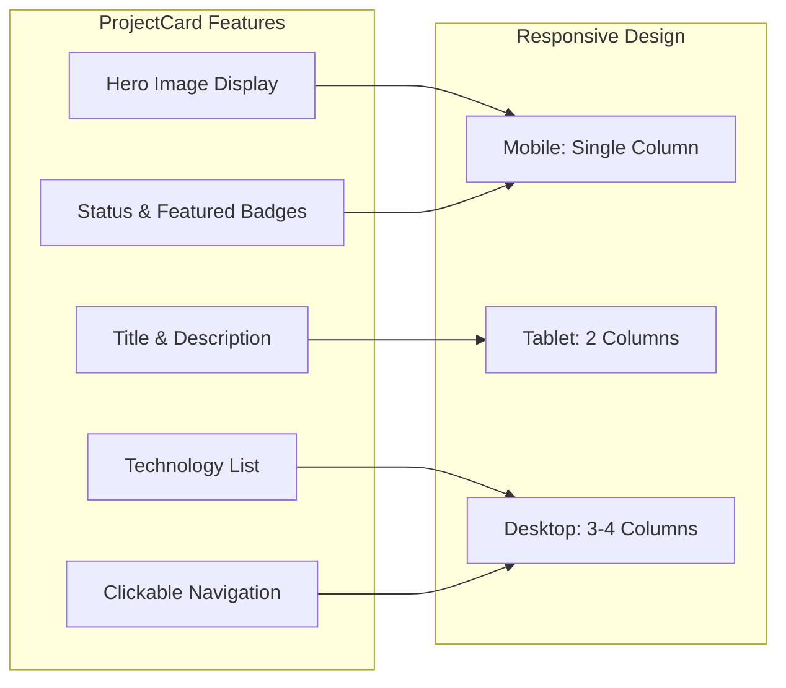

**Key Features**:
- Responsive image display with fallbacks
- Status badges (completed, in-progress, archived)
- Featured project highlighting
- Technology stack display
- Hover animations and transitions
- SEO-optimized clickable areas

#### ProjectFilter Component
**Location**: `src/components/ProjectFilter/index.tsx`

**Filter Capabilities**:
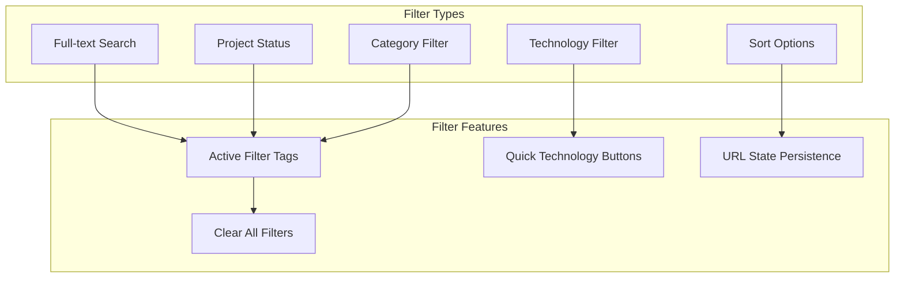

**Usage**:
```tsx
<ProjectFilter
  technologies={technologies}
  categories={categories}
  className="mb-12"
/>
```

#### TechnologyBadge Component
**Location**: `src/components/TechnologyBadge.tsx`

**Component Variants**:
- `TechnologyBadge` - Individual badge
- `TechnologyList` - Horizontal list of badges
- `TechnologyGrid` - Grid layout with descriptions

**Features**:
- Icon integration with technology data
- Brand color theming
- Click handlers for navigation
- Multiple size variants
- Description support

## Content Blocks System

### Block Architecture

```mermaid
graph TB
    subgraph "Block Categories"
        Hero[Hero Blocks]
        Content[Content Blocks]
        Media[Media Blocks]
        Data[Data Blocks]
        Interactive[Interactive Blocks]
    end
    
    subgraph "Project Hero Blocks"
        ProjectHero[ProjectHero]
    end
    
    subgraph "Content Blocks"
        TechnicalSpecs[TechnicalSpecs]
        ContentBlock[Content]
        CodeBlock[Code]
    end
    
    subgraph "Media Blocks"
        MediaGallery[MediaGallery]
        MediaBlock[MediaBlock]
        MermaidDiagram[MermaidDiagram]
    end
    
    subgraph "Data Blocks"
        ProjectMetrics[ProjectMetrics]
        ProjectArchive[ProjectArchive]
    end
    
    subgraph "Interactive Blocks"
        CallToAction[CallToAction]
        FormBlock[Form]
        Banner[Banner]
    end
    
    Hero --> ProjectHero
    Content --> TechnicalSpecs
    Content --> ContentBlock
    Content --> CodeBlock
    Media --> MediaGallery
    Media --> MediaBlock
    Media --> MermaidDiagram
    Data --> ProjectMetrics
    Data --> ProjectArchive
    Interactive --> CallToAction
    Interactive --> FormBlock
    Interactive --> Banner
```

### Available Blocks

#### 1. ProjectHero Block
**Location**: `src/blocks/ProjectHero/`

**Fields**:
- `title` - Hero title (defaults to project title)
- `subtitle` - Optional tagline
- `backgroundImage` - Background image with overlay
- `stats` - Key project statistics array
- `content` - Rich text content

**Usage**: Hero sections for project showcases with statistics and compelling visuals.

#### 2. TechnicalSpecs Block
**Location**: `src/blocks/TechnicalSpecs/`

**Fields**:
- `architecture` - System architecture (rich text)
- `requirements` - Categorized requirements array
- `deployment` - Deployment strategy (rich text)
- `performance` - Performance metrics object

**Categories**: System, Software, Hardware, Network, Security, Performance

#### 3. Code Block (Enhanced)
**Location**: `src/blocks/Code/`

**Features**:
- **25+ Programming Languages**: TypeScript, JavaScript, Python, Java, C++, Go, Rust, PHP, Ruby, Swift, Kotlin, SQL, HTML, CSS, SCSS, JSON, YAML, XML, Markdown, Bash, PowerShell, Docker
- **Filename Display**: Optional filename with header styling
- **Line Highlighting**: Support for ranges (e.g., "1,3,5-7")
- **Syntax Highlighting**: Prism.js integration with dark theme
- **Copy Functionality**: One-click code copying

**Usage Example**:
```yaml
language: typescript
filename: "api/users.ts"
highlightLines: "1,5-8,12"
description: "User authentication endpoint"
code: |
  export async function POST(request: Request) {
    const { email, password } = await request.json()
    // Authentication logic here
  }
```

#### 4. MermaidDiagram Block
**Location**: `src/blocks/MermaidDiagram/`

**Diagram Types**:
- Flowchart
- Sequence Diagram
- Class Diagram
- State Diagram
- Entity Relationship
- Gantt Chart
- Git Graph
- User Journey
- Pie Chart

**Features**:
- Client-side rendering to avoid SSR issues
- Dark theme configuration
- Error handling with code inspection
- Loading states

#### 5. MediaGallery Block
**Location**: `src/blocks/MediaGallery/`

**Layout Options**:
- **Grid**: 2, 3, or 4 columns with aspect ratio control
- **Carousel**: Interactive slider with navigation
- **Masonry**: Pinterest-style layout

**Features**:
- Caption support (overlay or below)
- Responsive image sizing
- Lightbox integration
- Alt text for accessibility

#### 6. ProjectMetrics Block
**Location**: `src/blocks/ProjectMetrics/`

**Layout Types**:
- Cards - Visual metric cards
- List - Compact list view
- Grid - Auto-adjusting grid

**Metric Properties**:
- Label, value, unit, description
- Optional icons
- Color theming (7 color themes)

#### 7. ProjectArchive Block
**Location**: `src/blocks/ProjectArchive/`

**Population Methods**:
- Collection-based with filtering
- Manual project selection

**Filter Options**:
- Categories, technologies, status
- Featured-only option
- Sort methods

**Display Styles**:
- Grid, List, Cards
- Column configuration
- Pagination support

### Block Rendering System

**Location**: `src/blocks/RenderBlocks.tsx`

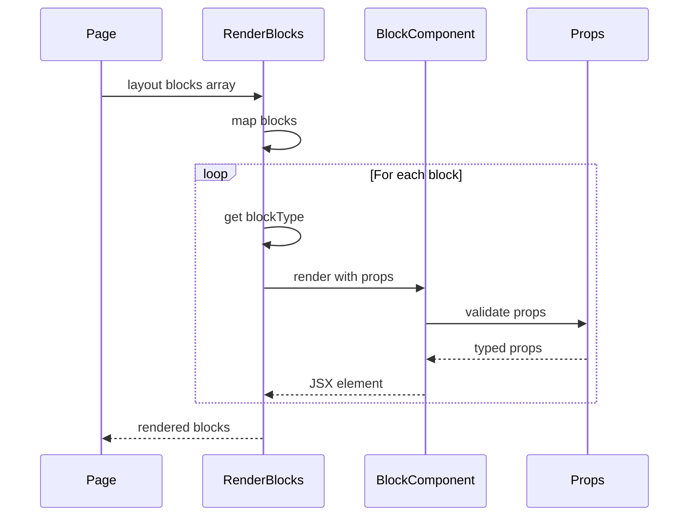

## Page Architecture

### Project Pages

#### Projects Listing Page
**Location**: `src/app/(frontend)/projects/page.tsx`

**Features**:
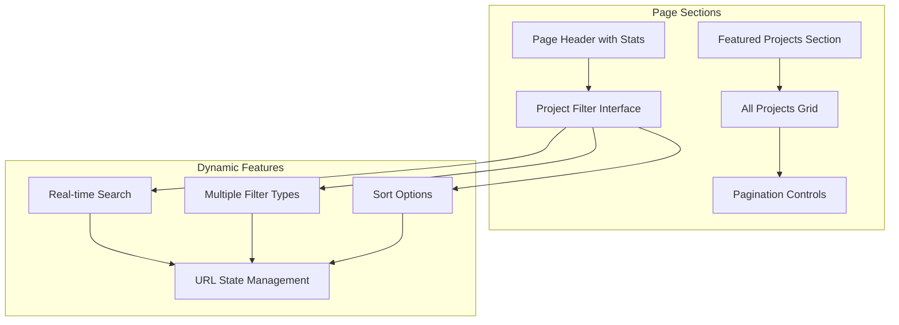

**Query Parameters**:
- `search` - Full-text search
- `status` - Project status filter
- `technology` - Technology slug filter
- `category` - Category slug filter
- `sort` - Sort method
- `page` - Pagination

#### Project Detail Page
**Location**: `src/app/(frontend)/projects/[slug]/page.tsx`

**Components**:
- `ProjectHero` - Hero section with metadata
- `ProjectContent` - Block-based content rendering
- `RelatedProjects` - Intelligent project suggestions

**Features**:
- Static generation with ISR
- Deep relationship population (depth: 3)
- SEO meta generation
- Live preview support
- Related projects based on technologies/categories

#### Technology Filter Pages
**Location**: `src/app/(frontend)/projects/technology/[slug]/page.tsx`

**Features**:
- Technology showcase with icon and description
- Filtered project results
- Related technologies display
- External links (official website, documentation)

#### Category Filter Pages
**Location**: `src/app/(frontend)/projects/category/[slug]/page.tsx`

**Features**:
- Category branding with colors
- Category hierarchy navigation
- Cross-category discovery
- Icon support with fallbacks

### Static Generation Strategy

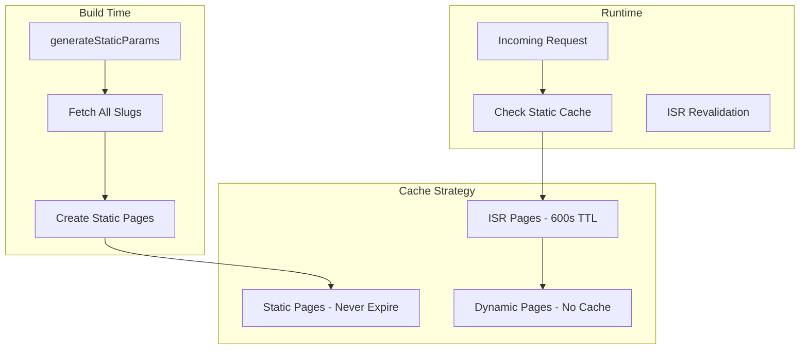

## Design System Implementation

### Theme System

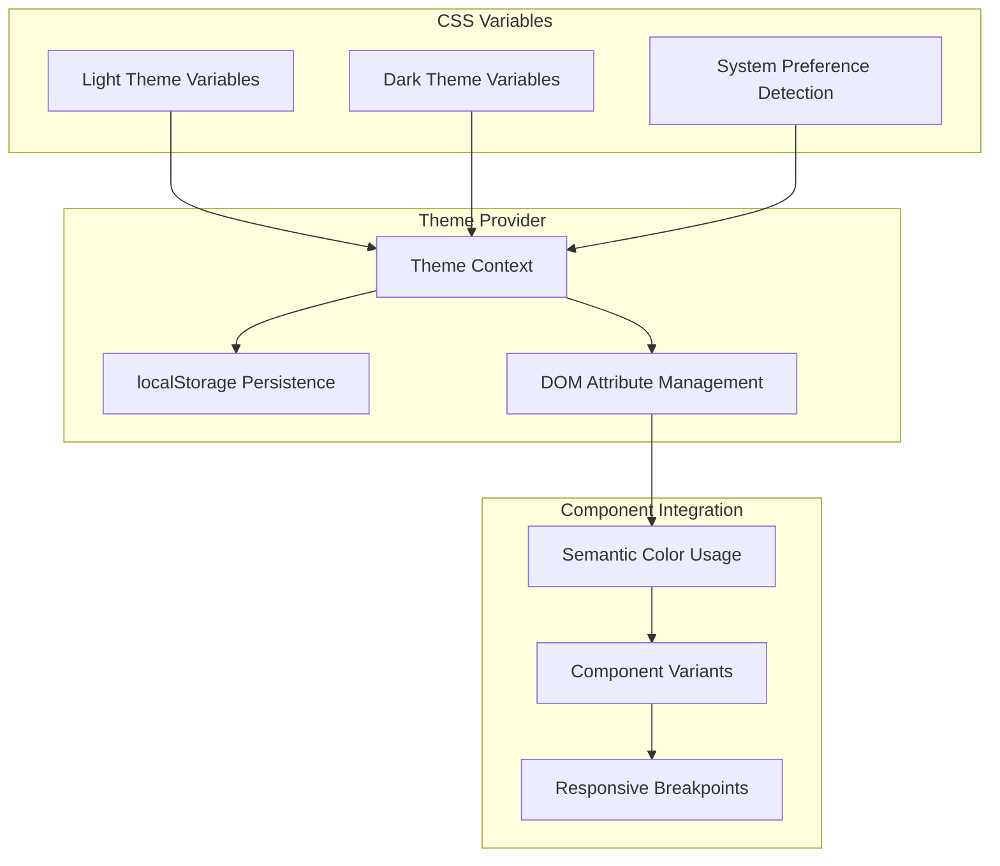

### Brand Colors (Perplexity-Inspired)

```css
:root {
  /* Perplexity Brand Colors */
  --perplexity-true-turquoise: #20808D;
  --perplexity-plex-blue: #1FB8CD;
  --perplexity-darker-peacock: #1A6B73;
  --perplexity-peacock: #218B94;
  --perplexity-inky-blue: #0C2B33;
  --perplexity-paper-white: #FEFEFE;
  --perplexity-offblack: #0A0F0F;
}
```

### Typography System

**Fonts**:
- **Space Grotesk** - Headings and body text
- **Space Mono** - Code blocks and monospace

**Scale**:
- Display: 61px (Hero sections)
- H1: 49px (Page titles)
- H2: 39px (Section headings)
- H3: 31px (Subsections)
- Body: 16px (Regular content)
- Small: 13px (Captions)

### Component Styling Patterns

**Utility Classes**:
```css
/* Spacing System (8px grid) */
.p-4    /* 16px padding */
.p-6    /* 24px padding */
.p-8    /* 32px padding */
.gap-4  /* 16px gap */
.gap-6  /* 24px gap */

/* Layout Patterns */
.container-content   /* Max-width content container */
.section-spacing     /* Standard section padding */
.content-spacing     /* Content element spacing */
```

## State Management

### State Architecture

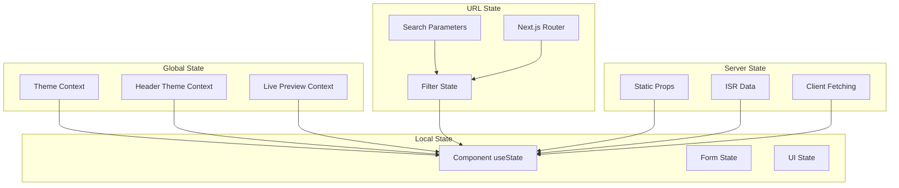

### State Management Patterns

#### Theme State
```typescript
const { theme, setTheme, resolvedTheme } = useTheme()
// theme: 'light' | 'dark' | 'system'
// resolvedTheme: 'light' | 'dark'
```

#### URL State Management
```typescript
const updateFilters = useCallback((updates: Record<string, string | null>) => {
  const params = new URLSearchParams(searchParams.toString())
  Object.entries(updates).forEach(([key, value]) => {
    if (value) params.set(key, value)
    else params.delete(key)
  })
  router.push(`/projects?${params.toString()}`)
}, [searchParams, router])
```

## Performance Patterns

### Optimization Strategies

```mermaid
graph TB
    subgraph "Build Optimization"
        SSG[Static Site Generation]
        ISR[Incremental Static Regeneration]
        TreeShaking[Tree Shaking]
        CodeSplitting[Code Splitting]
    end
    
    subgraph "Runtime Optimization"
        LazyLoading[Lazy Loading]
        ImageOptimization[Image Optimization]
        Caching[Response Caching]
        Prefetching[Link Prefetching]
    end
    
    subgraph "Client Optimization"
        ComponentMemo[React.memo]
        UseMemo[useMemo]
        UseCallback[useCallback]
        DynamicImports[Dynamic Imports]
    end
    
    SSG --> ISR
    ISR --> TreeShaking
    TreeShaking --> CodeSplitting
    
    LazyLoading --> ImageOptimization
    ImageOptimization --> Caching
    Caching --> Prefetching
    
    ComponentMemo --> UseMemo
    UseMemo --> UseCallback
    UseCallback --> DynamicImports
```

### Image Optimization

```typescript
<Media
  resource={heroImage}
  size="(max-width: 768px) 100vw, (max-width: 1200px) 50vw, 33vw"
  className="object-cover w-full h-full"
  priority={isAboveFold}
/>
```

### Dynamic Imports

```typescript
// Mermaid diagram client-side loading
const MermaidDiagram = dynamic(() => import('./Component.client'), {
  loading: () => <div>Loading diagram...</div>,
  ssr: false
})
```

## Development Guidelines

### Component Development Workflow

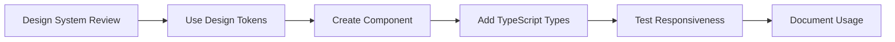

### Best Practices

#### 1. Component Structure
```typescript
// Component props interface
interface ComponentProps {
  className?: string
  variant?: 'default' | 'secondary'
  size?: 'sm' | 'md' | 'lg'
  children?: React.ReactNode
}

// Component implementation
export const Component: React.FC<ComponentProps> = ({
  className,
  variant = 'default',
  size = 'md',
  children,
}) => {
  return (
    <div className={cn(
      'base-styles',
      variantStyles[variant],
      sizeStyles[size],
      className
    )}>
      {children}
    </div>
  )
}
```

#### 2. Styling Guidelines
- Use semantic CSS variables
- Follow the 8px spacing grid
- Implement mobile-first responsive design
- Maintain consistent hover/focus states
- Ensure WCAG AA contrast ratios

#### 3. Performance Guidelines
- Use Server Components by default
- Client Components only for interactivity
- Implement proper loading states
- Optimize images and media
- Use React.memo for expensive components

### File Organization

```
src/
├── app/                    # Next.js App Router
├── components/
│   ├── ui/                # Base UI components
│   ├── patterns/          # Reusable patterns
│   └── feature/           # Feature-specific components
├── blocks/                # Content blocks
├── providers/             # React contexts
├── utilities/             # Helper functions
└── styles/               # Global styles
```

This frontend architecture provides a solid foundation for building scalable, performant, and maintainable React applications with PayloadCMS integration. The component system is designed for reusability, the design system ensures consistency, and the performance patterns optimize for production deployment.