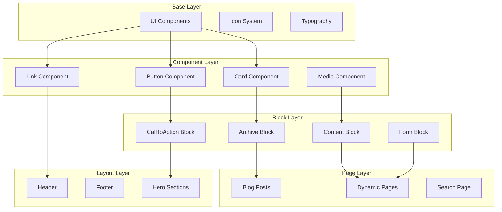
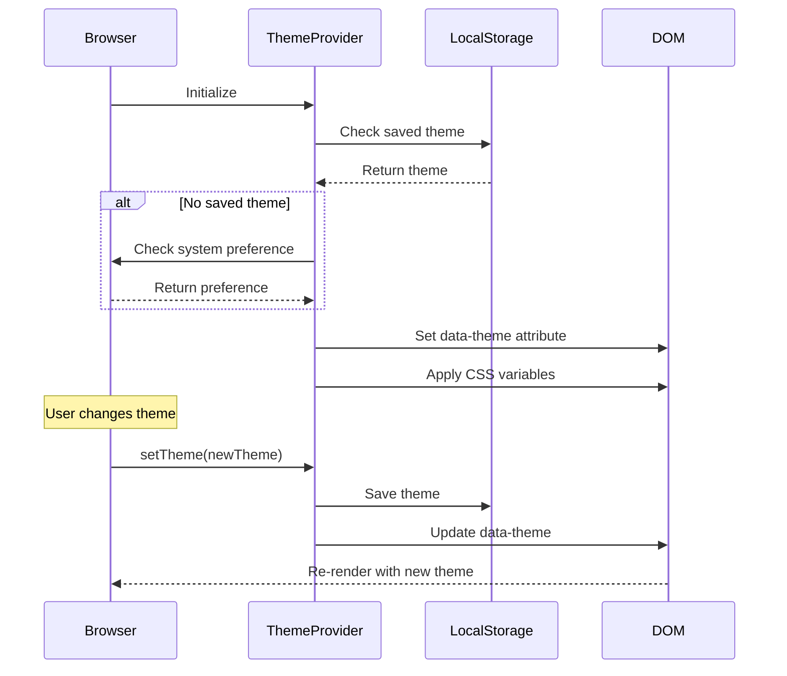
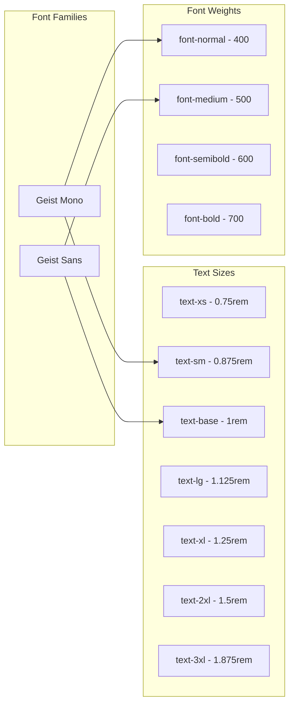
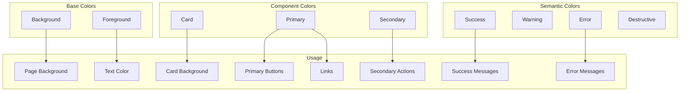
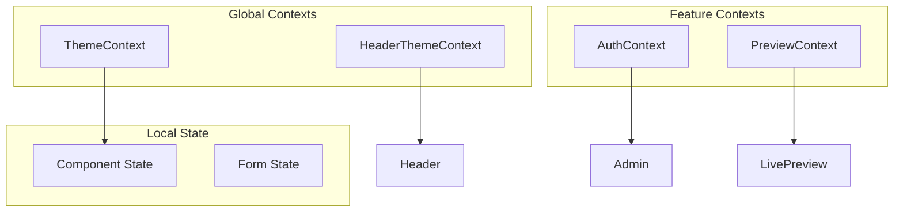
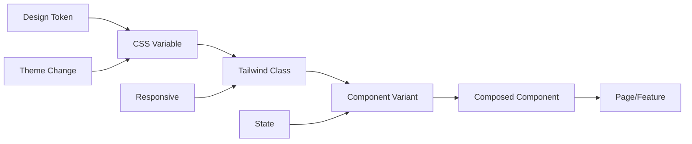

# Frontend Architecture & Theming System

This document provides a comprehensive guide to the frontend architecture, component system, and theming approach used in the Portfolio Blog 2025 project.

## Table of Contents

1. [Component Architecture](#component-architecture)
2. [Theming System](#theming-system)
3. [Design System](#design-system)
4. [Component Patterns](#component-patterns)
5. [State Management](#state-management)
6. [Performance Patterns](#performance-patterns)

## Component Architecture

### Directory Structure

```
src/
├── app/
│   ├── (frontend)/          # Public-facing routes
│   │   ├── layout.tsx       # Root layout with providers
│   │   ├── globals.css      # Global styles & CSS variables
│   │   ├── page.tsx         # Homepage
│   │   ├── [slug]/          # Dynamic pages
│   │   └── posts/           # Blog posts
│   └── (payload)/           # Admin panel routes
├── components/              # Shared components
│   ├── ui/                  # Base UI components
│   ├── blocks/              # Content blocks
│   └── ...                  # Feature components
├── providers/               # React context providers
└── utilities/               # Helper functions
```

### Component Hierarchy



## Theming System

### CSS Variables Architecture

The theming system is built on CSS custom properties (variables) that enable dynamic theme switching and consistent design tokens across the application.

#### Core Variables Structure

```css
/* Light Theme (Default) */
:root {
  /* Colors */
  --background: 0 0% 100%;          /* White */
  --foreground: 222.2 84% 4.9%;     /* Dark blue/black */
  
  /* Card colors */
  --card: 240 5% 96%;               /* Light gray */
  --card-foreground: 222.2 84% 4.9%;
  
  /* Primary colors */
  --primary: 222.2 47.4% 11.2%;     /* Dark blue */
  --primary-foreground: 210 40% 98%;
  
  /* Secondary colors */
  --secondary: 210 40% 96.1%;
  --secondary-foreground: 222.2 47.4% 11.2%;
  
  /* UI colors */
  --muted: 210 40% 96.1%;
  --muted-foreground: 215.4 16.3% 46.9%;
  --accent: 210 40% 96.1%;
  --accent-foreground: 222.2 47.4% 11.2%;
  
  /* Semantic colors */
  --destructive: 0 84.2% 60.2%;     /* Red */
  --success: 196 52% 74%;           /* Green */
  --warning: 34 89% 85%;            /* Yellow */
  --error: 10 100% 86%;             /* Red variant */
  
  /* Borders & inputs */
  --border: 240 6% 80%;
  --input: 214.3 31.8% 91.4%;
  --ring: 222.2 84% 4.9%;
  
  /* Radius */
  --radius: 0.2rem;
}

/* Dark Theme */
[data-theme='dark'] {
  --background: 0 0% 0%;            /* Black */
  --foreground: 210 40% 98%;        /* Light gray */
  
  --card: 0 0% 4%;                  /* Near black */
  --card-foreground: 210 40% 98%;
  
  /* Inverted primary/secondary */
  --primary: 210 40% 98%;
  --primary-foreground: 222.2 47.4% 11.2%;
  
  /* Adjusted semantic colors for dark mode */
  --success: 196 100% 14%;
  --warning: 34 51% 25%;
  --error: 10 39% 43%;
}
```

### Theme Provider Implementation



### Theme Context Structure

```typescript
// Theme types
export type Theme = 'light' | 'dark'

// Context type
export interface ThemeContextType {
  theme: Theme | undefined
  setTheme: (theme: Theme | null) => void
}

// Provider pattern
export const ThemeProvider: React.FC<{children: React.ReactNode}> = ({children}) => {
  // Theme state management
  // System preference detection
  // LocalStorage persistence
  // DOM attribute management
}
```

## Design System

### Component Variants System

Using `class-variance-authority` (CVA) for type-safe component variants:

```typescript
// Button variants example
const buttonVariants = cva(
  // Base styles
  'inline-flex items-center justify-center whitespace-nowrap rounded text-sm font-medium ring-offset-background transition-colors focus-visible:outline-none focus-visible:ring-2 focus-visible:ring-ring focus-visible:ring-offset-2 disabled:pointer-events-none disabled:opacity-50',
  {
    variants: {
      variant: {
        default: 'bg-primary text-primary-foreground hover:bg-primary/90',
        destructive: 'bg-destructive text-destructive-foreground hover:bg-destructive/90',
        outline: 'border border-border bg-background hover:bg-card hover:text-accent-foreground',
        secondary: 'bg-secondary text-secondary-foreground hover:bg-secondary/80',
        ghost: 'hover:bg-card hover:text-accent-foreground',
        link: 'text-primary underline-offset-4 hover:underline',
      },
      size: {
        default: 'h-10 px-4 py-2',
        sm: 'h-9 rounded px-3',
        lg: 'h-11 rounded px-8',
        icon: 'h-10 w-10',
      },
    },
    defaultVariants: {
      variant: 'default',
      size: 'default',
    },
  }
)
```

### Typography System



### Color Palette Usage



## Component Patterns

### Composable Components

The component system follows a composable pattern where complex components are built from simpler ones:

```typescript
// Base component composition
<Card>
  <CardHeader>
    <CardTitle>Title</CardTitle>
    <CardDescription>Description</CardDescription>
  </CardHeader>
  <CardContent>
    {/* Content */}
  </CardContent>
  <CardFooter>
    <Button>Action</Button>
  </CardFooter>
</Card>
```

### Consistent Styling Patterns

1. **Utility-First with Tailwind**
   ```typescript
   className={cn(
     "base-styles",
     variant && variantStyles[variant],
     size && sizeStyles[size],
     className // Allow overrides
   )}
   ```

2. **CSS Variables for Dynamic Values**
   ```css
   .component {
     background-color: hsl(var(--background));
     color: hsl(var(--foreground));
     border-radius: var(--radius);
   }
   ```

3. **Responsive Design**
   ```typescript
   className="text-sm md:text-base lg:text-lg"
   ```

### Component API Consistency

All components follow consistent prop patterns:

```typescript
interface ComponentProps {
  // Styling
  className?: string
  variant?: 'default' | 'secondary' | 'outline'
  size?: 'sm' | 'default' | 'lg'
  
  // Behavior
  disabled?: boolean
  loading?: boolean
  
  // Content
  children?: React.ReactNode
  
  // Accessibility
  'aria-label'?: string
  role?: string
}
```

## State Management

### Context Architecture



### State Flow Patterns

1. **Server State**: Fetched via Server Components
2. **Client State**: Managed with React hooks
3. **URL State**: Query parameters for filters
4. **Form State**: React Hook Form integration

## Performance Patterns

### Component Optimization

1. **Server Components by Default**
   ```typescript
   // Server Component (default)
   export async function PostList() {
     const posts = await getPosts()
     return <div>{/* render */}</div>
   }
   
   // Client Component (explicit)
   'use client'
   export function InteractiveComponent() {
     const [state, setState] = useState()
     return <div>{/* render */}</div>
   }
   ```

2. **Dynamic Imports**
   ```typescript
   const HeavyComponent = dynamic(() => import('./HeavyComponent'), {
     loading: () => <Skeleton />,
     ssr: false
   })
   ```

3. **Image Optimization**
   ```typescript
   <Image
     src={image.url}
     alt={image.alt}
     width={1200}
     height={630}
     sizes="(max-width: 768px) 100vw, (max-width: 1200px) 50vw, 33vw"
     priority={isAboveFold}
   />
   ```

### Styling Performance

1. **CSS Variables for Dynamic Themes**: No runtime style calculations
2. **Tailwind Purging**: Only used classes are included
3. **Component-Level Code Splitting**: Styles load with components

## Theming Best Practices

### 1. Consistent Token Usage

Always use design tokens through CSS variables:

```css
/* ✅ Good */
.component {
  background: hsl(var(--card));
  color: hsl(var(--card-foreground));
}

/* ❌ Bad */
.component {
  background: #f5f5f5;
  color: #333;
}
```

### 2. Semantic Color Names

Use semantic names that describe purpose, not appearance:

```css
/* ✅ Good */
--primary, --secondary, --destructive

/* ❌ Bad */
--blue, --gray, --red
```

### 3. Component Variants

Create variants for different states and uses:

```typescript
<Button variant="default">Save</Button>
<Button variant="destructive">Delete</Button>
<Button variant="outline">Cancel</Button>
```

### 4. Dark Mode Considerations

- Test all components in both themes
- Ensure sufficient contrast ratios
- Adjust shadows and borders for visibility
- Use semantic colors that adapt automatically

### 5. Accessibility

- Maintain WCAG AA contrast ratios (4.5:1 for normal text, 3:1 for large text)
- Provide focus indicators
- Support keyboard navigation
- Include proper ARIA attributes

## Component Development Workflow



## Summary

The frontend architecture provides:

1. **Consistent Theming**: CSS variables enable instant theme switching
2. **Type Safety**: TypeScript throughout with proper interfaces
3. **Performance**: Server Components and optimized client code
4. **Accessibility**: Built-in ARIA support and keyboard navigation
5. **Maintainability**: Clear patterns and composable components
6. **Responsive**: Mobile-first with Tailwind breakpoints

This architecture ensures a cohesive design system that scales with your application while maintaining performance and developer experience.
