# PayloadCMS Architecture Documentation - Portfolio Blog 2025

## Table of Contents

1. [Project Overview](#project-overview)
2. [Architecture Overview](#architecture-overview)
3. [Directory Structure](#directory-structure)
4. [PayloadCMS Configuration](#payloadcms-configuration)
5. [Data Layer Architecture](#data-layer-architecture)
6. [API Architecture](#api-architecture)
7. [Frontend Integration](#frontend-integration)
8. [Content Management System](#content-management-system)
9. [Authentication & Security](#authentication--security)
10. [Plugins & Extensions](#plugins--extensions)
11. [Performance & Optimization](#performance--optimization)
12. [Deployment Architecture](#deployment-architecture)

## Project Overview

This is a modern portfolio and blog website built with **PayloadCMS 3.43.0** and **Next.js 15.3.0**, leveraging the new Next.js App Router architecture. The project demonstrates advanced PayloadCMS integration patterns including:

- **Native Next.js Integration**: PayloadCMS runs directly within the Next.js application
- **PostgreSQL Database**: Using Neon PostgreSQL with Drizzle ORM
- **Advanced Content Blocks**: Flexible layout system with rich content blocks
- **SEO Optimization**: Built-in SEO features with meta generation
- **Live Preview**: Real-time content preview for editors
- **Multi-environment Support**: Staging, production, and development environments

## Architecture Overview

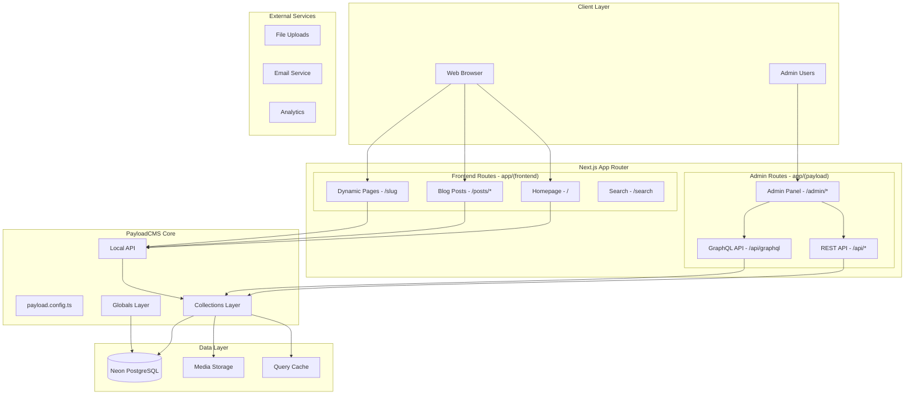

## Directory Structure

The project follows PayloadCMS 3.0's new Next.js-native structure:

```
portfolio-blog-2025/
├── src/
│   ├── app/                        # Next.js App Router
│   │   ├── (frontend)/            # Public-facing routes
│   │   │   ├── layout.tsx         # Frontend layout with providers
│   │   │   ├── page.tsx           # Homepage (redirects to [slug])
│   │   │   ├── [slug]/            # Dynamic pages
│   │   │   │   ├── page.tsx       # Page template
│   │   │   │   └── page.client.tsx
│   │   │   ├── posts/             # Blog functionality
│   │   │   │   ├── page.tsx       # Posts listing
│   │   │   │   └── [slug]/        # Individual post
│   │   │   └── search/            # Search functionality
│   │   └── (payload)/             # PayloadCMS admin routes
│   │       ├── admin/             # Admin panel
│   │       │   └── [[...segments]]/
│   │       │       └── page.tsx   # Admin routing
│   │       ├── api/               # API endpoints
│   │       │   ├── [...slug]/     # REST API routes
│   │       │   └── graphql/       # GraphQL endpoint
│   │       ├── layout.tsx         # Admin layout
│   │       └── custom.scss        # Admin customizations
│   │
│   ├── collections/               # PayloadCMS Collections
│   │   ├── Categories.ts          # Blog categories
│   │   ├── Media.ts              # File uploads & media
│   │   ├── Pages/                # Dynamic pages
│   │   │   ├── index.ts          # Main collection config
│   │   │   └── hooks/            # Page-specific hooks
│   │   ├── Posts/                # Blog posts
│   │   │   ├── index.ts          # Main collection config
│   │   │   └── hooks/            # Post-specific hooks
│   │   └── Users/                # User management
│   │       └── index.ts
│   │
│   ├── blocks/                   # Content blocks system
│   │   ├── ArchiveBlock/         # Post archive display
│   │   ├── Banner/               # Announcement banners
│   │   ├── CallToAction/         # CTA blocks
│   │   ├── Code/                 # Code syntax highlighting
│   │   ├── Content/              # Rich text content
│   │   ├── Form/                 # Dynamic forms
│   │   ├── MediaBlock/           # Media display
│   │   └── RenderBlocks.tsx      # Block renderer
│   │
│   ├── components/               # Shared components
│   │   ├── ui/                   # Base UI components
│   │   ├── AdminBar/             # Live preview bar
│   │   ├── BeforeLogin/          # Admin login customization
│   │   ├── BeforeDashboard/      # Admin dashboard customization
│   │   └── ...
│   │
│   ├── fields/                   # Reusable field definitions
│   │   ├── defaultLexical.ts     # Rich text editor config
│   │   ├── link.ts               # Link field
│   │   ├── linkGroup.ts          # Link group field
│   │   └── slug/                 # Auto-slug generation
│   │
│   ├── access/                   # Access control functions
│   │   ├── anyone.ts             # Public access
│   │   ├── authenticated.ts      # Authenticated users only
│   │   └── authenticatedOrPublished.ts
│   │
│   ├── hooks/                    # Lifecycle hooks
│   │   ├── formatSlug.ts         # Slug formatting
│   │   ├── populatePublishedAt.ts
│   │   └── revalidateRedirects.ts
│   │
│   ├── heros/                    # Hero section types
│   ├── plugins/                  # Plugin configurations
│   │   └── index.ts              # All plugins setup
│   │
│   ├── providers/                # React context providers
│   ├── utilities/                # Helper functions
│   ├── Header/                   # Global header
│   ├── Footer/                   # Global footer
│   │
│   ├── payload.config.ts         # Main PayloadCMS configuration
│   └── payload-types.ts          # Auto-generated TypeScript types
│
├── docs/                         # Project documentation
├── public/                       # Static assets
├── package.json                  # Dependencies & scripts
└── next.config.js               # Next.js configuration
```

## PayloadCMS Configuration

### Main Configuration (`src/payload.config.ts`)

```typescript
export default buildConfig({
  // Database Configuration
  db: postgresAdapter({
    pool: {
      connectionString: process.env.DATABASE_URI || '',
    },
  }),

  // Admin Panel Configuration
  admin: {
    components: {
      beforeLogin: ['@/components/BeforeLogin'],
      beforeDashboard: ['@/components/BeforeDashboard'],
    },
    importMap: {
      baseDir: path.resolve(dirname),
    },
    user: Users.slug,
    livePreview: {
      breakpoints: [
        { label: 'Mobile', name: 'mobile', width: 375, height: 667 },
        { label: 'Tablet', name: 'tablet', width: 768, height: 1024 },
        { label: 'Desktop', name: 'desktop', width: 1440, height: 900 },
      ],
    },
  },

  // Content Configuration
  collections: [Pages, Posts, Media, Categories, Users],
  globals: [Header, Footer],
  
  // Rich Text Editor
  editor: defaultLexical,
  
  // Plugins
  plugins: [
    redirectsPlugin,
    nestedDocsPlugin,
    seoPlugin,
    formBuilderPlugin,
    searchPlugin,
    payloadCloudPlugin,
  ],

  // Security & Performance
  secret: process.env.PAYLOAD_SECRET,
  cors: [getServerSideURL()].filter(Boolean),
  
  // TypeScript Integration
  typescript: {
    outputFile: path.resolve(dirname, 'payload-types.ts'),
  },

  // Job System
  jobs: {
    access: {
      run: ({ req }) => {
        if (req.user) return true
        const authHeader = req.headers.get('authorization')
        return authHeader === `Bearer ${process.env.CRON_SECRET}`
      },
    },
    tasks: [],
  },
})
```

### Key Configuration Features

1. **PostgreSQL Integration**: Using Neon PostgreSQL with connection pooling
2. **Live Preview**: Multi-device preview system for content editors
3. **Plugin System**: Comprehensive plugin suite for SEO, forms, search, etc.
4. **Job System**: Background task processing with authentication
5. **TypeScript Generation**: Automatic type generation for all collections

## Data Layer Architecture

### Collections Overview

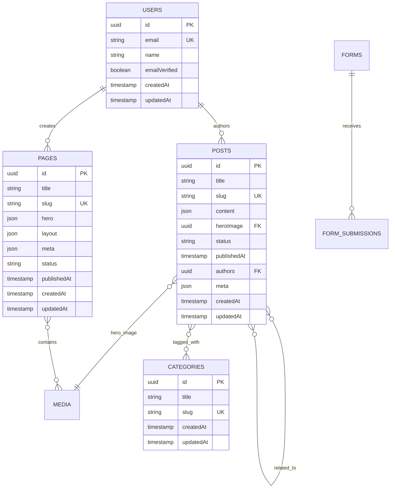

### Collection Configurations

#### 1. Users Collection
```typescript
export const Users: CollectionConfig = {
  slug: 'users',
  auth: true,
  access: {
    admin: authenticated,
    create: authenticated,
    delete: authenticated,
    read: authenticated,
    update: authenticated,
  },
  admin: {
    defaultColumns: ['name', 'email'],
    useAsTitle: 'name',
  },
  fields: [
    {
      name: 'name',
      type: 'text',
    },
  ],
  timestamps: true,
}
```

#### 2. Posts Collection
- **Rich Content**: Lexical editor with custom blocks
- **SEO Integration**: Meta fields with auto-generation
- **Relationships**: Authors, categories, related posts
- **Media**: Hero images with multiple sizes
- **Versioning**: Draft/published states with auto-save
- **Live Preview**: Real-time preview during editing

#### 3. Pages Collection
- **Dynamic Layout**: Block-based layout system
- **Hero Sections**: Multiple hero types (High Impact, Medium Impact, Low Impact)
- **Content Blocks**: CallToAction, Content, MediaBlock, Archive, Form
- **SEO Optimization**: Complete meta tag management
- **URL Generation**: Dynamic preview paths

#### 4. Media Collection
- **File Processing**: Multiple image sizes generated automatically
- **Storage**: Public directory with direct access
- **Metadata**: Alt text, captions with rich text
- **Focal Point**: Smart cropping support
- **Thumbnails**: Admin thumbnail generation

### Access Control System

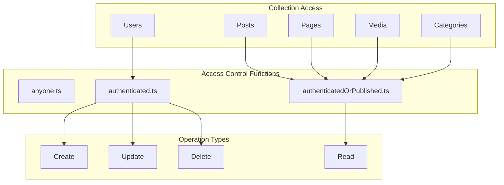

**Access Control Logic:**
- **Authenticated Users**: Full CRUD operations
- **Public Users**: Read access to published content only
- **Anonymous**: Read access to published content
- **Field-Level**: Granular control over individual fields

## API Architecture

### API Endpoints Structure

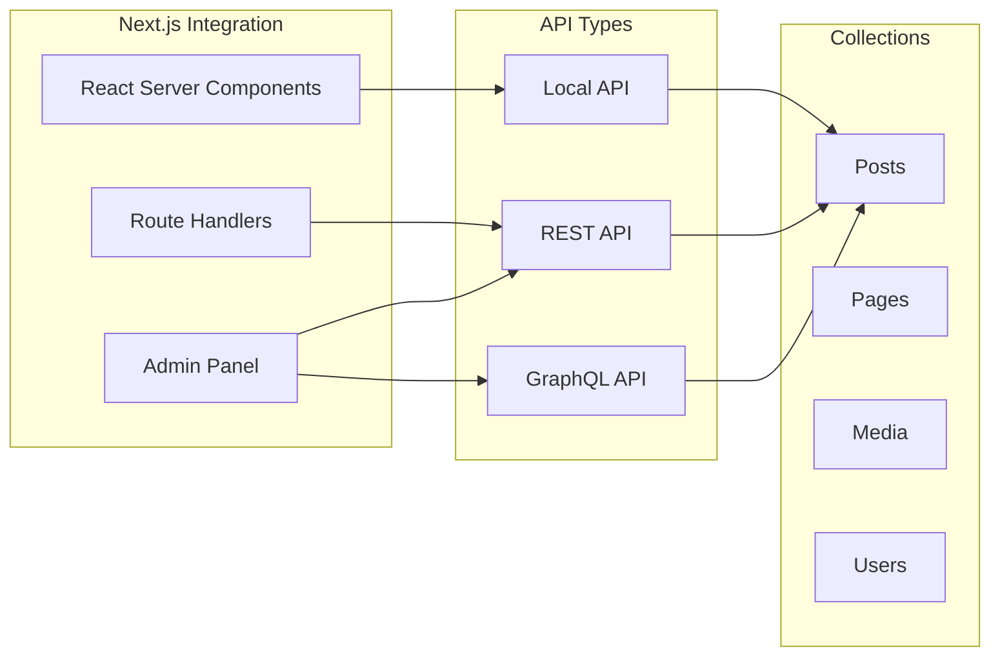

### 1. Local API (Server Components)

**Usage Pattern:**
```typescript
// Server Component data fetching
export default async function PostsPage() {
  const payload = await getPayload({ config: configPromise })
  
  const posts = await payload.find({
    collection: 'posts',
    where: {
      status: { equals: 'published' },
    },
    limit: 10,
    sort: '-publishedAt',
    depth: 2,
  })

  return <PostsList posts={posts.docs} />
}
```

**Benefits:**
- Direct database access without HTTP overhead
- Type-safe queries with auto-completion
- Server-side rendering optimization
- Automatic relationship population

### 2. REST API (`/api/*`)

**Auto-generated Endpoints:**
```
GET    /api/posts              # List posts with pagination
GET    /api/posts/:id          # Get single post
POST   /api/posts              # Create post
PATCH  /api/posts/:id          # Update post
DELETE /api/posts/:id          # Delete post

GET    /api/pages              # List pages
GET    /api/pages/:id          # Get single page
POST   /api/pages              # Create page
PATCH  /api/pages/:id          # Update page
DELETE /api/pages/:id          # Delete page

GET    /api/media              # List media
POST   /api/media              # Upload media
GET    /api/media/:id          # Get media details

POST   /api/users/login        # User authentication
POST   /api/users/logout       # User logout
GET    /api/users/me           # Current user info
```

### 3. GraphQL API (`/api/graphql`)

**Query Examples:**
```graphql
query GetPosts($limit: Int, $where: Post_where) {
  Posts(limit: $limit, where: $where) {
    docs {
      id
      title
      slug
      content
      heroImage {
        url
        alt
      }
      categories {
        title
        slug
      }
      authors {
        name
      }
      publishedAt
    }
    totalDocs
    hasNextPage
  }
}

mutation CreatePost($data: mutationPostInput!) {
  createPost(data: $data) {
    id
    title
    slug
    status
  }
}
```

## Frontend Integration

### Next.js App Router Integration

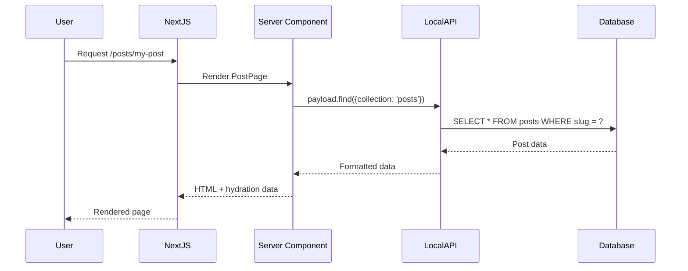

### Page Generation Strategies

#### 1. Static Generation with ISR

```typescript
// generateStaticParams for build-time generation
export async function generateStaticParams() {
  const payload = await getPayload({ config: configPromise })
  const pages = await payload.find({
    collection: 'pages',
    draft: false,
    limit: 1000,
    pagination: false,
    select: { slug: true },
  })

  return pages.docs?.map(({ slug }) => ({ slug }))
}
```

#### 2. Dynamic Rendering with Caching

```typescript
// Cache function for performance
const queryPageBySlug = cache(async ({ slug }: { slug: string }) => {
  const { isEnabled: draft } = await draftMode()
  const payload = await getPayload({ config: configPromise })

  const result = await payload.find({
    collection: 'pages',
    draft,
    limit: 1,
    pagination: false,
    overrideAccess: draft,
    where: { slug: { equals: slug } },
  })

  return result.docs?.[0] || null
})
```

### Content Rendering System

#### Block-Based Layout System

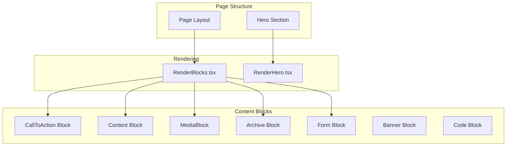

**Block Rendering Implementation:**
```typescript
export const RenderBlocks: React.FC<{
  blocks: (CallToActionBlock | ContentBlock | MediaBlock | ArchiveBlock | FormBlock)[]
}> = (props) => {
  const { blocks } = props

  const hasBlocks = blocks && Array.isArray(blocks) && blocks.length > 0

  if (hasBlocks) {
    return (
      <Fragment>
        {blocks.map((block, index) => {
          const { blockType } = block

          switch (blockType) {
            case 'cta':
              return <CallToActionBlock key={index} {...block} />
            case 'content':
              return <ContentBlock key={index} {...block} />
            case 'mediaBlock':
              return <MediaBlock key={index} {...block} />
            case 'archive':
              return <ArchiveBlock key={index} {...block} />
            case 'formBlock':
              return <FormBlock key={index} {...block} />
            default:
              return null
          }
        })}
      </Fragment>
    )
  }

  return null
}
```

## Content Management System

### Admin Panel Features

#### 1. Live Preview System
- **Multi-device Preview**: Mobile, tablet, desktop breakpoints
- **Real-time Updates**: Changes reflect immediately
- **Draft Mode**: Preview unpublished content
- **URL Generation**: Dynamic preview paths

#### 2. Rich Text Editor (Lexical)
- **Custom Features**: Headings, links, blocks, horizontal rules
- **Block Support**: Banner, Code, MediaBlock integration
- **Toolbar**: Fixed and inline toolbars
- **Extensible**: Custom features and plugins

#### 3. Media Management
- **Upload Processing**: Multiple image sizes automatically generated
- **Focal Point**: Smart cropping for different aspect ratios
- **Metadata**: Alt text, captions with rich text support
- **Public Access**: Direct file serving from `/public/media`

#### 4. Form Builder
- **Dynamic Forms**: Visual form builder interface
- **Field Types**: Text, email, textarea, select, checkbox, etc.
- **Email Integration**: Configurable form submission emails
- **Confirmation**: Custom confirmation messages

### Content Versioning

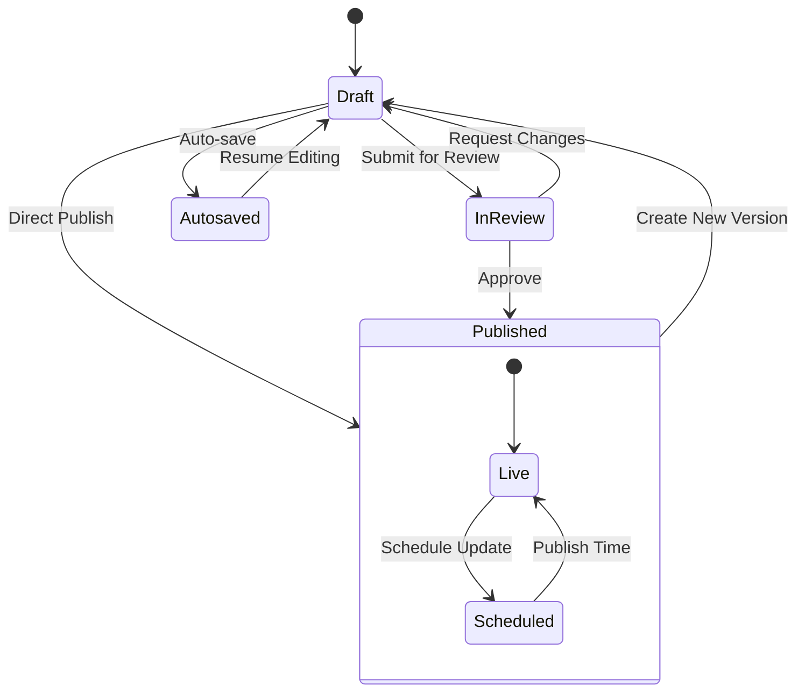

**Version Configuration:**
```typescript
versions: {
  drafts: {
    autosave: {
      interval: 100, // Optimal for live preview
    },
    schedulePublish: true,
  },
  maxPerDoc: 50,
}
```

## Authentication & Security

### Authentication System

#### User Management
- **Built-in Auth**: Email/password authentication
- **Role-Based**: Admin, editor, user roles
- **Session Management**: JWT tokens with refresh
- **Email Verification**: Optional email verification
- **Account Locking**: Brute force protection

#### Access Control Flow

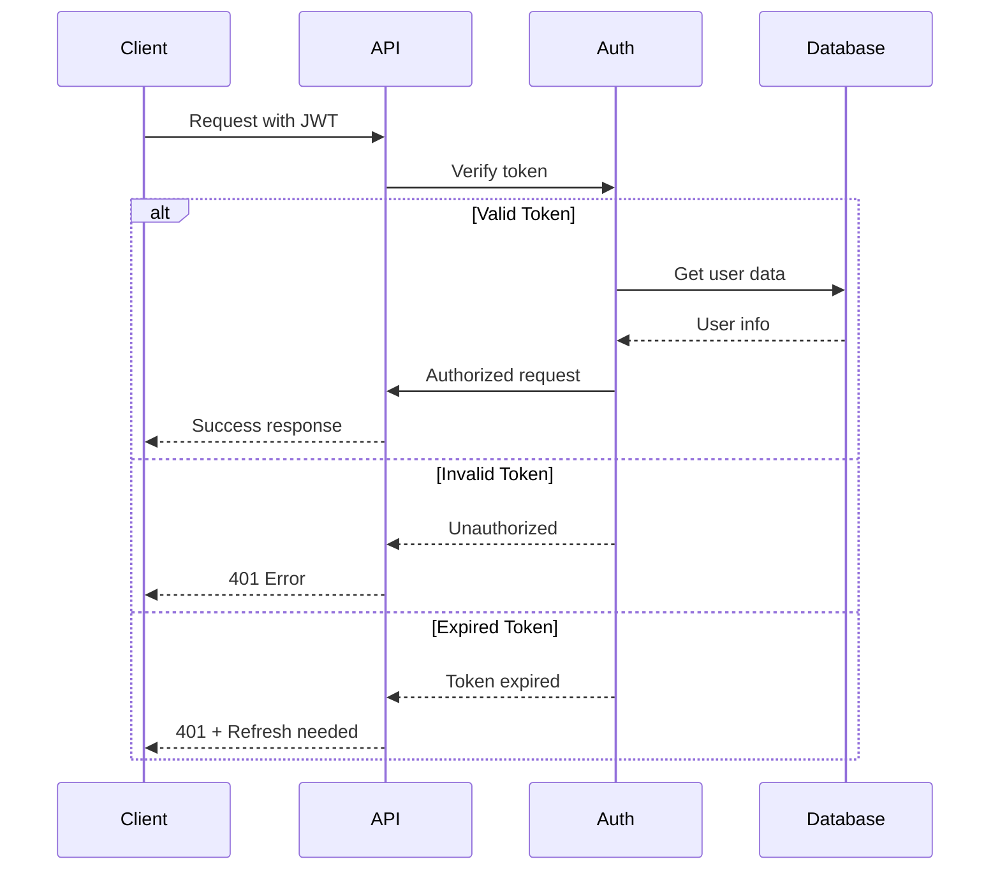

### Security Features

1. **CORS Configuration**: Restricted to known domains
2. **Environment Variables**: Sensitive data protection
3. **SQL Injection Prevention**: ORM-based queries
4. **XSS Protection**: Content sanitization
5. **CSRF Protection**: Built-in token validation
6. **Rate Limiting**: API request throttling
7. **Admin Access Control**: Collection and field-level permissions

## Plugins & Extensions

### Core Plugins Configuration

```typescript
export const plugins: Plugin[] = [
  // Redirects Management
  redirectsPlugin({
    collections: ['pages', 'posts'],
    overrides: {
      hooks: {
        afterChange: [revalidateRedirects],
      },
    },
  }),

  // Nested Categories
  nestedDocsPlugin({
    collections: ['categories'],
    generateURL: (docs) => docs.reduce((url, doc) => `${url}/${doc.slug}`, ''),
  }),

  // SEO Optimization
  seoPlugin({
    generateTitle: ({ doc }) => 
      doc?.title ? `${doc.title} | Portfolio Blog` : 'Portfolio Blog',
    generateURL: ({ doc }) => `${getServerSideURL()}/${doc?.slug || ''}`,
  }),

  // Dynamic Forms
  formBuilderPlugin({
    fields: {
      payment: false, // Disable payment fields
    },
    formOverrides: {
      fields: ({ defaultFields }) => 
        defaultFields.map((field) => {
          if ('name' in field && field.name === 'confirmationMessage') {
            return {
              ...field,
              editor: lexicalEditor({
                features: ({ rootFeatures }) => [
                  ...rootFeatures,
                  FixedToolbarFeature(),
                  HeadingFeature({ enabledHeadingSizes: ['h1', 'h2', 'h3', 'h4'] }),
                ],
              }),
            }
          }
          return field
        }),
    },
  }),

  // Search Functionality
  searchPlugin({
    collections: ['posts'],
    beforeSync: beforeSyncWithSearch,
    searchOverrides: {
      fields: ({ defaultFields }) => [...defaultFields, ...searchFields],
    },
  }),

  // Payload Cloud Integration
  payloadCloudPlugin(),
]
```

### Plugin Features

1. **Redirects Plugin**: 
   - Automatic redirect management
   - Build-time optimization
   - UI for redirect creation

2. **Nested Docs Plugin**:
   - Hierarchical category structure
   - URL path generation
   - Parent-child relationships

3. **SEO Plugin**:
   - Meta tag generation
   - Open Graph support
   - Twitter Card integration
   - Sitemap generation

4. **Form Builder Plugin**:
   - Visual form designer
   - Email configuration
   - Custom field types
   - Submission handling

5. **Search Plugin**:
   - Full-text search
   - Collection indexing
   - Custom search fields
   - Search API endpoints

## Performance & Optimization

### Caching Strategy

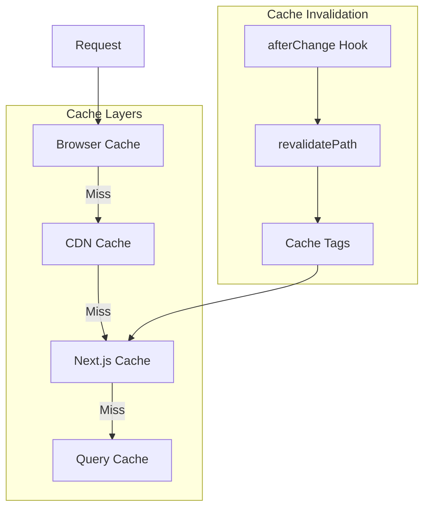

### Performance Optimizations

1. **Database Optimization**:
   - Connection pooling
   - Selective field queries
   - Relationship depth limiting
   - Indexed slug fields

2. **Image Optimization**:
   - Multiple size generation
   - WebP format support
   - Lazy loading
   - Responsive images

3. **API Optimization**:
   - Query result caching
   - Pagination implementation
   - Selective population
   - Rate limiting

4. **Build Optimization**:
   - Static page generation
   - Incremental Static Regeneration
   - Bundle splitting
   - Tree shaking

### Monitoring & Analytics

- **Performance Metrics**: Core Web Vitals tracking
- **Error Tracking**: Comprehensive error logging
- **Usage Analytics**: User behavior insights  
- **SEO Monitoring**: Search engine optimization tracking

## Deployment Architecture

### Production Infrastructure

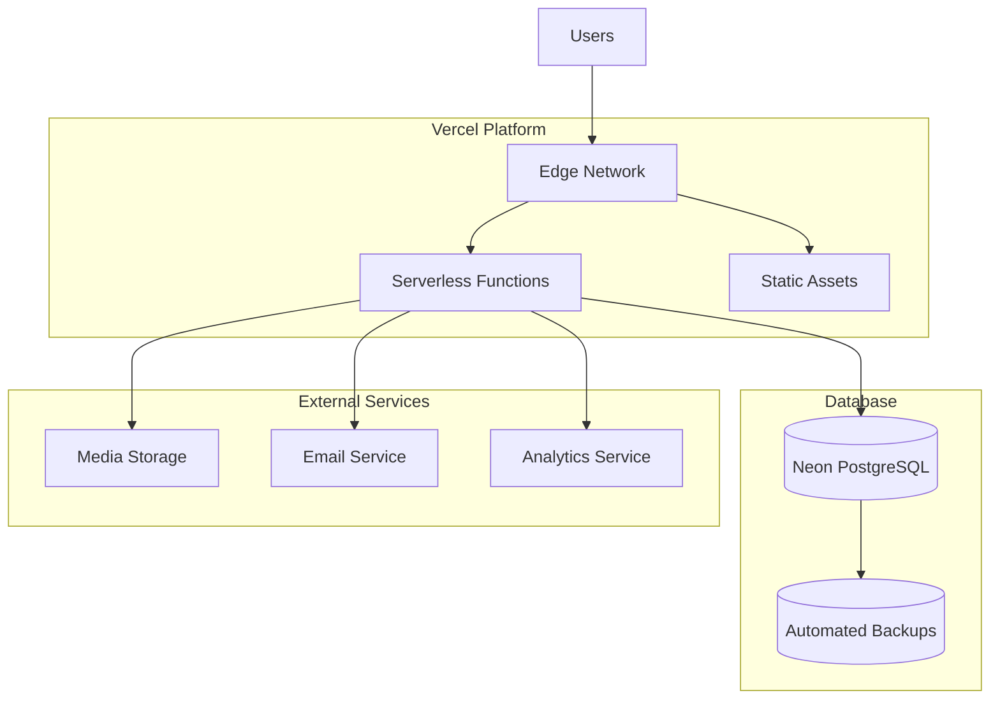

### Environment Configuration

```typescript
// Environment Variables Structure
{
  // Core Configuration
  DATABASE_URI: 'postgresql://...',
  PAYLOAD_SECRET: 'secure-secret-key',
  
  // Application URLs
  NEXT_PUBLIC_SERVER_URL: 'https://domain.com',
  
  // Services
  CRON_SECRET: 'cron-job-secret',
  
  // Optional Services
  EMAIL_FROM: 'noreply@domain.com',
  EMAIL_SMTP_HOST: 'smtp.service.com',
  EMAIL_SMTP_PORT: '587',
  EMAIL_SMTP_USER: 'username',
  EMAIL_SMTP_PASS: 'password',
}
```

### CI/CD Pipeline

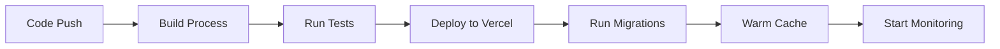

## Summary

This PayloadCMS architecture provides:

1. **Modern Integration**: Native Next.js App Router support with Server Components
2. **Type Safety**: Full TypeScript integration with auto-generated types
3. **Flexibility**: Block-based content system with rich customization
4. **Performance**: Optimized queries, caching, and static generation
5. **Scalability**: Serverless deployment with database connection pooling
6. **Security**: Comprehensive access control and authentication
7. **Developer Experience**: Hot reload, live preview, and excellent tooling
8. **Content Management**: Rich editing experience with version control
9. **SEO Optimization**: Built-in SEO features and meta generation
10. **Extensibility**: Plugin system for additional functionality

The architecture demonstrates advanced PayloadCMS patterns and serves as a comprehensive example of building modern, performant content management systems with Next.js.