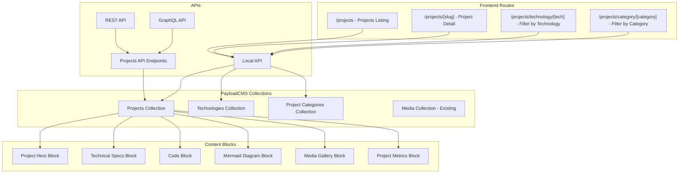
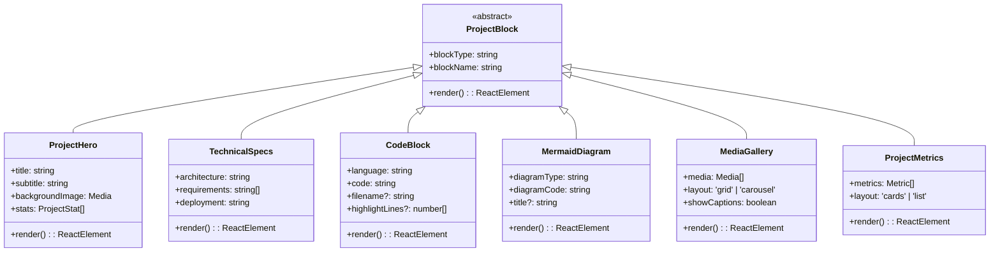

# PayloadCMS Projects Feature - Product Requirements Document

## Table of Contents

1. [Executive Summary](#executive-summary)
2. [User Stories & Requirements](#user-stories--requirements)
3. [Technical Specifications](#technical-specifications)
4. [Architecture Design](#architecture-design)
5. [Database Schema](#database-schema)
6. [Content Blocks System](#content-blocks-system)
7. [Frontend Integration](#frontend-integration)
8. [Implementation Plan](#implementation-plan)
9. [Content Migration Strategy](#content-migration-strategy)
10. [Testing & Quality Assurance](#testing--quality-assurance)
11. [Success Metrics](#success-metrics)
12. [Risk Assessment](#risk-assessment)

## Executive Summary

### Objective
Modernize the existing JSON-based projects system by integrating it into PayloadCMS, providing a comprehensive project portfolio management system with advanced content management capabilities, rich media support, and enhanced user experience.

### Key Goals
- **Centralized Management**: Consolidate project data into PayloadCMS for unified content management
- **Rich Content**: Support for advanced content blocks, Mermaid diagrams, code blocks, and media galleries
- **Technology Tracking**: Comprehensive technology stack management with icons and categorization
- **Enhanced UX**: Improved admin and frontend user experience with filtering, search, and featured projects
- **SEO Optimization**: Full SEO support for project pages with meta generation and social sharing
- **Scalability**: Designed to handle growing portfolio with performance optimization

### Success Criteria
- Complete migration of existing 50+ projects from JSON to PayloadCMS
- Admin users can create/edit projects 3x faster than current workflow
- Frontend users can discover projects through advanced filtering and search
- 100% SEO coverage for all project pages
- Mobile-responsive project gallery with optimized performance

## User Stories & Requirements

### Admin User Stories

#### Content Management
- **As an admin**, I want to create projects with rich content blocks so I can showcase projects with diverse content types
- **As an admin**, I want to drag-and-drop content blocks to reorder project sections easily
- **As an admin**, I want to add Mermaid diagrams to explain project architecture visually
- **As an admin**, I want to include code blocks with syntax highlighting to demonstrate technical implementation
- **As an admin**, I want to upload and manage project media (images, videos, documents) in one place

#### Technology Management
- **As an admin**, I want to create and manage a library of technologies with icons and descriptions
- **As an admin**, I want to categorize technologies (Frontend, Backend, Database, etc.) for better organization
- **As an admin**, I want to quickly assign technologies to projects through an intuitive interface
- **As an admin**, I want to see which technologies are most commonly used across projects

#### Project Organization
- **As an admin**, I want to mark projects as featured to highlight them on the homepage
- **As an admin**, I want to organize projects with tags and categories for better discoverability
- **As an admin**, I want to set project status (In Progress, Completed, Archived) to manage visibility
- **As an admin**, I want to preview projects before publishing them

### Frontend User Stories

#### Project Discovery
- **As a visitor**, I want to browse all projects in an attractive gallery layout
- **As a visitor**, I want to filter projects by technology, category, or status to find relevant projects
- **As a visitor**, I want to search projects by title, description, or technology to quickly find what I'm looking for
- **As a visitor**, I want to see featured projects prominently displayed on the homepage

#### Project Details
- **As a visitor**, I want to view detailed project information with rich content and media
- **As a visitor**, I want to see the complete technology stack with icons and descriptions
- **As a visitor**, I want to access project source code and live demos through provided links
- **As a visitor**, I want to view project architecture through interactive Mermaid diagrams

#### User Experience
- **As a visitor**, I want fast-loading project pages with optimized images and content
- **As a visitor**, I want responsive design that works perfectly on mobile devices
- **As a visitor**, I want to share projects on social media with proper preview cards
- **As a visitor**, I want to navigate between related projects easily

## Technical Specifications

### Core Collections

#### Projects Collection
```typescript
export const Projects: CollectionConfig = {
  slug: 'projects',
  access: {
    create: authenticated,
    delete: authenticated,
    read: authenticatedOrPublished,
    update: authenticated,
  },
  admin: {
    defaultColumns: ['title', 'status', 'featured', 'updatedAt'],
    useAsTitle: 'title',
    livePreview: {
      url: ({ data, req }) => generatePreviewPath({
        slug: data?.slug,
        collection: 'projects',
        req,
      }),
    },
  },
  fields: [
    // Basic Information
    {
      name: 'title',
      type: 'text',
      required: true,
      admin: {
        description: 'Project title displayed in listings and project page',
      },
    },
    {
      name: 'description',
      type: 'textarea',
      required: true,
      maxLength: 500,
      admin: {
        description: 'Brief project description for listings and meta description',
      },
    },
    {
      name: 'status',
      type: 'select',
      options: [
        { label: 'In Progress', value: 'in-progress' },
        { label: 'Completed', value: 'completed' },
        { label: 'Archived', value: 'archived' },
      ],
      defaultValue: 'completed',
      admin: {
        position: 'sidebar',
      },
    },
    {
      name: 'featured',
      type: 'checkbox',
      defaultValue: false,
      admin: {
        position: 'sidebar',
        description: 'Feature this project on homepage and top of listings',
      },
    },
    
    // Media
    {
      name: 'heroImage',
      type: 'upload',
      relationTo: 'media',
      admin: {
        description: 'Main project image displayed in listings and project header',
      },
    },
    {
      name: 'heroVideo',
      type: 'text',
      admin: {
        description: 'YouTube video ID for project demo (overrides hero image)',
      },
    },
    
    // External Links
    {
      name: 'links',
      type: 'group',
      fields: [
        {
          name: 'github',
          type: 'text',
          validate: (val) => !val || val.startsWith('https://github.com/') || 'Must be a valid GitHub URL',
        },
        {
          name: 'liveDemo',
          type: 'text',
          validate: (val) => !val || val.startsWith('http') || 'Must be a valid URL',
        },
        {
          name: 'documentation',
          type: 'text',
          validate: (val) => !val || val.startsWith('http') || 'Must be a valid URL',
        },
      ],
    },
    
    // Content Tabs
    {
      type: 'tabs',
      tabs: [
        {
          label: 'Content',
          fields: [
            {
              name: 'layout',
              type: 'blocks',
              blocks: [
                ProjectHero,
                ProjectOverview,
                TechnicalSpecs,
                ProjectFeatures,
                CodeBlock,
                MermaidDiagram,
                MediaGallery,
                ProjectMetrics,
                ChallengesSolutions,
                FutureEnhancements,
              ],
            },
          ],
        },
        {
          label: 'Technologies',
          fields: [
            {
              name: 'technologies',
              type: 'relationship',
              relationTo: 'technologies',
              hasMany: true,
              admin: {
                description: 'Select technologies used in this project',
              },
            },
            {
              name: 'primaryTechnology',
              type: 'relationship',
              relationTo: 'technologies',
              admin: {
                description: 'Main technology/framework used (for filtering)',
              },
            },
          ],
        },
        {
          label: 'Organization',
          fields: [
            {
              name: 'categories',
              type: 'relationship',
              relationTo: 'project-categories',
              hasMany: true,
            },
            {
              name: 'tags',
              type: 'text',
              hasMany: true,
              admin: {
                description: 'Keywords for search and filtering',
              },
            },
            {
              name: 'relatedProjects',
              type: 'relationship',
              relationTo: 'projects',
              hasMany: true,
              filterOptions: ({ id }) => ({
                id: { not_in: [id] },
              }),
            },
          ],
        },
        {
          name: 'meta',
          label: 'SEO',
          fields: [
            OverviewField({
              titlePath: 'meta.title',
              descriptionPath: 'meta.description',
              imagePath: 'meta.image',
            }),
            MetaTitleField({
              hasGenerateFn: true,
            }),
            MetaImageField({
              relationTo: 'media',
            }),
            MetaDescriptionField({}),
            PreviewField({
              hasGenerateFn: true,
              titlePath: 'meta.title',
              descriptionPath: 'meta.description',
            }),
          ],
        },
      ],
    },
    
    // Timestamps
    {
      name: 'startDate',
      type: 'date',
      admin: {
        position: 'sidebar',
        description: 'When project development started',
      },
    },
    {
      name: 'completionDate',
      type: 'date',
      admin: {
        position: 'sidebar',
        description: 'When project was completed',
      },
    },
    
    // Slug field
    ...slugField(),
  ],
  hooks: {
    beforeChange: [populatePublishedAt],
    afterChange: [revalidateProject],
    afterDelete: [revalidateDelete],
  },
  versions: {
    drafts: {
      autosave: {
        interval: 100,
      },
      schedulePublish: true,
    },
    maxPerDoc: 50,
  },
}
```

#### Technologies Collection
```typescript
export const Technologies: CollectionConfig = {
  slug: 'technologies',
  access: {
    create: authenticated,
    delete: authenticated,
    read: anyone,
    update: authenticated,
  },
  admin: {
    defaultColumns: ['name', 'category', 'updatedAt'],
    useAsTitle: 'name',
  },
  fields: [
    {
      name: 'name',
      type: 'text',
      required: true,
      unique: true,
    },
    {
      name: 'description',
      type: 'textarea',
      admin: {
        description: 'Brief description of the technology',
      },
    },
    {
      name: 'icon',
      type: 'upload',
      relationTo: 'media',
      required: true,
      admin: {
        description: 'Technology icon/logo (SVG preferred)',
      },
    },
    {
      name: 'category',
      type: 'select',
      options: [
        { label: 'Frontend', value: 'frontend' },
        { label: 'Backend', value: 'backend' },
        { label: 'Database', value: 'database' },
        { label: 'DevOps', value: 'devops' },
        { label: 'Mobile', value: 'mobile' },
        { label: 'Desktop', value: 'desktop' },
        { label: 'Cloud', value: 'cloud' },
        { label: 'AI/ML', value: 'ai-ml' },
        { label: 'Testing', value: 'testing' },
        { label: 'Tools', value: 'tools' },
      ],
      required: true,
    },
    {
      name: 'officialWebsite',
      type: 'text',
      validate: (val) => !val || val.startsWith('http') || 'Must be a valid URL',
    },
    {
      name: 'documentation',
      type: 'text',
      validate: (val) => !val || val.startsWith('http') || 'Must be a valid URL',
    },
    {
      name: 'color',
      type: 'text',
      admin: {
        description: 'Brand color for UI theming (hex code)',
      },
      validate: (val) => !val || /^#[0-9A-F]{6}$/i.test(val) || 'Must be a valid hex color',
    },
    ...slugField(),
  ],
}
```

#### Project Categories Collection
```typescript
export const ProjectCategories: CollectionConfig = {
  slug: 'project-categories',
  access: {
    create: authenticated,
    delete: authenticated,
    read: anyone,
    update: authenticated,
  },
  admin: {
    useAsTitle: 'name',
  },
  fields: [
    {
      name: 'name',
      type: 'text',
      required: true,
    },
    {
      name: 'description',
      type: 'textarea',
    },
    {
      name: 'color',
      type: 'text',
      admin: {
        description: 'Category color for UI (hex code)',
      },
    },
    {
      name: 'icon',
      type: 'upload',
      relationTo: 'media',
    },
    ...slugField(),
  ],
}
```

## Architecture Design

### Updated System Architecture



### Database Relationships

```mermaid
erDiagram
    PROJECTS ||--o{ PROJECT_TECHNOLOGIES : uses
    PROJECTS ||--o{ PROJECT_CATEGORIES : belongs_to
    PROJECTS }o--|| MEDIA : hero_image
    PROJECTS }o--o{ PROJECTS : related_to
    
    TECHNOLOGIES ||--o{ PROJECT_TECHNOLOGIES : used_in
    TECHNOLOGIES }o--|| MEDIA : icon
    
    PROJECT_CATEGORIES ||--o{ PROJECT_CATEGORIES : parent_child
    PROJECT_CATEGORIES }o--|| MEDIA : icon
    
    PROJECTS {
        uuid id PK
        string title
        string slug UK
        text description
        string status
        boolean featured
        uuid hero_image FK
        string hero_video
        json links
        json layout
        json meta
        date start_date
        date completion_date
        timestamp created_at
        timestamp updated_at
    }
    
    TECHNOLOGIES {
        uuid id PK
        string name UK
        string slug UK
        text description
        uuid icon FK
        string category
        string official_website
        string documentation
        string color
        timestamp created_at
        timestamp updated_at
    }
    
    PROJECT_CATEGORIES {
        uuid id PK
        string name
        string slug UK
        text description
        string color
        uuid icon FK
        uuid parent_id FK
        timestamp created_at
        timestamp updated_at
    }
    
    PROJECT_TECHNOLOGIES {
        uuid project_id FK
        uuid technology_id FK
        integer order_index
        PRIMARY KEY (project_id, technology_id)
    }
```

### Content Blocks Architecture



## Content Blocks System

### Project-Specific Blocks

#### 1. Project Hero Block
```typescript
export const ProjectHero: Block = {
  slug: 'project-hero',
  fields: [
    {
      name: 'title',
      type: 'text',
      required: true,
    },
    {
      name: 'subtitle',
      type: 'text',
    },
    {
      name: 'backgroundImage',
      type: 'upload',
      relationTo: 'media',
    },
    {
      name: 'stats',
      type: 'array',
      fields: [
        {
          name: 'label',
          type: 'text',
          required: true,
        },
        {
          name: 'value',
          type: 'text',
          required: true,
        },
        {
          name: 'icon',
          type: 'upload',
          relationTo: 'media',
        },
      ],
    },
  ],
}
```

#### 2. Technical Specifications Block
```typescript
export const TechnicalSpecs: Block = {
  slug: 'technical-specs',
  fields: [
    {
      name: 'architecture',
      type: 'richText',
      editor: defaultLexical,
    },
    {
      name: 'requirements',
      type: 'array',
      fields: [
        {
          name: 'requirement',
          type: 'text',
          required: true,
        },
      ],
    },
    {
      name: 'deployment',
      type: 'richText',
      editor: defaultLexical,
    },
    {
      name: 'performance',
      type: 'group',
      fields: [
        {
          name: 'loadTime',
          type: 'text',
        },
        {
          name: 'throughput',
          type: 'text',
        },
        {
          name: 'scalability',
          type: 'text',
        },
      ],
    },
  ],
}
```

#### 3. Code Block
```typescript
export const CodeBlock: Block = {
  slug: 'code-block',
  fields: [
    {
      name: 'language',
      type: 'select',
      options: [
        { label: 'JavaScript', value: 'javascript' },
        { label: 'TypeScript', value: 'typescript' },
        { label: 'Python', value: 'python' },
        { label: 'Java', value: 'java' },
        { label: 'C++', value: 'cpp' },
        { label: 'SQL', value: 'sql' },
        { label: 'Bash', value: 'bash' },
        { label: 'YAML', value: 'yaml' },
        { label: 'JSON', value: 'json' },
      ],
      required: true,
    },
    {
      name: 'code',
      type: 'textarea',
      required: true,
      admin: {
        rows: 20,
      },
    },
    {
      name: 'filename',
      type: 'text',
      admin: {
        description: 'Optional filename to display',
      },
    },
    {
      name: 'highlightLines',
      type: 'text',
      admin: {
        description: 'Comma-separated line numbers to highlight (e.g., "1,3,5-7")',
      },
    },
    {
      name: 'description',
      type: 'textarea',
      admin: {
        description: 'Optional description of the code',
      },
    },
  ],
}
```

#### 4. Mermaid Diagram Block
```typescript
export const MermaidDiagram: Block = {
  slug: 'mermaid-diagram',
  fields: [
    {
      name: 'diagramType',
      type: 'select',
      options: [
        { label: 'Flowchart', value: 'flowchart' },
        { label: 'Sequence Diagram', value: 'sequence' },
        { label: 'Class Diagram', value: 'class' },
        { label: 'State Diagram', value: 'state' },
        { label: 'Entity Relationship', value: 'er' },
        { label: 'Gantt Chart', value: 'gantt' },
        { label: 'Git Graph', value: 'gitgraph' },
      ],
      required: true,
    },
    {
      name: 'diagramCode',
      type: 'textarea',
      required: true,
      admin: {
        rows: 15,
        description: 'Mermaid diagram syntax',
      },
    },
    {
      name: 'title',
      type: 'text',
      admin: {
        description: 'Diagram title/caption',
      },
    },
    {
      name: 'description',
      type: 'textarea',
      admin: {
        description: 'Explanation of the diagram',
      },
    },
  ],
}
```

#### 5. Media Gallery Block
```typescript
export const MediaGallery: Block = {
  slug: 'media-gallery',
  fields: [
    {
      name: 'media',
      type: 'array',
      required: true,
      fields: [
        {
          name: 'image',
          type: 'upload',
          relationTo: 'media',
          required: true,
        },
        {
          name: 'caption',
          type: 'text',
        },
        {
          name: 'alt',
          type: 'text',
          required: true,
        },
      ],
    },
    {
      name: 'layout',
      type: 'select',
      options: [
        { label: 'Grid', value: 'grid' },
        { label: 'Carousel', value: 'carousel' },
        { label: 'Masonry', value: 'masonry' },
      ],
      defaultValue: 'grid',
    },
    {
      name: 'showCaptions',
      type: 'checkbox',
      defaultValue: true,
    },
    {
      name: 'aspectRatio',
      type: 'select',
      options: [
        { label: 'Auto', value: 'auto' },
        { label: '16:9', value: '16-9' },
        { label: '4:3', value: '4-3' },
        { label: '1:1', value: '1-1' },
      ],
      defaultValue: 'auto',
    },
  ],
}
```

#### 6. Project Metrics Block
```typescript
export const ProjectMetrics: Block = {
  slug: 'project-metrics',
  fields: [
    {
      name: 'metrics',
      type: 'array',
      required: true,
      fields: [
        {
          name: 'label',
          type: 'text',
          required: true,
        },
        {
          name: 'value',
          type: 'text',
          required: true,
        },
        {
          name: 'unit',
          type: 'text',
          admin: {
            description: 'e.g., %, ms, MB, users',
          },
        },
        {
          name: 'description',
          type: 'textarea',
        },
        {
          name: 'icon',
          type: 'upload',
          relationTo: 'media',
        },
      ],
    },
    {
      name: 'layout',
      type: 'select',
      options: [
        { label: 'Cards', value: 'cards' },
        { label: 'List', value: 'list' },
        { label: 'Chart', value: 'chart' },
      ],
      defaultValue: 'cards',
    },
  ],
}
```

## Frontend Integration

### Route Structure

```typescript
// src/app/(frontend)/projects/
├── page.tsx                    // Projects listing page
├── [slug]/
│   └── page.tsx               // Individual project page
├── technology/
│   └── [slug]/
│       └── page.tsx           // Projects filtered by technology
├── category/
│   └── [slug]/
│       └── page.tsx           // Projects filtered by category
└── components/
    ├── ProjectCard.tsx         // Project card component
    ├── ProjectFilter.tsx       // Filtering interface
    ├── ProjectGrid.tsx         // Grid layout
    ├── TechnologyBadge.tsx     // Technology badge
    └── ProjectBlocks/          // Project-specific blocks
        ├── ProjectHeroBlock.tsx
        ├── TechnicalSpecsBlock.tsx
        ├── CodeBlock.tsx
        ├── MermaidBlock.tsx
        ├── MediaGalleryBlock.tsx
        └── ProjectMetricsBlock.tsx
```

### Projects Listing Page

```typescript
// src/app/(frontend)/projects/page.tsx
import { getPayload } from 'payload'
import { ProjectGrid } from './components/ProjectGrid'
import { ProjectFilter } from './components/ProjectFilter'

export default async function ProjectsPage({
  searchParams,
}: {
  searchParams: { 
    category?: string
    technology?: string
    status?: string
    search?: string
  }
}) {
  const payload = await getPayload({ config: configPromise })
  
  // Build where clause based on search params
  const where: any = {}
  
  if (searchParams.category) {
    where['categories.slug'] = { equals: searchParams.category }
  }
  
  if (searchParams.technology) {
    where['technologies.slug'] = { equals: searchParams.technology }
  }
  
  if (searchParams.status) {
    where.status = { equals: searchParams.status }
  }
  
  if (searchParams.search) {
    where.or = [
      { title: { contains: searchParams.search } },
      { description: { contains: searchParams.search } },
      { 'tags': { contains: searchParams.search } },
    ]
  }
  
  const [projects, technologies, categories] = await Promise.all([
    payload.find({
      collection: 'projects',
      where: {
        _status: { equals: 'published' },
        ...where,
      },
      sort: ['-featured', '-updatedAt'],
      limit: 50,
      depth: 2,
    }),
    payload.find({
      collection: 'technologies',
      limit: 100,
      sort: 'name',
    }),
    payload.find({
      collection: 'project-categories',
      limit: 50,
      sort: 'name',
    }),
  ])
  
  const featuredProjects = projects.docs.filter(p => p.featured)
  const regularProjects = projects.docs.filter(p => !p.featured)
  
  return (
    <div className="container mx-auto px-4 py-8">
      <div className="mb-8">
        <h1 className="text-4xl font-bold mb-4">Projects</h1>
        <p className="text-lg text-muted-foreground">
          Explore my portfolio of {projects.totalDocs} projects
        </p>
      </div>
      
      <ProjectFilter
        technologies={technologies.docs}
        categories={categories.docs}
        searchParams={searchParams}
      />
      
      {featuredProjects.length > 0 && (
        <section className="mb-12">
          <h2 className="text-2xl font-semibold mb-6">Featured Projects</h2>
          <ProjectGrid projects={featuredProjects} featured />
        </section>
      )}
      
      <section>
        <h2 className="text-2xl font-semibold mb-6">All Projects</h2>
        <ProjectGrid projects={regularProjects} />
      </section>
    </div>
  )
}
```

### Individual Project Page

```typescript
// src/app/(frontend)/projects/[slug]/page.tsx
import { notFound } from 'next/navigation'
import { getPayload } from 'payload'
import { RenderBlocks } from '@/blocks/RenderBlocks'
import { ProjectHeader } from './components/ProjectHeader'
import { TechnologyStack } from './components/TechnologyStack'
import { ProjectNavigation } from './components/ProjectNavigation'

export async function generateStaticParams() {
  const payload = await getPayload({ config: configPromise })
  const projects = await payload.find({
    collection: 'projects',
    draft: false,
    limit: 1000,
    select: { slug: true },
  })
  
  return projects.docs?.map(({ slug }) => ({ slug }))
}

interface Props {
  params: { slug: string }
}

export default async function ProjectPage({ params }: Props) {
  const payload = await getPayload({ config: configPromise })
  
  const projects = await payload.find({
    collection: 'projects',
    where: { slug: { equals: params.slug } },
    depth: 3,
    limit: 1,
  })
  
  const project = projects.docs?.[0]
  
  if (!project) {
    notFound()
  }
  
  // Get related projects
  const relatedProjects = await payload.find({
    collection: 'projects',
    where: {
      id: { not_equals: project.id },
      or: [
        { 'technologies.id': { in: project.technologies?.map(t => t.id) } },
        { 'categories.id': { in: project.categories?.map(c => c.id) } },
      ],
    },
    limit: 3,
    depth: 1,
  })
  
  return (
    <article className="py-8">
      <ProjectHeader project={project} />
      
      <div className="container mx-auto px-4">
        <div className="max-w-4xl mx-auto">
          {/* Technology Stack */}
          <TechnologyStack technologies={project.technologies} />
          
          {/* Project Content Blocks */}
          <div className="my-12">
            <RenderBlocks blocks={project.layout} />
          </div>
          
          {/* Project Navigation */}
          <ProjectNavigation
            currentProject={project}
            relatedProjects={relatedProjects.docs}
          />
        </div>
      </div>
    </article>
  )
}

export async function generateMetadata({ params }: Props) {
  const payload = await getPayload({ config: configPromise })
  const projects = await payload.find({
    collection: 'projects',
    where: { slug: { equals: params.slug } },
    limit: 1,
  })
  
  const project = projects.docs?.[0]
  
  if (!project) {
    return {}
  }
  
  return {
    title: project.meta?.title || `${project.title} | Portfolio`,
    description: project.meta?.description || project.description,
    openGraph: {
      title: project.meta?.title || project.title,
      description: project.meta?.description || project.description,
      images: project.meta?.image ? [project.meta.image.url] : [],
      type: 'article',
    },
  }
}
```

## Implementation Plan

### Phase 1: Foundation (Weeks 1-2)

#### Backend Collections Setup
- [ ] Create Technologies collection with full field configuration
- [ ] Create Project Categories collection
- [ ] Create Projects collection with basic fields (no blocks yet)
- [ ] Set up relationships between collections
- [ ] Configure access control and permissions
- [ ] Add slug generation hooks
- [ ] Set up basic admin UI customizations

#### Database Migration
- [ ] Create migration scripts for new collections
- [ ] Set up indexes for performance optimization
- [ ] Test collection creation and relationships
- [ ] Validate access control rules

**Deliverables:**
- Working Technologies collection with CRUD operations
- Working Project Categories collection
- Basic Projects collection (without content blocks)
- Admin interface for managing all collections
- Database migration scripts

**Acceptance Criteria:**
- Admin can create, edit, and delete technologies
- Admin can create, edit, and delete project categories
- Admin can create basic projects and assign technologies/categories
- All collections respect access control rules
- Relationships work correctly in admin interface

### Phase 2: Content Blocks System (Weeks 3-4)

#### Block Development
- [ ] Create ProjectHero block with configuration and component
- [ ] Create TechnicalSpecs block with rich text support
- [ ] Create CodeBlock with syntax highlighting
- [ ] Create MermaidDiagram block with client-side rendering
- [ ] Create MediaGallery block with layout options
- [ ] Create ProjectMetrics block with different display modes
- [ ] Create ChallengesSolutions block
- [ ] Create FutureEnhancements block

#### Block Integration
- [ ] Add all blocks to Projects collection configuration
- [ ] Create RenderProjectBlocks component
- [ ] Implement block-specific React components
- [ ] Add block styling and responsive design
- [ ] Test block rendering and admin interface

**Deliverables:**
- Complete set of project-specific content blocks
- Block rendering system integrated with existing architecture
- Responsive block components with proper styling
- Admin interface for managing blocks within projects

**Acceptance Criteria:**
- Admin can add, reorder, and configure all project blocks
- All blocks render correctly on frontend
- Blocks are responsive and accessible
- Mermaid diagrams render properly client-side
- Code blocks have proper syntax highlighting

### Phase 3: Frontend Implementation (Weeks 5-6)

#### Page Development
- [ ] Create projects listing page with filtering
- [ ] Create individual project pages
- [ ] Create technology-based filtering pages
- [ ] Create category-based filtering pages
- [ ] Implement search functionality
- [ ] Add pagination for project listings

#### Component Development
- [ ] Create ProjectCard component for listings
- [ ] Create ProjectFilter component with dropdowns and search
- [ ] Create ProjectGrid component with responsive layout
- [ ] Create TechnologyBadge component
- [ ] Create ProjectHeader component
- [ ] Create ProjectNavigation component
- [ ] Create FeaturedProjects component

#### Integration
- [ ] Integrate with existing theme system
- [ ] Add proper loading states and error handling
- [ ] Implement SEO optimization for all pages
- [ ] Add social sharing capabilities
- [ ] Test responsive design across devices

**Deliverables:**
- Complete frontend implementation for projects
- Responsive project listing and detail pages
- Advanced filtering and search functionality
- SEO-optimized pages with proper meta tags

**Acceptance Criteria:**
- Users can browse projects in an attractive gallery
- Filtering by technology, category, and search works correctly
- Individual project pages display rich content properly
- All pages are responsive and perform well
- SEO meta tags are properly generated

### Phase 4: Advanced Features (Weeks 7-8)

#### Enhanced Functionality
- [ ] Implement featured projects showcase
- [ ] Add project analytics and view tracking
- [ ] Create related projects suggestions
- [ ] Add project sharing functionality
- [ ] Implement project bookmarking (if user system exists)
- [ ] Add project comparison feature
- [ ] Create technology trending analysis

#### Performance Optimization
- [ ] Implement image optimization for project media
- [ ] Add caching for project listings and details
- [ ] Optimize database queries with proper indexing
- [ ] Implement lazy loading for images and content
- [ ] Add service worker for offline capabilities
- [ ] Optimize Core Web Vitals scores

#### Admin Enhancements
- [ ] Add bulk operations for projects
- [ ] Create project templates for common types
- [ ] Add project duplicate functionality
- [ ] Implement project scheduling and publishing workflow
- [ ] Add project analytics dashboard
- [ ] Create import/export functionality

**Deliverables:**
- Advanced project features and admin tools
- Performance-optimized project pages
- Analytics and tracking capabilities
- Bulk management tools for administrators

**Acceptance Criteria:**
- Featured projects display prominently on homepage
- Project pages load quickly with optimized images
- Related projects suggestions are relevant
- Admin has efficient tools for managing multiple projects
- Analytics provide useful insights

### Phase 5: Migration & Polish (Weeks 9-10)

#### Data Migration
- [ ] Create migration script for existing JSON data
- [ ] Map existing project data to new collections
- [ ] Migrate technology data with icons
- [ ] Import project categories and tags
- [ ] Validate migrated data integrity
- [ ] Create fallback content for missing data

#### Testing & Quality Assurance
- [ ] Comprehensive testing of all project features
- [ ] Performance testing and optimization
- [ ] SEO audit and improvements
- [ ] Accessibility testing and fixes
- [ ] Cross-browser compatibility testing
- [ ] Mobile responsiveness validation

#### Documentation & Training
- [ ] Create admin user guide for project management
- [ ] Document content block usage and best practices
- [ ] Create troubleshooting guide
- [ ] Record training videos for content editors
- [ ] Update system architecture documentation

**Deliverables:**
- Complete migration of existing project data
- Comprehensive testing and quality assurance
- User documentation and training materials
- Production-ready projects feature

**Acceptance Criteria:**
- All existing projects are successfully migrated
- No regressions in existing functionality
- Project feature is fully tested and documented
- Admin users can effectively manage projects
- Performance meets or exceeds existing system

## Content Migration Strategy

### Data Mapping Analysis

#### Existing JSON Structure → PayloadCMS Collections

```typescript
// Existing JSON Structure
interface OldProject {
  id: number
  slug: string
  image: string
  alt: string
  title: string
  categories: string[]
  techStack: string[]
  show: boolean
  description: string
  href: string
  markdownPath?: string
  markdownContent?: string
  githubUrl: string
  videoUrl?: string
}

// Migration Mapping
const migrationMapping = {
  // Direct mappings
  title: 'title',
  slug: 'slug', 
  description: 'description',
  show: 'status', // true → 'published', false → 'draft'
  githubUrl: 'links.github',
  videoUrl: 'heroVideo',
  
  // Complex mappings
  image: 'heroImage', // Upload to media collection
  categories: 'categories', // Create/link to project-categories
  techStack: 'technologies', // Create/link to technologies
  markdownContent: 'layout', // Convert to content blocks
  markdownPath: 'layout', // Read file and convert to blocks
}
```

### Migration Script Structure

```typescript
// Migration script (to be run once)
async function migrateProjects() {
  const payload = await getPayload({ config })
  
  // Step 1: Create technologies from existing data
  const uniqueTechnologies = extractUniqueTechnologies(oldProjects)
  const technologyMap = await createTechnologies(uniqueTechnologies)
  
  // Step 2: Create categories from existing data
  const uniqueCategories = extractUniqueCategories(oldProjects)
  const categoryMap = await createCategories(uniqueCategories)
  
  // Step 3: Upload media files
  const mediaMap = await uploadProjectMedia(oldProjects)
  
  // Step 4: Migrate projects
  for (const oldProject of oldProjects) {
    const newProject = await migrateProject(
      oldProject,
      technologyMap,
      categoryMap,
      mediaMap
    )
    
    console.log(`Migrated project: ${newProject.title}`)
  }
}

async function migrateProject(
  oldProject: OldProject,
  technologyMap: Map<string, string>,
  categoryMap: Map<string, string>,
  mediaMap: Map<string, string>
) {
  // Convert markdown to content blocks
  const contentBlocks = await convertMarkdownToBlocks(
    oldProject.markdownContent || oldProject.markdownPath
  )
  
  return await payload.create({
    collection: 'projects',
    data: {
      title: oldProject.title,
      slug: oldProject.slug,
      description: oldProject.description,
      status: oldProject.show ? 'published' : 'draft',
      heroImage: mediaMap.get(oldProject.image),
      heroVideo: oldProject.videoUrl,
      links: {
        github: oldProject.githubUrl,
      },
      technologies: oldProject.techStack.map(tech => technologyMap.get(tech)),
      categories: oldProject.categories.map(cat => categoryMap.get(cat)),
      layout: contentBlocks,
      featured: false, // Set manually later
    }
  })
}
```

### Technology Migration Strategy

```typescript
// Default technology configurations
const defaultTechnologies = {
  "React": {
    name: "React",
    category: "frontend",
    officialWebsite: "https://reactjs.org",
    documentation: "https://reactjs.org/docs",
    color: "#61DAFB",
    description: "A JavaScript library for building user interfaces"
  },
  "Next.js": {
    name: "Next.js", 
    category: "frontend",
    officialWebsite: "https://nextjs.org",
    documentation: "https://nextjs.org/docs",
    color: "#000000",
    description: "The React Framework for Production"
  },
  "Node.js": {
    name: "Node.js",
    category: "backend", 
    officialWebsite: "https://nodejs.org",
    documentation: "https://nodejs.org/docs",
    color: "#339933",
    description: "JavaScript runtime built on Chrome's V8 JavaScript engine"
  },
  // ... continue for all technologies
}

async function createTechnologies(technologies: string[]) {
  const technologyMap = new Map<string, string>()
  
  for (const tech of technologies) {
    const config = defaultTechnologies[tech] || {
      name: tech,
      category: 'tools',
      description: `${tech} technology`,
    }
    
    // Upload icon if exists
    const iconPath = `/icons/${tech.toLowerCase()}.svg`
    const icon = await uploadIcon(iconPath)
    
    const technology = await payload.create({
      collection: 'technologies',
      data: {
        ...config,
        icon: icon?.id,
        slug: tech.toLowerCase().replace(/[^a-z0-9]+/g, '-'),
      }
    })
    
    technologyMap.set(tech, technology.id)
  }
  
  return technologyMap
}
```

## Testing & Quality Assurance

### Testing Strategy

#### Unit Testing
- **Collections Testing**: Validate field configurations, hooks, and access control
- **Block Components**: Test individual block rendering and functionality
- **Utility Functions**: Test slug generation, validation, and helper functions
- **Migration Scripts**: Test data transformation and integrity

#### Integration Testing
- **API Endpoints**: Test REST and GraphQL endpoints for projects
- **Frontend Pages**: Test page rendering with different data scenarios
- **Admin Interface**: Test project creation, editing, and publishing workflows
- **Search & Filtering**: Test all filtering combinations and search functionality

#### Performance Testing
- **Page Load Times**: Ensure project pages load within 2 seconds
- **Image Optimization**: Validate proper image sizing and formats
- **Database Queries**: Test query performance with large datasets
- **Caching**: Validate cache behavior and invalidation

#### SEO Testing
- **Meta Tags**: Verify proper meta tag generation for all project pages
- **Structured Data**: Test schema.org markup for projects
- **Sitemap**: Validate project pages are included in sitemap
- **Social Sharing**: Test Open Graph and Twitter Card functionality

### Test Cases

#### Admin User Workflows
```typescript
describe('Project Management', () => {
  it('should create a new project with all fields', async () => {
    // Test project creation workflow
  })
  
  it('should allow drag-and-drop reordering of content blocks', async () => {
    // Test block reordering functionality
  })
  
  it('should validate required fields and show appropriate errors', async () => {
    // Test form validation
  })
  
  it('should preview project before publishing', async () => {
    // Test preview functionality
  })
  
  it('should properly handle media uploads', async () => {
    // Test media upload and association
  })
})
```

#### Frontend User Workflows
```typescript
describe('Project Discovery', () => {
  it('should display projects in grid layout', async () => {
    // Test project listing display
  })
  
  it('should filter projects by technology', async () => {
    // Test technology filtering
  })
  
  it('should search projects by title and description', async () => {
    // Test search functionality
  })
  
  it('should display individual project with all content blocks', async () => {
    // Test project detail page
  })
  
  it('should show related projects based on technologies', async () => {
    // Test related projects logic
  })
})
```

## Success Metrics

### Quantitative Metrics

#### Performance Metrics
- **Page Load Time**: < 2 seconds for project pages
- **First Contentful Paint**: < 1.5 seconds
- **Largest Contentful Paint**: < 2.5 seconds
- **Cumulative Layout Shift**: < 0.1
- **Time to Interactive**: < 3 seconds

#### Usage Metrics
- **Project Creation Time**: Reduce from 30 minutes to 10 minutes
- **Admin Task Completion**: 90% success rate for common tasks
- **Search Success Rate**: 85% of searches return relevant results
- **Mobile Usage**: 40% of project views on mobile devices
- **Bounce Rate**: < 30% for project pages

#### Content Metrics
- **Project Migration**: 100% of existing projects migrated successfully
- **Content Completeness**: 90% of projects have complete information
- **Media Optimization**: 80% reduction in image file sizes
- **SEO Coverage**: 100% of project pages have proper meta tags

### Qualitative Metrics

#### User Satisfaction
- **Admin Feedback**: 4.5+ stars for ease of use
- **Content Quality**: Improved visual presentation and organization
- **Discovery Experience**: Enhanced filtering and search capabilities
- **Mobile Experience**: Fully responsive design across all devices

#### Business Impact
- **Portfolio Presentation**: Professional showcase of technical skills
- **Content Management**: Streamlined workflow for adding new projects
- **SEO Performance**: Improved search engine visibility
- **Maintenance**: Reduced time spent on content updates

## Risk Assessment

### Technical Risks

#### High Risk
- **Mermaid Rendering Issues**: Client-side diagram rendering may cause performance issues
  - *Mitigation*: Implement lazy loading and fallback to static images
  - *Contingency*: Pre-render diagrams server-side or use image alternatives

- **Large Media Files**: Project images and videos may impact performance
  - *Mitigation*: Implement comprehensive image optimization and CDN
  - *Contingency*: Set file size limits and compression requirements

#### Medium Risk
- **Migration Data Loss**: Complex migration may result in data corruption
  - *Mitigation*: Extensive testing with backup data, incremental migration
  - *Contingency*: Manual data entry for critical projects

- **Search Performance**: Complex filtering may cause slow queries
  - *Mitigation*: Implement proper database indexing and query optimization
  - *Contingency*: Simplify search functionality or implement external search

#### Low Risk
- **Admin Interface Complexity**: Too many options may confuse users
  - *Mitigation*: Progressive disclosure and comprehensive documentation
  - *Contingency*: Simplify interface based on user feedback

### Business Risks

#### Medium Risk
- **Content Migration Delays**: Migration may take longer than expected
  - *Mitigation*: Parallel development of new features while migration occurs
  - *Contingency*: Phased rollout with gradual migration

- **User Adoption**: Admin users may resist new interface
  - *Mitigation*: Training sessions and gradual rollout
  - *Contingency*: Maintain old system during transition period

#### Low Risk
- **Performance Regression**: New features may impact existing functionality
  - *Mitigation*: Comprehensive testing and performance monitoring
  - *Contingency*: Feature flags for quick rollback

### Mitigation Strategies

1. **Incremental Development**: Build and test features incrementally
2. **Comprehensive Testing**: Automated testing at all levels
3. **User Feedback**: Regular feedback sessions with admin users
4. **Performance Monitoring**: Real-time monitoring of key metrics
5. **Rollback Plan**: Ability to quickly revert to previous version
6. **Documentation**: Comprehensive documentation and training materials

## Conclusion

This PRD outlines a comprehensive approach to modernizing the projects system with PayloadCMS, providing enhanced content management capabilities, improved user experience, and better performance. The phased implementation approach ensures manageable development cycles while delivering value incrementally.

The success of this implementation will significantly improve the portfolio showcase capabilities, streamline content management workflows, and provide a foundation for future enhancements. The risk mitigation strategies ensure that potential issues are addressed proactively, while the comprehensive testing approach guarantees a high-quality delivery.

Key benefits of this implementation:
- **Modern CMS Integration**: Leverage PayloadCMS's advanced features
- **Rich Content Management**: Flexible block-based content system
- **Enhanced User Experience**: Improved discovery and presentation
- **Performance Optimization**: Fast, responsive, and SEO-friendly
- **Scalable Architecture**: Foundation for future growth and features

This implementation will transform the portfolio from a static JSON-based system to a dynamic, manageable, and professional showcase platform.